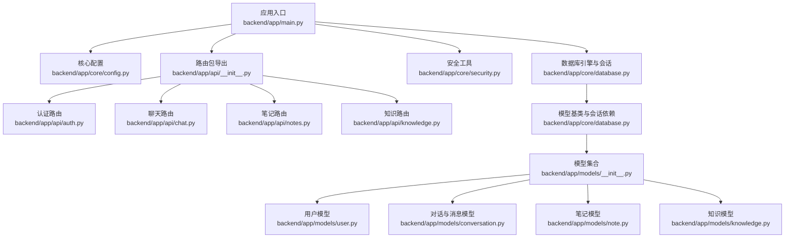
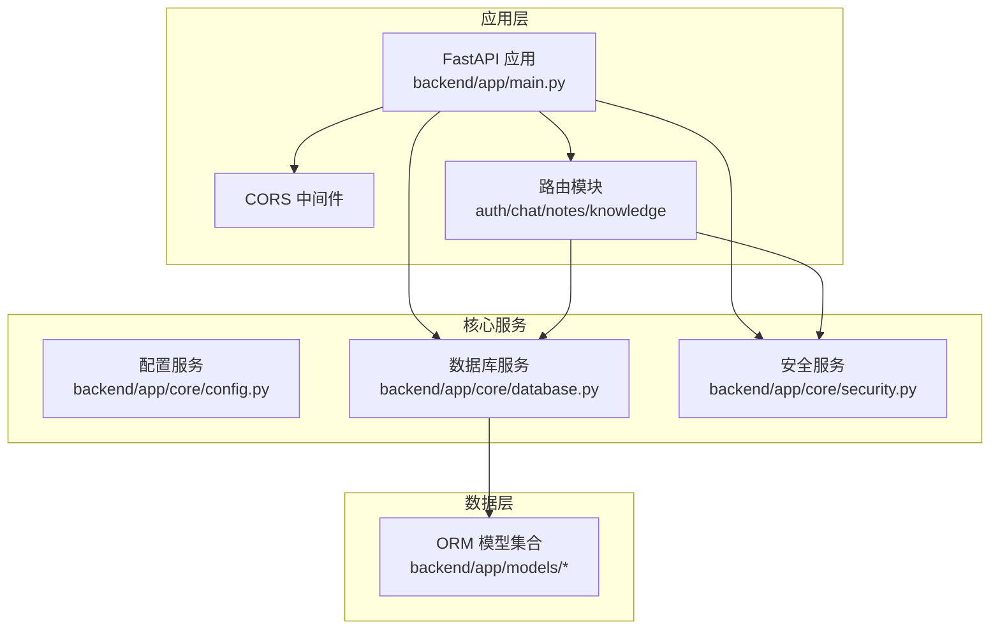
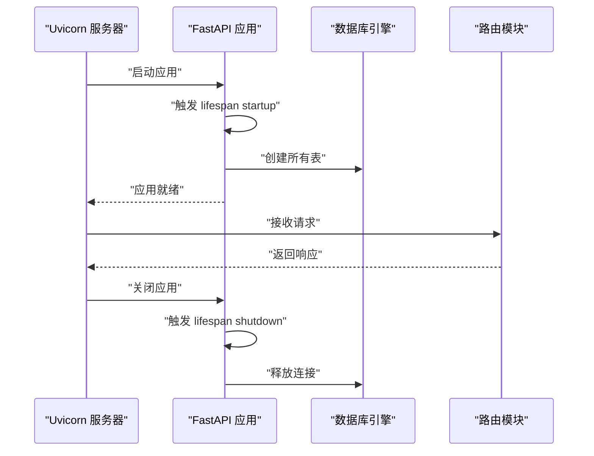
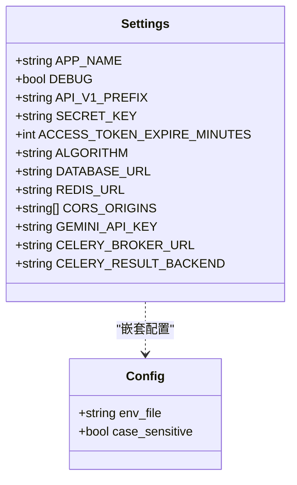
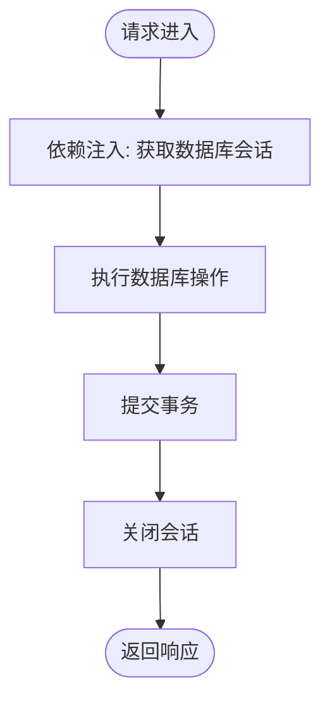
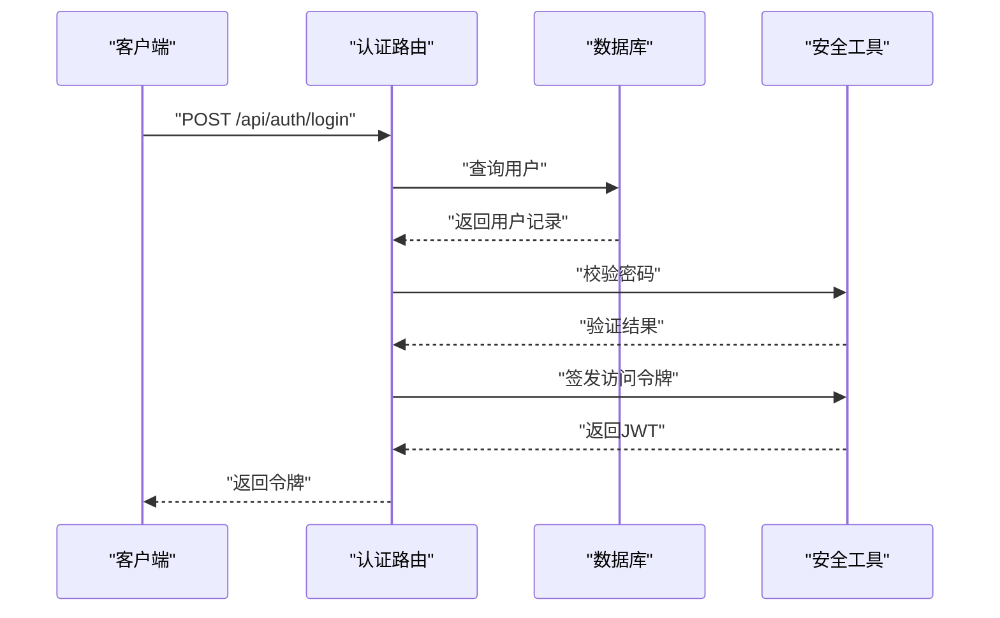
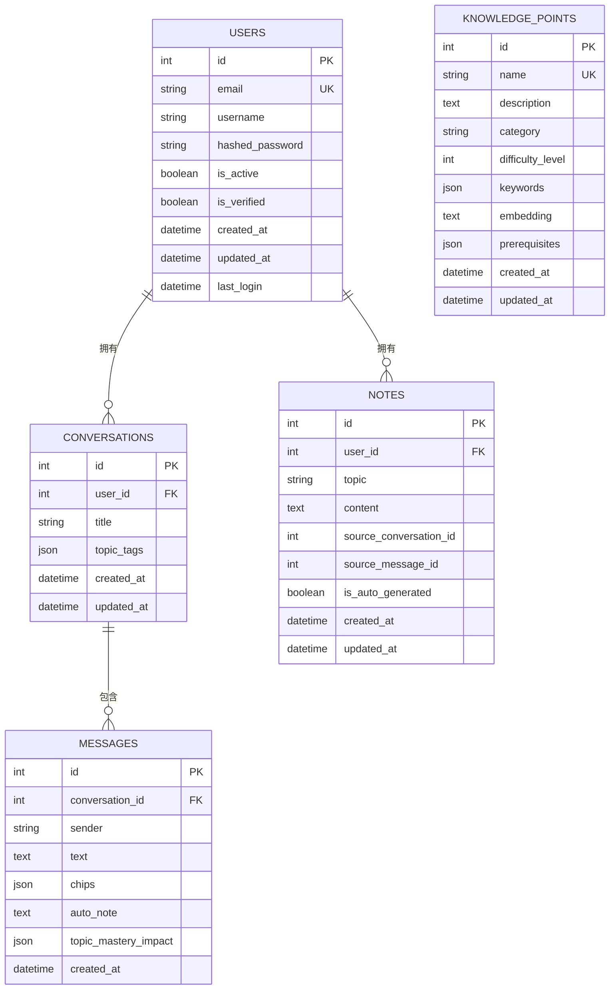
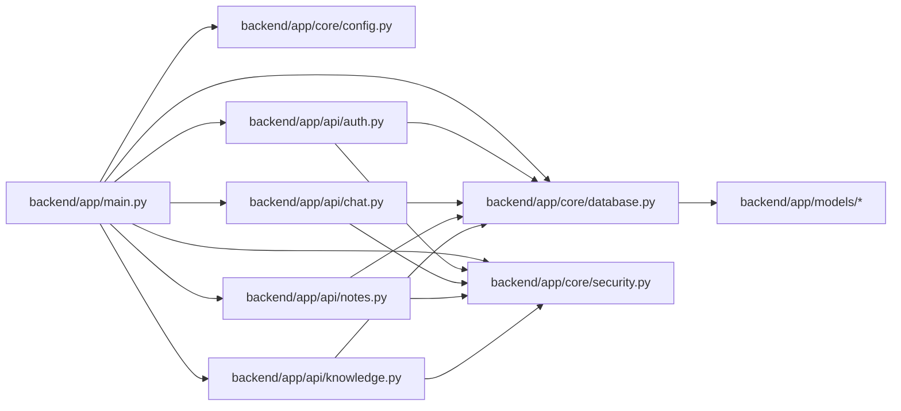

# 后端架构设计

<cite>
**本文档引用的文件**
- [backend/app/main.py](file://backend/app/main.py)
- [backend/app/core/config.py](file://backend/app/core/config.py)
- [backend/app/core/database.py](file://backend/app/core/database.py)
- [backend/app/core/security.py](file://backend/app/core/security.py)
- [backend/app/api/__init__.py](file://backend/app/api/__init__.py)
- [backend/app/api/auth.py](file://backend/app/api/auth.py)
- [backend/app/api/chat.py](file://backend/app/api/chat.py)
- [backend/app/api/notes.py](file://backend/app/api/notes.py)
- [backend/app/api/knowledge.py](file://backend/app/api/knowledge.py)
- [backend/app/models/__init__.py](file://backend/app/models/__init__.py)
- [backend/app/models/user.py](file://backend/app/models/user.py)
- [backend/app/models/conversation.py](file://backend/app/models/conversation.py)
- [backend/app/models/note.py](file://backend/app/models/note.py)
- [backend/app/models/knowledge.py](file://backend/app/models/knowledge.py)
- [backend/requirements.txt](file://backend/requirements.txt)
</cite>

## 目录
1. [引言](#引言)
2. [项目结构](#项目结构)
3. [核心组件](#核心组件)
4. [架构总览](#架构总览)
5. [详细组件分析](#详细组件分析)
6. [依赖关系分析](#依赖关系分析)
7. [性能考量](#性能考量)
8. [故障排查指南](#故障排查指南)
9. [结论](#结论)

## 引言
本文件为 Quickly 项目的后端架构设计文档，聚焦于基于 FastAPI 的应用整体架构与实现细节，涵盖应用生命周期管理、中间件配置、路由组织策略；深入解析 MVC 架构在后端的具体落地（模型层、视图层、控制器层）；说明依赖注入模式在数据库连接与配置管理中的应用；阐述异步编程在 FastAPI 中的实现方式（异步数据库操作与协程处理）；描述 CORS 跨域配置、错误处理机制与中间件链设计；最后给出性能优化策略、并发能力与扩展性建议。

## 项目结构
后端采用分层清晰的目录组织：
- 应用入口与生命周期：backend/app/main.py
- 核心子系统：backend/app/core（配置、数据库、安全）
- API 路由：backend/app/api（按功能域划分）
- 数据模型与关系：backend/app/models（SQLAlchemy ORM 模型）
- 依赖声明：backend/requirements.txt

图表来源
- [backend/app/main.py:1-66](file://backend/app/main.py#L1-L66)
- [backend/app/core/config.py:1-45](file://backend/app/core/config.py#L1-L45)
- [backend/app/core/database.py:1-46](file://backend/app/core/database.py#L1-L46)
- [backend/app/core/security.py:1-80](file://backend/app/core/security.py#L1-L80)
- [backend/app/api/__init__.py:1-8](file://backend/app/api/__init__.py#L1-L8)
- [backend/app/api/auth.py:1-99](file://backend/app/api/auth.py#L1-L99)
- [backend/app/api/chat.py:1-252](file://backend/app/api/chat.py#L1-L252)
- [backend/app/api/notes.py:1-133](file://backend/app/api/notes.py#L1-L133)
- [backend/app/api/knowledge.py:1-69](file://backend/app/api/knowledge.py#L1-L69)
- [backend/app/models/__init__.py:1-23](file://backend/app/models/__init__.py#L1-L23)
- [backend/app/models/user.py:1-39](file://backend/app/models/user.py#L1-L39)
- [backend/app/models/conversation.py:1-54](file://backend/app/models/conversation.py#L1-L54)
- [backend/app/models/note.py:1-35](file://backend/app/models/note.py#L1-L35)
- [backend/app/models/knowledge.py:1-32](file://backend/app/models/knowledge.py#L1-L32)

章节来源
- [backend/app/main.py:1-66](file://backend/app/main.py#L1-L66)
- [backend/app/core/config.py:1-45](file://backend/app/core/config.py#L1-L45)
- [backend/app/core/database.py:1-46](file://backend/app/core/database.py#L1-L46)
- [backend/app/core/security.py:1-80](file://backend/app/core/security.py#L1-L80)
- [backend/app/api/__init__.py:1-8](file://backend/app/api/__init__.py#L1-L8)
- [backend/app/api/auth.py:1-99](file://backend/app/api/auth.py#L1-L99)
- [backend/app/api/chat.py:1-252](file://backend/app/api/chat.py#L1-L252)
- [backend/app/api/notes.py:1-133](file://backend/app/api/notes.py#L1-L133)
- [backend/app/api/knowledge.py:1-69](file://backend/app/api/knowledge.py#L1-L69)
- [backend/app/models/__init__.py:1-23](file://backend/app/models/__init__.py#L1-L23)
- [backend/app/models/user.py:1-39](file://backend/app/models/user.py#L1-L39)
- [backend/app/models/conversation.py:1-54](file://backend/app/models/conversation.py#L1-L54)
- [backend/app/models/note.py:1-35](file://backend/app/models/note.py#L1-L35)
- [backend/app/models/knowledge.py:1-32](file://backend/app/models/knowledge.py#L1-L32)

## 核心组件
- 应用生命周期与中间件
  - 使用异步生命周期钩子在启动时创建数据库表并在关闭时释放资源。
  - 配置并注册 CORS 中间件，支持凭证、通配方法与头。
- 配置管理
  - 基于 Pydantic Settings 的集中式配置，包含应用名、调试开关、API 前缀、密钥、数据库、Redis、CORS、AI 与 Celery 等。
- 数据库与会话
  - 基于 SQLAlchemy 2.x 异步引擎，自动适配 SQLite 与 PostgreSQL 的连接池参数；提供异步会话依赖。
- 安全与认证
  - 提供密码哈希、JWT 签发与校验、OAuth2 密码流、当前用户解析等工具，并通过依赖注入在路由中使用。
- 路由组织
  - 按功能域拆分路由模块，统一在入口处注册前缀与标签，便于 API 文档与维护。

章节来源
- [backend/app/main.py:15-66](file://backend/app/main.py#L15-L66)
- [backend/app/core/config.py:10-45](file://backend/app/core/config.py#L10-L45)
- [backend/app/core/database.py:10-46](file://backend/app/core/database.py#L10-L46)
- [backend/app/core/security.py:19-80](file://backend/app/core/security.py#L19-L80)
- [backend/app/api/__init__.py:5-8](file://backend/app/api/__init__.py#L5-L8)

## 架构总览
后端采用“入口应用 + 核心子系统 + 功能路由 + 数据模型”的分层架构。入口应用负责生命周期与中间件装配，核心子系统提供配置、数据库与安全工具，功能路由模块实现 API 控制器逻辑，模型层定义数据结构与关系。

图表来源
- [backend/app/main.py:26-49](file://backend/app/main.py#L26-L49)
- [backend/app/core/config.py:40-45](file://backend/app/core/config.py#L40-L45)
- [backend/app/core/database.py:32-46](file://backend/app/core/database.py#L32-L46)
- [backend/app/core/security.py:19-80](file://backend/app/core/security.py#L19-L80)
- [backend/app/models/__init__.py:13-22](file://backend/app/models/__init__.py#L13-L22)

## 详细组件分析

### 应用生命周期与中间件
- 生命周期钩子
  - 在启动阶段通过异步上下文管理器创建数据库表；在关闭阶段释放引擎连接。
- CORS 配置
  - 允许指定来源、凭证、通配方法与头，满足前端开发环境跨域需求。
- 路由注册
  - 统一前缀与标签，便于 API 文档聚合与功能划分。

图表来源
- [backend/app/main.py:15-31](file://backend/app/main.py#L15-L31)
- [backend/app/main.py:34-49](file://backend/app/main.py#L34-L49)

章节来源
- [backend/app/main.py:15-66](file://backend/app/main.py#L15-L66)

### 配置管理（Pydantic Settings）
- 集中式配置项：应用名、调试、API 前缀、密钥、数据库 URL、Redis、CORS 来源、AI 与任务队列等。
- 环境变量加载：通过 .env 文件与大小写敏感配置。
- 作用范围：被数据库引擎、安全模块与应用中间件共同消费。

图表来源
- [backend/app/core/config.py:10-42](file://backend/app/core/config.py#L10-L42)

章节来源
- [backend/app/core/config.py:10-45](file://backend/app/core/config.py#L10-L45)

### 数据库与依赖注入
- 引擎与会话
  - 自动区分 SQLite 与 PostgreSQL 的连接池参数；提供异步会话依赖，确保每个请求获得独立会话并在结束后正确关闭。
- 依赖注入
  - 通过 FastAPI 依赖系统注入数据库会话与配置实例，简化路由层代码并提升可测试性。

图表来源
- [backend/app/core/database.py:39-46](file://backend/app/core/database.py#L39-L46)

章节来源
- [backend/app/core/database.py:10-46](file://backend/app/core/database.py#L10-L46)

### 安全与认证（JWT + OAuth2）
- 密码处理：使用 bcrypt 进行哈希与验证。
- JWT 签发与校验：支持自定义过期时间与算法。
- 当前用户解析：通过 OAuth2 密码流从请求中提取令牌并解析用户身份。
- 在路由中通过依赖注入获取当前用户，实现受保护接口。

图表来源
- [backend/app/api/auth.py:52-87](file://backend/app/api/auth.py#L52-L87)
- [backend/app/core/security.py:23-80](file://backend/app/core/security.py#L23-L80)

章节来源
- [backend/app/api/auth.py:1-99](file://backend/app/api/auth.py#L1-L99)
- [backend/app/core/security.py:19-80](file://backend/app/core/security.py#L19-L80)

### MVC 架构实现

#### 视图层（API 路由）
- 按功能域拆分路由模块：认证、聊天、笔记、知识等。
- 统一前缀与标签，便于 API 文档聚合与版本管理。
- 使用 Pydantic 模型作为请求/响应序列化载体。

章节来源
- [backend/app/api/__init__.py:5-8](file://backend/app/api/__init__.py#L5-L8)
- [backend/app/api/auth.py:19-99](file://backend/app/api/auth.py#L19-L99)
- [backend/app/api/chat.py:22-252](file://backend/app/api/chat.py#L22-L252)
- [backend/app/api/notes.py:17-133](file://backend/app/api/notes.py#L17-L133)
- [backend/app/api/knowledge.py:17-69](file://backend/app/api/knowledge.py#L17-L69)

#### 控制器层（业务逻辑）
- 认证：注册、登录、获取当前用户、登出。
- 聊天：发送消息、生成模拟回复、自动创建笔记、更新掌握度。
- 笔记：分页检索、搜索、CRUD。
- 知识：查询知识点列表与详情、创建（权限说明）。

章节来源
- [backend/app/api/auth.py:22-99](file://backend/app/api/auth.py#L22-L99)
- [backend/app/api/chat.py:78-151](file://backend/app/api/chat.py#L78-L151)
- [backend/app/api/notes.py:20-133](file://backend/app/api/notes.py#L20-L133)
- [backend/app/api/knowledge.py:20-69](file://backend/app/api/knowledge.py#L20-L69)

#### 模型层（数据模型）
- 用户、对话、消息、笔记、知识点等实体及其关系。
- 使用 SQLAlchemy DeclarativeBase 作为基类，统一元数据与表映射。

图表来源
- [backend/app/models/user.py:11-39](file://backend/app/models/user.py#L11-L39)
- [backend/app/models/conversation.py:11-54](file://backend/app/models/conversation.py#L11-L54)
- [backend/app/models/note.py:11-35](file://backend/app/models/note.py#L11-L35)
- [backend/app/models/knowledge.py:10-32](file://backend/app/models/knowledge.py#L10-L32)

章节来源
- [backend/app/models/__init__.py:13-22](file://backend/app/models/__init__.py#L13-L22)
- [backend/app/models/user.py:11-39](file://backend/app/models/user.py#L11-L39)
- [backend/app/models/conversation.py:11-54](file://backend/app/models/conversation.py#L11-L54)
- [backend/app/models/note.py:11-35](file://backend/app/models/note.py#L11-L35)
- [backend/app/models/knowledge.py:10-32](file://backend/app/models/knowledge.py#L10-L32)

### 异步编程与协程处理
- 异步数据库：使用 SQLAlchemy 2.x 异步引擎与会话，路由处理函数均为 async，数据库操作均 await。
- 协程链路：请求进入 -> 依赖注入会话 -> 执行异步查询/写入 -> 提交事务 -> 返回响应。
- 并发能力：异步 I/O 与事件循环提升并发吞吐，适合 IO 密集型场景（数据库、网络请求）。

章节来源
- [backend/app/core/database.py:16-46](file://backend/app/core/database.py#L16-L46)
- [backend/app/api/chat.py:78-151](file://backend/app/api/chat.py#L78-L151)
- [backend/app/api/notes.py:20-133](file://backend/app/api/notes.py#L20-L133)

### CORS 跨域、错误处理与中间件链
- CORS：允许凭证、通配方法与头，支持本地开发前端来源。
- 错误处理：路由内使用 HTTPException 抛出标准状态码与错误信息；安全模块在令牌无效或用户不存在时抛出 401。
- 中间件链：应用启动时注册 CORS；生命周期钩子负责数据库初始化与清理。

章节来源
- [backend/app/main.py:34-40](file://backend/app/main.py#L34-L40)
- [backend/app/api/auth.py:26-31](file://backend/app/api/auth.py#L26-L31)
- [backend/app/core/security.py:59-78](file://backend/app/core/security.py#L59-L78)

## 依赖关系分析

图表来源
- [backend/app/main.py:10-12](file://backend/app/main.py#L10-L12)
- [backend/app/api/auth.py:11-16](file://backend/app/api/auth.py#L11-L16)
- [backend/app/api/chat.py:11-19](file://backend/app/api/chat.py#L11-L19)
- [backend/app/api/notes.py:10-14](file://backend/app/api/notes.py#L10-L14)
- [backend/app/api/knowledge.py:10-14](file://backend/app/api/knowledge.py#L10-L14)
- [backend/app/core/database.py:5-8](file://backend/app/core/database.py#L5-L8)

章节来源
- [backend/app/main.py:10-12](file://backend/app/main.py#L10-L12)
- [backend/app/api/auth.py:11-16](file://backend/app/api/auth.py#L11-L16)
- [backend/app/api/chat.py:11-19](file://backend/app/api/chat.py#L11-L19)
- [backend/app/api/notes.py:10-14](file://backend/app/api/notes.py#L10-L14)
- [backend/app/api/knowledge.py:10-14](file://backend/app/api/knowledge.py#L10-L14)
- [backend/app/core/database.py:5-8](file://backend/app/core/database.py#L5-L8)

## 性能考量
- 异步 I/O：利用 SQLAlchemy 异步引擎与 FastAPI 的异步特性，减少阻塞，提升并发。
- 连接池优化：针对 PostgreSQL 设置 pool_pre_ping、pool_size 与 max_overflow；SQLite 不支持这些参数。
- 会话生命周期：每个请求使用独立会话，避免共享状态引发的锁竞争。
- 查询优化：在路由层限制分页数量、使用索引字段过滤、避免 N+1 查询（可通过关系预加载优化）。
- 缓存与外部服务：Redis 作为可选缓存与任务队列后端，可在生产环境启用以降低数据库压力。
- 部署建议：使用 uvicorn 运行时的多进程/多线程模式与合适的 worker 数量，结合异步 I/O 获得最佳吞吐。

章节来源
- [backend/app/core/database.py:16-30](file://backend/app/core/database.py#L16-L30)
- [backend/requirements.txt:4-37](file://backend/requirements.txt#L4-L37)

## 故障排查指南
- 常见错误与定位
  - 401 未授权：检查令牌是否有效、算法与密钥是否匹配、用户是否存在且激活。
  - 404 资源不存在：确认资源 ID 与所属用户匹配，或查询条件是否正确。
  - 数据库连接失败：检查 DATABASE_URL 与数据库可达性；确认 SQLite 文件路径或 PostgreSQL 地址。
  - CORS 失败：确认 CORS_ORIGINS 是否包含前端地址，是否允许凭证与相应方法/头。
- 排查步骤
  - 开启 DEBUG 查看 SQL 输出与异常堆栈。
  - 使用健康检查端点确认应用运行状态与 AI 模式。
  - 检查依赖安装与版本兼容性。

章节来源
- [backend/app/core/config.py:39-41](file://backend/app/core/config.py#L39-L41)
- [backend/app/main.py:52-65](file://backend/app/main.py#L52-L65)
- [backend/app/api/auth.py:62-73](file://backend/app/api/auth.py#L62-L73)
- [backend/app/core/security.py:59-78](file://backend/app/core/security.py#L59-L78)

## 结论
Quickly 后端以 FastAPI 为核心，采用清晰的分层与依赖注入模式，实现了可维护、可扩展的异步架构。通过集中式配置、异步数据库与安全工具、按功能域组织的路由模块，以及完善的生命周期与中间件链，系统在开发效率与运行性能之间取得了良好平衡。后续可在生产环境中引入 Redis 缓存与任务队列、完善鉴权与速率限制、并持续优化查询与连接池参数以进一步提升并发与稳定性。