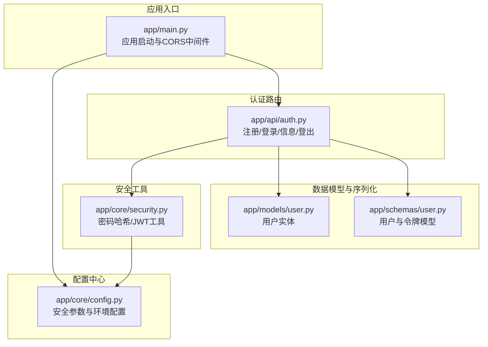
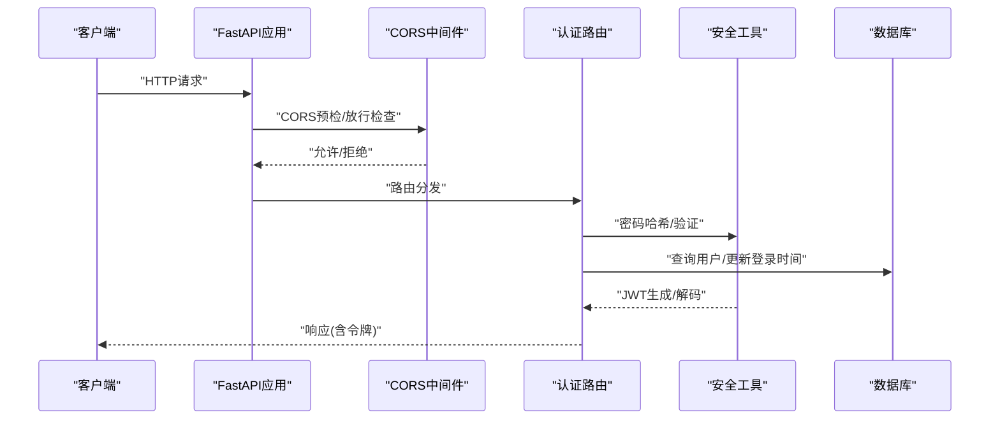
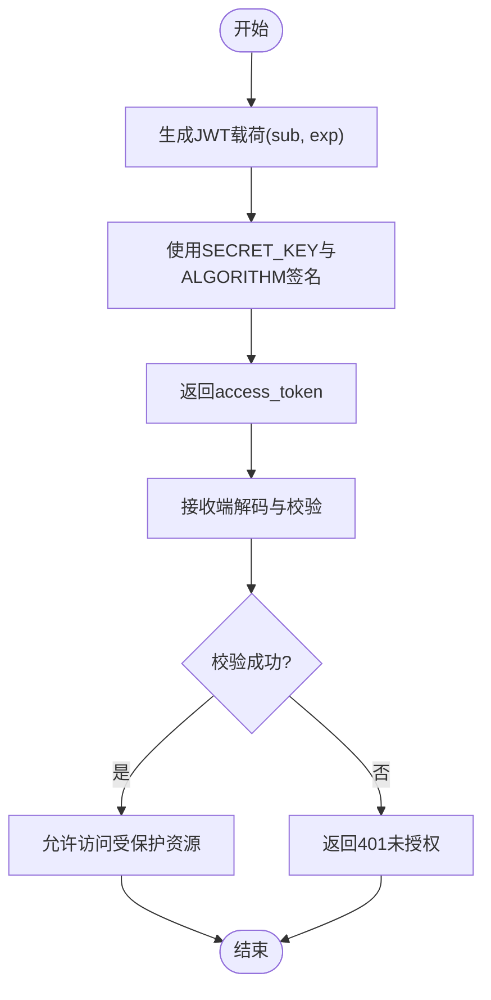
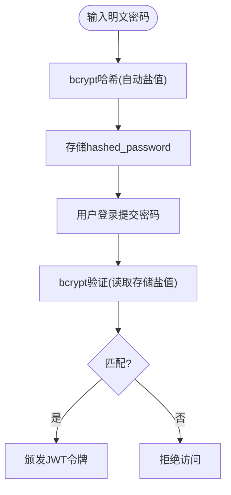
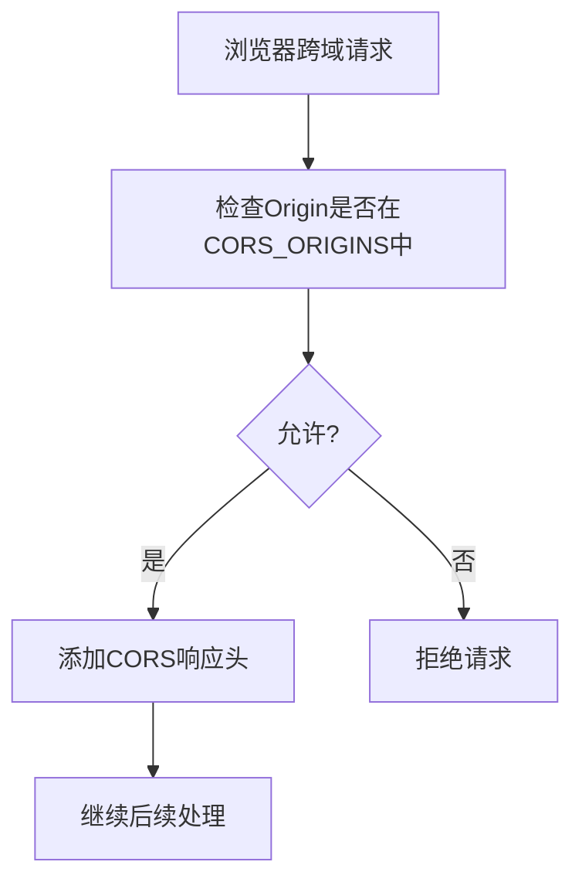
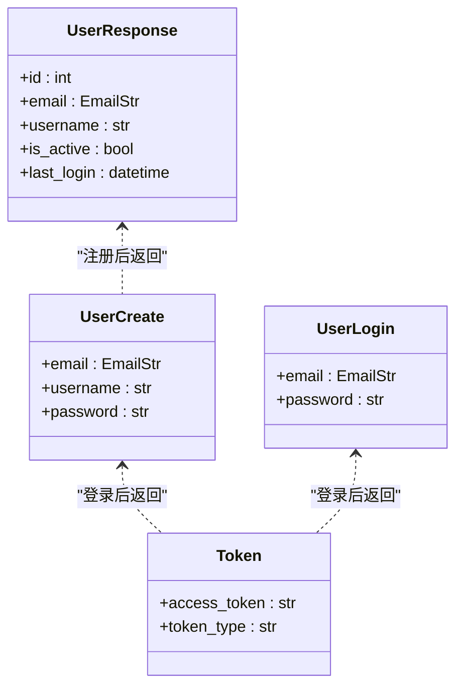
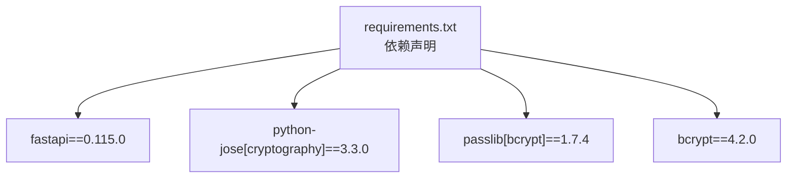

# 安全架构设计

<cite>
**本文档引用的文件**
- [backend/app/main.py](file://backend/app/main.py)
- [backend/app/core/config.py](file://backend/app/core/config.py)
- [backend/app/core/security.py](file://backend/app/core/security.py)
- [backend/app/api/auth.py](file://backend/app/api/auth.py)
- [backend/app/models/user.py](file://backend/app/models/user.py)
- [backend/app/schemas/user.py](file://backend/app/schemas/user.py)
- [backend/requirements.txt](file://backend/requirements.txt)
</cite>

## 目录
1. [引言](#引言)
2. [项目结构](#项目结构)
3. [核心组件](#核心组件)
4. [架构概览](#架构概览)
5. [详细组件分析](#详细组件分析)
6. [依赖关系分析](#依赖关系分析)
7. [性能考虑](#性能考虑)
8. [故障排除指南](#故障排除指南)
9. [结论](#结论)
10. [附录](#附录)

## 引言
本文件为Quickly项目的全面安全架构设计文档，重点阐述后端服务在认证授权、数据保护、传输安全与API防护方面的整体设计与实现。系统采用基于JWT（JSON Web Token）的无状态认证机制，结合密码学安全的哈希算法、严格的CORS配置以及完善的用户模型与数据验证层，确保从入口到数据库的全链路安全。

## 项目结构
后端采用FastAPI框架，按功能模块化组织，核心安全相关模块分布如下：
- 应用入口与中间件：应用启动、生命周期管理、CORS中间件注册
- 配置中心：集中管理密钥、算法、令牌过期时间、CORS白名单等安全参数
- 安全工具：密码哈希、JWT生成与校验、当前用户解析
- 认证路由：注册、登录、信息查询、登出接口
- 数据模型与序列化：用户实体、令牌响应模型、输入输出校验

**图表来源**
- [backend/app/main.py:1-66](file://backend/app/main.py#L1-L66)
- [backend/app/core/config.py:1-45](file://backend/app/core/config.py#L1-L45)
- [backend/app/core/security.py:1-80](file://backend/app/core/security.py#L1-L80)
- [backend/app/api/auth.py:1-99](file://backend/app/api/auth.py#L1-L99)
- [backend/app/models/user.py:1-39](file://backend/app/models/user.py#L1-L39)
- [backend/app/schemas/user.py:1-50](file://backend/app/schemas/user.py#L1-L50)

**章节来源**
- [backend/app/main.py:1-66](file://backend/app/main.py#L1-L66)
- [backend/app/core/config.py:1-45](file://backend/app/core/config.py#L1-L45)

## 核心组件
- JWT令牌认证：基于HS256算法，使用随机生成的SECRET_KEY进行签名；支持自定义过期时长，默认7天
- 密码安全：使用bcrypt哈希方案，自动处理盐值生成与验证
- CORS跨域：严格限定允许来源，支持凭据传递
- 用户模型：包含邮箱、用户名、哈希密码、激活状态、最后登录时间等字段
- 请求验证：Pydantic模型用于输入校验与序列化

**章节来源**
- [backend/app/core/security.py:19-80](file://backend/app/core/security.py#L19-L80)
- [backend/app/core/config.py:18-31](file://backend/app/core/config.py#L18-L31)
- [backend/app/models/user.py:11-32](file://backend/app/models/user.py#L11-L32)
- [backend/app/schemas/user.py:10-50](file://backend/app/schemas/user.py#L10-L50)

## 架构概览
下图展示了从客户端到后端服务的关键交互路径，以及安全控制点的分布：

**图表来源**
- [backend/app/main.py:33-40](file://backend/app/main.py#L33-L40)
- [backend/app/api/auth.py:52-86](file://backend/app/api/auth.py#L52-L86)
- [backend/app/core/security.py:23-80](file://backend/app/core/security.py#L23-L80)

## 详细组件分析

### JWT令牌认证机制
- 令牌生成：使用HS256算法，载荷包含用户标识(sub)，并设置过期时间；过期时长由配置决定
- 令牌验证：接收端通过相同密钥与算法对令牌进行解码与校验，失败则返回未授权错误
- 刷新策略：当前实现未提供专用刷新令牌接口，建议在生产环境引入短期访问令牌与长期刷新令牌的双令牌机制，并在服务器端维护刷新令牌的黑名单/白名单

**图表来源**
- [backend/app/core/security.py:33-51](file://backend/app/core/security.py#L33-L51)
- [backend/app/core/config.py:18-21](file://backend/app/core/config.py#L18-L21)

**章节来源**
- [backend/app/core/security.py:33-51](file://backend/app/core/security.py#L33-L51)
- [backend/app/core/config.py:18-21](file://backend/app/core/config.py#L18-L21)

### 密码加密与哈希
- 哈希算法：bcrypt，自动处理盐值，具备抗彩虹表与侧信道攻击能力
- 注册流程：对明文密码进行哈希后存入数据库
- 登录流程：比对输入密码与存储哈希值，成功后颁发JWT

**图表来源**
- [backend/app/core/security.py:19-30](file://backend/app/core/security.py#L19-L30)
- [backend/app/api/auth.py:34-47](file://backend/app/api/auth.py#L34-L47)
- [backend/app/api/auth.py:62-67](file://backend/app/api/auth.py#L62-L67)

**章节来源**
- [backend/app/core/security.py:19-30](file://backend/app/core/security.py#L19-L30)
- [backend/app/api/auth.py:34-47](file://backend/app/api/auth.py#L34-L47)

### CORS跨域安全配置
- 允许来源：通过配置项指定可信前端域名
- 凭据支持：允许携带Cookie/HTTP认证头
- 方法与头部：默认允许所有方法与头部，建议在生产环境细化为最小必要集

**图表来源**
- [backend/app/main.py:33-40](file://backend/app/main.py#L33-L40)
- [backend/app/core/config.py:29-30](file://backend/app/core/config.py#L29-L30)

**章节来源**
- [backend/app/main.py:33-40](file://backend/app/main.py#L33-L40)
- [backend/app/core/config.py:29-30](file://backend/app/core/config.py#L29-L30)

### CSRF防护与XSS防范
- CSRF：当前未实现专门的CSRF令牌机制。建议在需要Cookie认证的场景下引入SameSite Cookie策略、CSRF令牌与Referer/Origin校验
- XSS：建议在前端模板渲染与富文本处理时进行严格的输入过滤与输出编码；后端响应不直接拼接不可信内容

说明：当前代码库未发现专门的CSRF/XSS防护实现，建议在后续版本中补充

**章节来源**
- [backend/app/main.py:33-40](file://backend/app/main.py#L33-L40)

### API安全设计
- 请求验证：使用Pydantic模型对输入进行类型校验与约束（如邮箱格式、用户名长度、密码长度）
- 参数过滤：通过模型字段约束减少非法参数进入业务逻辑
- 访问控制：基于JWT的OAuth2 Bearer令牌进行受保护路由访问；当前未实现细粒度的RBAC

**图表来源**
- [backend/app/schemas/user.py:16-49](file://backend/app/schemas/user.py#L16-L49)

**章节来源**
- [backend/app/schemas/user.py:10-50](file://backend/app/schemas/user.py#L10-L50)

### 会话管理、令牌存储与过期处理
- 会话策略：采用无状态JWT，服务器不保存会话上下文
- 存储位置：客户端负责持久化令牌（建议使用HttpOnly、Secure、SameSite Cookie或安全存储）
- 过期处理：令牌过期后需重新登录获取新令牌；建议实现“静默续期”或“自动刷新”机制以提升用户体验

**章节来源**
- [backend/app/core/security.py:33-42](file://backend/app/core/security.py#L33-L42)
- [backend/app/core/config.py:18-21](file://backend/app/core/config.py#L18-L21)

### 安全审计、异常监控与事件响应
- 审计日志：建议记录关键安全事件（登录尝试、令牌颁发/失效、敏感操作）
- 异常监控：统一异常处理器捕获认证/授权相关错误并上报
- 事件响应：建立告警与处置流程，针对暴力破解、异常登录IP等触发响应

说明：当前代码库未包含专门的日志与监控实现，建议在后续版本中集成

## 依赖关系分析
后端安全相关依赖主要集中在认证与加密领域，确保密码与令牌处理的安全性。

**图表来源**
- [backend/requirements.txt:4-19](file://backend/requirements.txt#L4-L19)

**章节来源**
- [backend/requirements.txt:1-37](file://backend/requirements.txt#L1-L37)

## 性能考虑
- JWT负载：仅包含必要字段（如用户ID），避免过大的载荷影响网络传输与解析性能
- 密码哈希：bcrypt成本因子应根据硬件能力平衡安全与性能
- CORS范围：生产环境应缩小允许来源与方法范围，减少不必要的预检请求

## 故障排除指南
- 401未授权：检查令牌是否过期、算法与密钥是否正确、用户是否存在且激活
- 400错误：检查注册/登录请求体字段是否符合Pydantic模型约束
- CORS失败：确认前端Origin是否在CORS_ORIGINS中，且请求头/方法是否被允许

**章节来源**
- [backend/app/api/auth.py:58-78](file://backend/app/api/auth.py#L58-L78)
- [backend/app/core/security.py:59-79](file://backend/app/core/security.py#L59-L79)

## 结论
Quickly后端已实现基础而有效的安全框架：JWT认证、bcrypt密码哈希、CORS跨域控制与Pydantic输入验证。建议在生产环境中进一步完善CSRF防护、XSS防护、令牌刷新机制、安全审计与异常监控体系，以满足更严格的安全合规要求。

## 附录
- 最佳实践建议
  - 使用短期访问令牌与长期刷新令牌的双令牌模型
  - 在生产环境收紧CORS策略，限制方法与头部
  - 对高风险操作增加二次验证与操作日志
  - 定期轮换SECRET_KEY并妥善保管
- 漏洞扫描与渗透测试
  - 使用自动化工具扫描常见漏洞（SQL注入、XSS、CSRF等）
  - 手工渗透测试验证边界条件与异常路径
  - 定期进行安全代码审查与第三方依赖审计