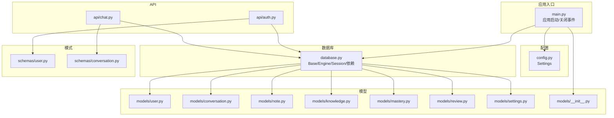
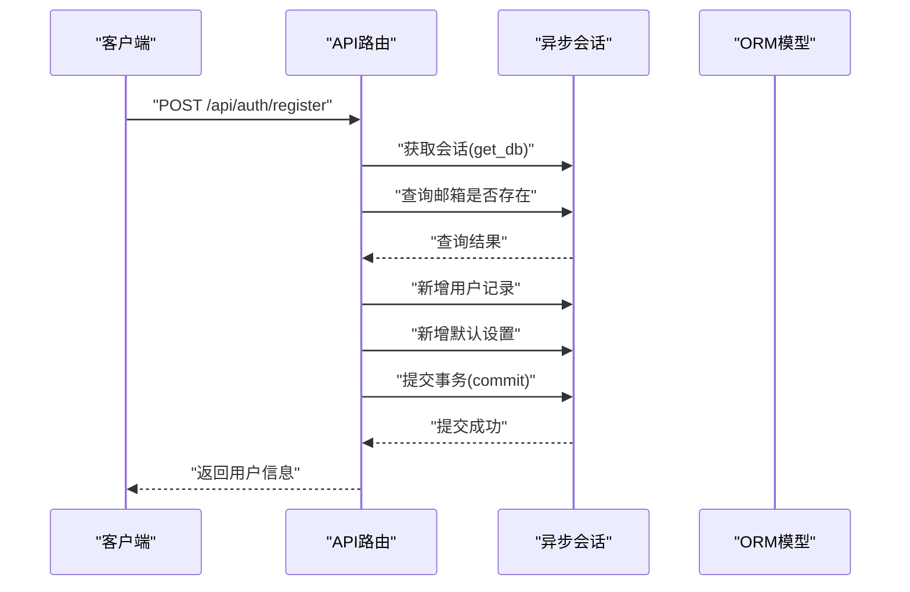
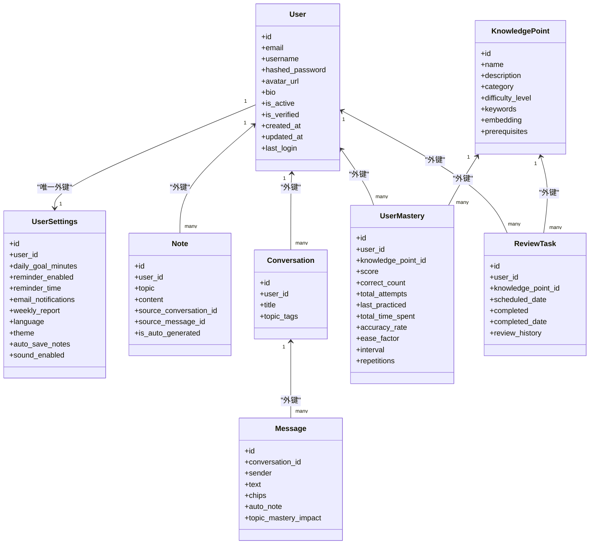
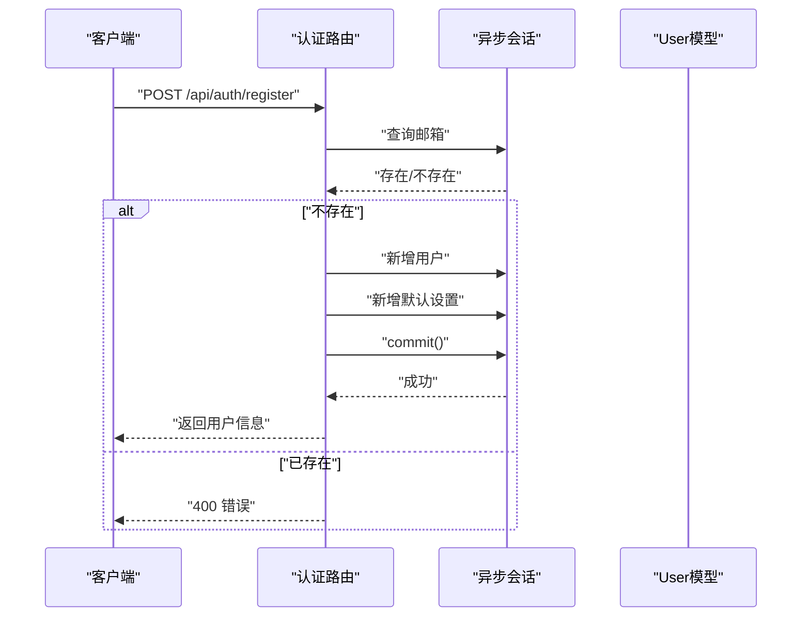
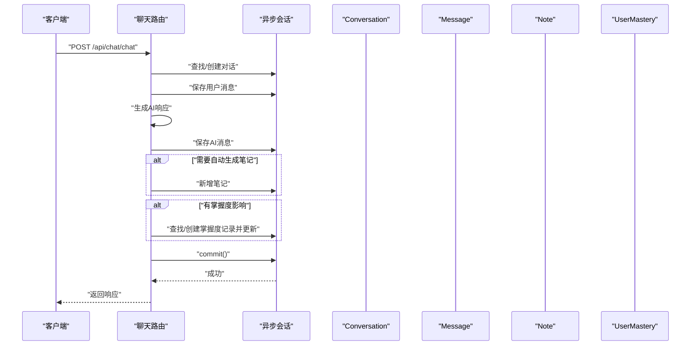
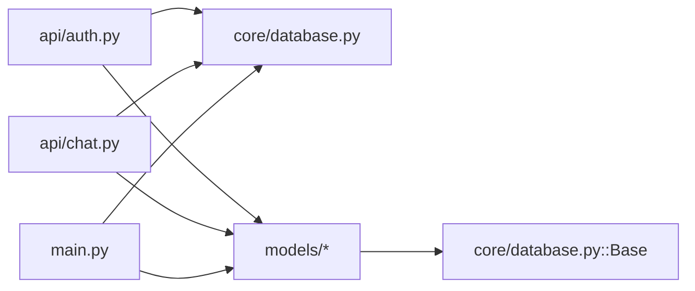

# 数据架构设计

<cite>
**本文引用的文件**
- [backend/app/core/database.py](file://backend/app/core/database.py)
- [backend/app/core/config.py](file://backend/app/core/config.py)
- [backend/app/models/__init__.py](file://backend/app/models/__init__.py)
- [backend/app/models/user.py](file://backend/app/models/user.py)
- [backend/app/models/conversation.py](file://backend/app/models/conversation.py)
- [backend/app/models/note.py](file://backend/app/models/note.py)
- [backend/app/models/knowledge.py](file://backend/app/models/knowledge.py)
- [backend/app/models/mastery.py](file://backend/app/models/mastery.py)
- [backend/app/models/review.py](file://backend/app/models/review.py)
- [backend/app/models/settings.py](file://backend/app/models/settings.py)
- [backend/app/schemas/user.py](file://backend/app/schemas/user.py)
- [backend/app/schemas/conversation.py](file://backend/app/schemas/conversation.py)
- [backend/app/api/auth.py](file://backend/app/api/auth.py)
- [backend/app/api/chat.py](file://backend/app/api/chat.py)
- [backend/app/main.py](file://backend/app/main.py)
</cite>

## 目录
1. [简介](#简介)
2. [项目结构](#项目结构)
3. [核心组件](#核心组件)
4. [架构总览](#架构总览)
5. [详细组件分析](#详细组件分析)
6. [依赖分析](#依赖分析)
7. [性能考虑](#性能考虑)
8. [故障排查指南](#故障排查指南)
9. [结论](#结论)
10. [附录](#附录)

## 简介
本文件系统化梳理Quickly项目的数据库与数据访问层设计，覆盖以下主题：
- SQLAlchemy ORM数据模型设计：实体关系映射、表结构与约束
- 异步数据库连接池与会话管理、事务处理流程
- 关系设计：一对一、一对多、多对多的实现方式
- 数据迁移策略与版本管理思路
- 数据访问层模式：依赖注入式会话、仓储模式的实践要点
- 数据安全与完整性保障
- 性能优化与索引策略

## 项目结构
后端采用FastAPI + SQLAlchemy Async的分层组织：
- 配置层：读取环境变量与应用配置
- 数据库层：异步引擎、会话工厂、生命周期钩子
- 模型层：ORM实体与关系定义
- 模式层：Pydantic输入/输出模型
- API层：路由与业务编排，使用异步会话执行数据库操作
- 应用入口：FastAPI应用与生命周期事件

图表来源
- [backend/app/main.py:15-24](file://backend/app/main.py#L15-L24)
- [backend/app/core/config.py:10-45](file://backend/app/core/config.py#L10-L45)
- [backend/app/core/database.py:10-46](file://backend/app/core/database.py#L10-L46)
- [backend/app/models/__init__.py:5-22](file://backend/app/models/__init__.py#L5-L22)
- [backend/app/api/auth.py:11-16](file://backend/app/api/auth.py#L11-L16)
- [backend/app/api/chat.py:11-19](file://backend/app/api/chat.py#L11-L19)

章节来源
- [backend/app/main.py:15-66](file://backend/app/main.py#L15-L66)
- [backend/app/core/config.py:10-45](file://backend/app/core/config.py#L10-L45)
- [backend/app/core/database.py:10-46](file://backend/app/core/database.py#L10-L46)
- [backend/app/models/__init__.py:5-22](file://backend/app/models/__init__.py#L5-L22)

## 核心组件
- 配置中心：集中管理数据库URL、调试开关、CORS等
- 数据库引擎与会话：基于SQLAlchemy Async的异步引擎、会话工厂与依赖注入
- ORM模型：用户、对话、消息、笔记、知识点、掌握度、复习任务、用户设置
- API路由：认证、聊天、笔记、知识、掌握度、复习、设置
- 生命周期：应用启动时自动建表，关闭时释放资源

章节来源
- [backend/app/core/config.py:24](file://backend/app/core/config.py#L24)
- [backend/app/core/database.py:16-36](file://backend/app/core/database.py#L16-L36)
- [backend/app/models/user.py:11-39](file://backend/app/models/user.py#L11-L39)
- [backend/app/api/auth.py:22-99](file://backend/app/api/auth.py#L22-L99)
- [backend/app/api/chat.py:78-252](file://backend/app/api/chat.py#L78-L252)
- [backend/app/main.py:19-23](file://backend/app/main.py#L19-L23)

## 架构总览
Quickly采用“异步ORM + 依赖注入”的数据访问架构：
- 使用异步引擎与会话，确保I/O密集型场景下的并发能力
- 通过依赖注入获取会话，避免全局状态，便于测试与扩展
- 在应用生命周期内统一创建数据库表，简化部署流程
- API层在事务边界内完成读写，必要时回滚或提交

图表来源
- [backend/app/api/auth.py:22-49](file://backend/app/api/auth.py#L22-L49)
- [backend/app/core/database.py:39-45](file://backend/app/core/database.py#L39-L45)

## 详细组件分析

### 数据库连接与会话管理
- 引擎配置
  - SQLite：禁用连接池参数，启用echo便于调试
  - 其他数据库（如PostgreSQL）：启用pool_pre_ping、设置pool_size与max_overflow，提升稳定性与吞吐
- 会话工厂
  - 使用async_sessionmaker创建AsyncSession，expire_on_commit=False以避免提交后属性失效
- 依赖注入
  - get_db提供异步上下文管理，确保异常时正确关闭会话

章节来源
- [backend/app/core/database.py:16-36](file://backend/app/core/database.py#L16-L36)
- [backend/app/core/database.py:39-45](file://backend/app/core/database.py#L39-L45)

### 应用生命周期与建表
- 应用启动时通过engine.begin()与Base.metadata.create_all()自动创建所有表
- 应用关闭时释放引擎资源

章节来源
- [backend/app/main.py:19-23](file://backend/app/main.py#L19-L23)

### 数据模型与实体关系

#### 用户(User)
- 字段：自增主键、唯一邮箱、用户名、密码哈希、头像、个人简介、激活/验证状态、时间戳、最后登录
- 关系：一对多到笔记、对话；一对一到设置；一对多到掌握度与复习任务；删除级联（delete-orphan）

章节来源
- [backend/app/models/user.py:11-39](file://backend/app/models/user.py#L11-L39)

#### 对话与消息(Conversation & Message)
- Conversation：自增主键、外键到用户、标题、话题标签(JSON)、时间戳
- Message：自增主键、外键到对话、发送者标识、文本内容、知识芯片(JSON)、自动生成笔记文本、掌握度影响(JSON)、时间戳
- 关系：Conversation与User为一对多；Conversation与Message为一对多；Message与Conversation为多对一

章节来源
- [backend/app/models/conversation.py:11-54](file://backend/app/models/conversation.py#L11-L54)

#### 笔记(Note)
- 字段：自增主键、外键到用户、主题、内容、来源对话与消息、是否自动生成、时间戳
- 关系：与User为一对多；可选关联到Message

章节来源
- [backend/app/models/note.py:11-35](file://backend/app/models/note.py#L11-L35)

#### 知识点(KnowledgePoint)
- 字段：自增主键、唯一名称、描述、分类、难度等级、关键词(JSON)、向量嵌入、先修关系(JSON)、时间戳
- 约束：名称唯一

章节来源
- [backend/app/models/knowledge.py:10-32](file://backend/app/models/knowledge.py#L10-L32)

#### 掌握度(UserMastery)
- 字段：自增主键、外键到用户与知识点、分数、答题统计、练习时间、准确率、SM-2算法参数、时间戳
- 关系：与User、KnowledgePoint均为多对一

章节来源
- [backend/app/models/mastery.py:11-44](file://backend/app/models/mastery.py#L11-L44)

#### 复习任务(ReviewTask)
- 字段：自增主键、外键到用户与知识点、计划复习日期、完成状态与历史、时间戳
- 关系：与User、KnowledgePoint均为多对一

章节来源
- [backend/app/models/review.py:11-35](file://backend/app/models/review.py#L11-L35)

#### 用户设置(UserSettings)
- 字段：自增主键、唯一外键到用户、学习目标、提醒设置、偏好、高级设置、时间戳
- 约束：用户唯一

章节来源
- [backend/app/models/settings.py:11-41](file://backend/app/models/settings.py#L11-L41)

#### 关系图（代码级）

图表来源
- [backend/app/models/user.py:11-39](file://backend/app/models/user.py#L11-L39)
- [backend/app/models/settings.py:11-41](file://backend/app/models/settings.py#L11-L41)
- [backend/app/models/note.py:11-35](file://backend/app/models/note.py#L11-L35)
- [backend/app/models/conversation.py:11-54](file://backend/app/models/conversation.py#L11-L54)
- [backend/app/models/knowledge.py:10-32](file://backend/app/models/knowledge.py#L10-L32)
- [backend/app/models/mastery.py:11-44](file://backend/app/models/mastery.py#L11-L44)
- [backend/app/models/review.py:11-35](file://backend/app/models/review.py#L11-L35)

### 数据访问层与事务处理

#### 认证API中的事务模式
- 注册：查询邮箱是否存在 → 新增用户 → 新增默认设置 → 提交事务 → 刷新对象
- 登录：查询用户 → 校验密码 → 更新最后登录时间 → 提交事务 → 生成令牌

图表来源
- [backend/app/api/auth.py:22-49](file://backend/app/api/auth.py#L22-L49)

章节来源
- [backend/app/api/auth.py:22-99](file://backend/app/api/auth.py#L22-L99)

#### 聊天API中的复合事务
- 查找或创建对话 → 保存用户消息 → 生成AI响应 → 保存AI消息 → 条件创建笔记 → 更新掌握度 → 提交事务

图表来源
- [backend/app/api/chat.py:78-150](file://backend/app/api/chat.py#L78-L150)
- [backend/app/api/chat.py:186-218](file://backend/app/api/chat.py#L186-L218)

章节来源
- [backend/app/api/chat.py:78-252](file://backend/app/api/chat.py#L78-L252)

### 数据模型关系设计
- 一对一：User与UserSettings（唯一外键约束）
- 一对多：User→Notes/Conversations/Masteries/ReviewTasks；Conversation→Messages
- 多对多：通过UserMastery与ReviewTask间接实现（User与KnowledgePoint的多对多）
- 级联策略：删除级联（delete-orphan）用于子实体随父实体删除而清理

章节来源
- [backend/app/models/user.py:34-38](file://backend/app/models/user.py#L34-L38)
- [backend/app/models/conversation.py:29-30](file://backend/app/models/conversation.py#L29-L30)
- [backend/app/models/mastery.py:16-17](file://backend/app/models/mastery.py#L16-L17)
- [backend/app/models/review.py:16-19](file://backend/app/models/review.py#L16-L19)
- [backend/app/models/settings.py:16](file://backend/app/models/settings.py#L16)

### 数据迁移策略与版本管理
- 当前实现：应用启动时自动建表，无需额外迁移脚本
- 建议演进：
  - 引入Alembic进行迁移管理，支持版本控制与回滚
  - 将建表逻辑从启动阶段迁移到显式迁移命令
  - 为生产环境增加迁移检查与回滚保护

章节来源
- [backend/app/main.py:19-23](file://backend/app/main.py#L19-L23)

### 数据安全与完整性
- 安全
  - 密码使用哈希存储，登录时校验
  - JWT令牌签发与过期控制
- 完整性
  - 唯一约束：用户邮箱、设置唯一
  - 外键约束：对话/消息/笔记/掌握度/复习任务指向用户与知识点
  - 级联删除：删除用户时同步清理其子实体
- 输入校验
  - Pydantic模式用于请求/响应数据的字段类型与长度约束

章节来源
- [backend/app/api/auth.py:34-47](file://backend/app/api/auth.py#L34-L47)
- [backend/app/schemas/user.py:16-24](file://backend/app/schemas/user.py#L16-L24)
- [backend/app/schemas/conversation.py:58-73](file://backend/app/schemas/conversation.py#L58-L73)

## 依赖分析
- 组件耦合
  - API层仅依赖数据库会话与模型，通过依赖注入解耦
  - 模型间通过外键建立关系，避免循环导入
- 外部依赖
  - SQLAlchemy Async、FastAPI、Pydantic Settings
- 潜在风险
  - 过度依赖单一会话上下文，需注意跨协程传递与作用域
  - SQLite在高并发下可能成为瓶颈，建议生产使用PostgreSQL

图表来源
- [backend/app/api/auth.py:11-16](file://backend/app/api/auth.py#L11-L16)
- [backend/app/api/chat.py:11-19](file://backend/app/api/chat.py#L11-L19)
- [backend/app/core/database.py:10](file://backend/app/core/database.py#L10)
- [backend/app/main.py:10](file://backend/app/main.py#L10)

章节来源
- [backend/app/api/auth.py:11-16](file://backend/app/api/auth.py#L11-L16)
- [backend/app/api/chat.py:11-19](file://backend/app/api/chat.py#L11-L19)
- [backend/app/main.py:10](file://backend/app/main.py#L10)

## 性能考虑
- 连接池
  - 非SQLite：启用pool_pre_ping、合理设置pool_size与max_overflow
  - SQLite：避免连接池参数，减少开销
- 查询优化
  - 为高频过滤字段添加索引（如用户邮箱、对话外键、消息创建时间）
  - 使用selectin加载策略减少N+1查询（如获取对话列表时预加载消息）
- 索引策略
  - 用户：邮箱唯一索引
  - 对话：user_id + updated_at
  - 消息：conversation_id + created_at
  - 掌握度：user_id + knowledge_point_id
- 批量操作
  - 合理使用flush与commit，避免单事务过大
- 缓存
  - 结合Redis缓存热点数据（如用户设置、近期对话摘要）

## 故障排查指南
- 会话生命周期
  - 确保每个请求使用独立会话，异常时及时关闭
- 事务边界
  - 将原子性要求高的操作放在同一事务内，避免部分提交
- 常见错误
  - 重复邮箱注册：捕获唯一约束冲突并返回明确错误
  - 未找到对话：校验当前用户是否拥有该对话
  - 令牌无效：检查签名算法与过期时间

章节来源
- [backend/app/core/database.py:39-45](file://backend/app/core/database.py#L39-L45)
- [backend/app/api/auth.py:25-31](file://backend/app/api/auth.py#L25-L31)
- [backend/app/api/chat.py:94-95](file://backend/app/api/chat.py#L94-L95)

## 结论
Quickly的数据架构以SQLAlchemy Async为核心，结合FastAPI依赖注入与Pydantic模式，实现了清晰的分层与良好的可维护性。当前采用启动即建表的简单策略，适合开发与演示；建议在演进至生产时引入迁移工具与更严格的事务与索引策略，以获得更高的可靠性与性能。

## 附录
- 配置项参考
  - 数据库URL：用于选择SQLite或PostgreSQL
  - 调试开关：开启SQL日志
  - CORS：允许的前端源
- 模型导出
  - models/__init__.py统一导出所有模型，便于集中管理

章节来源
- [backend/app/core/config.py:24](file://backend/app/core/config.py#L24)
- [backend/app/models/__init__.py:13-22](file://backend/app/models/__init__.py#L13-L22)