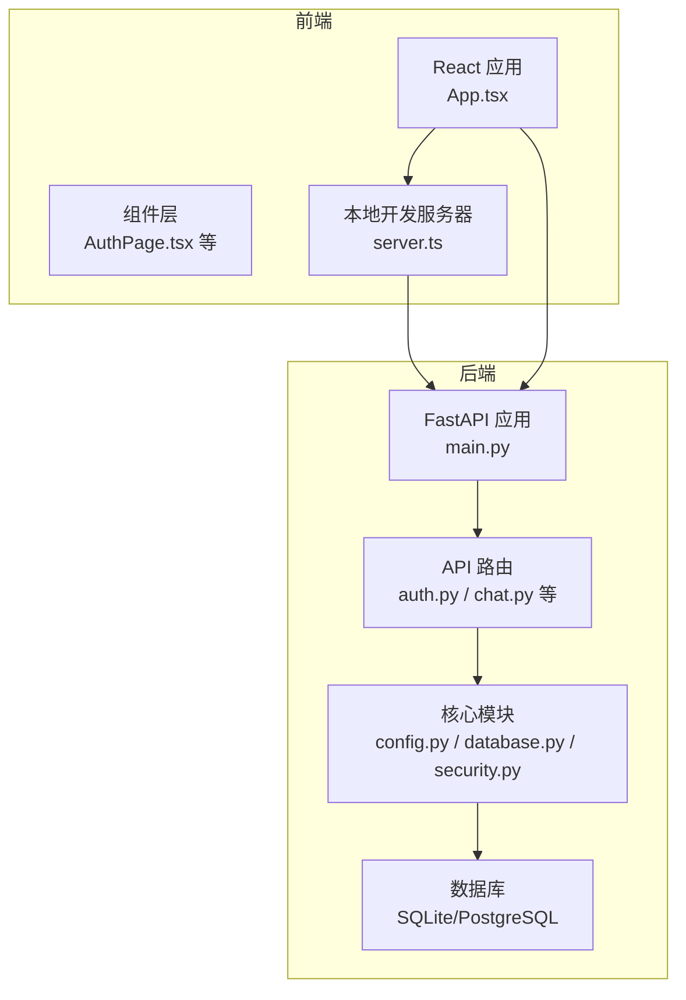
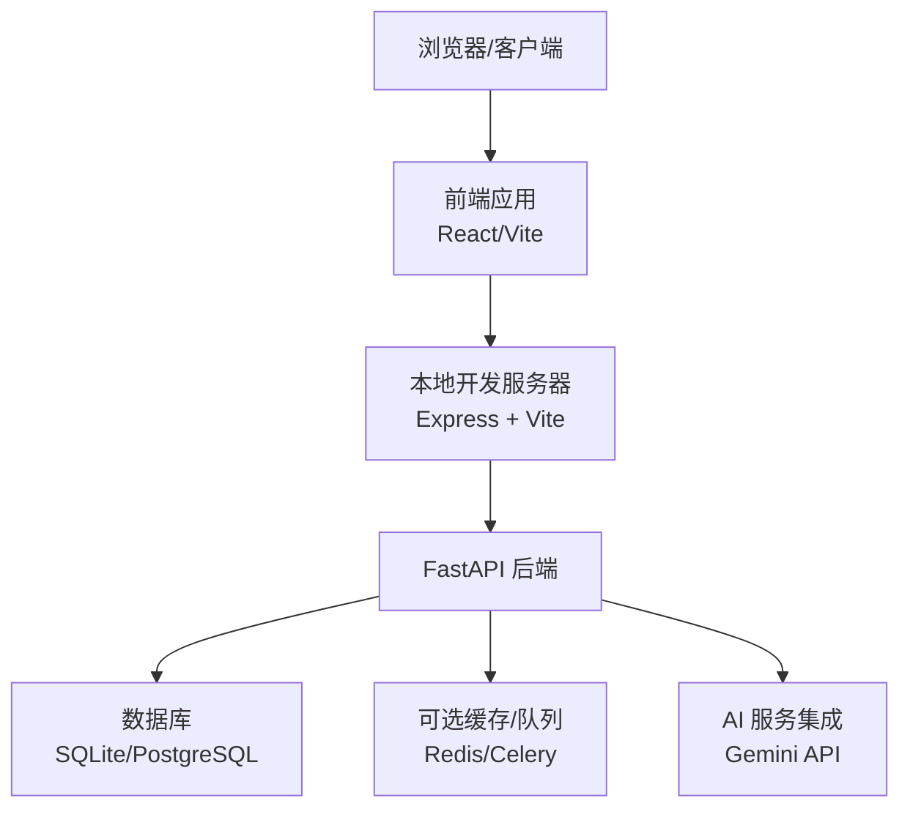
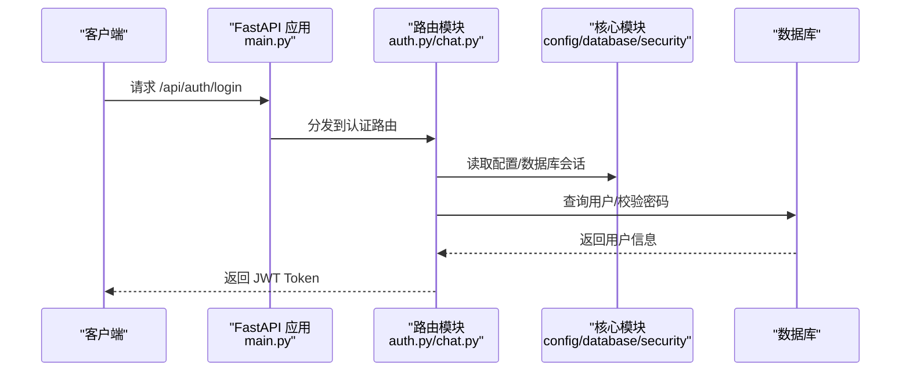
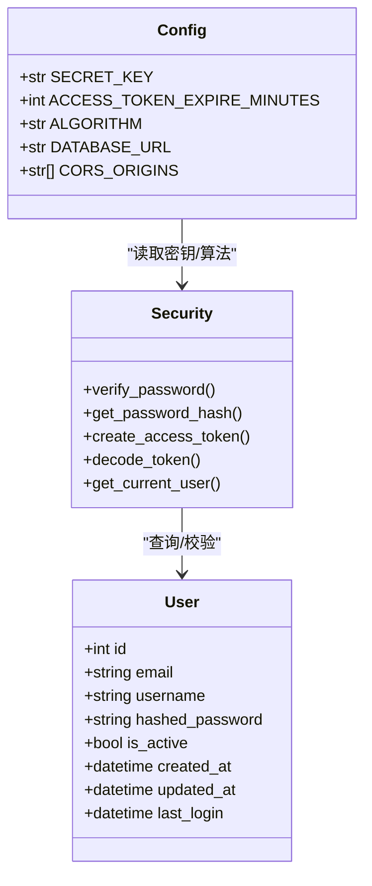
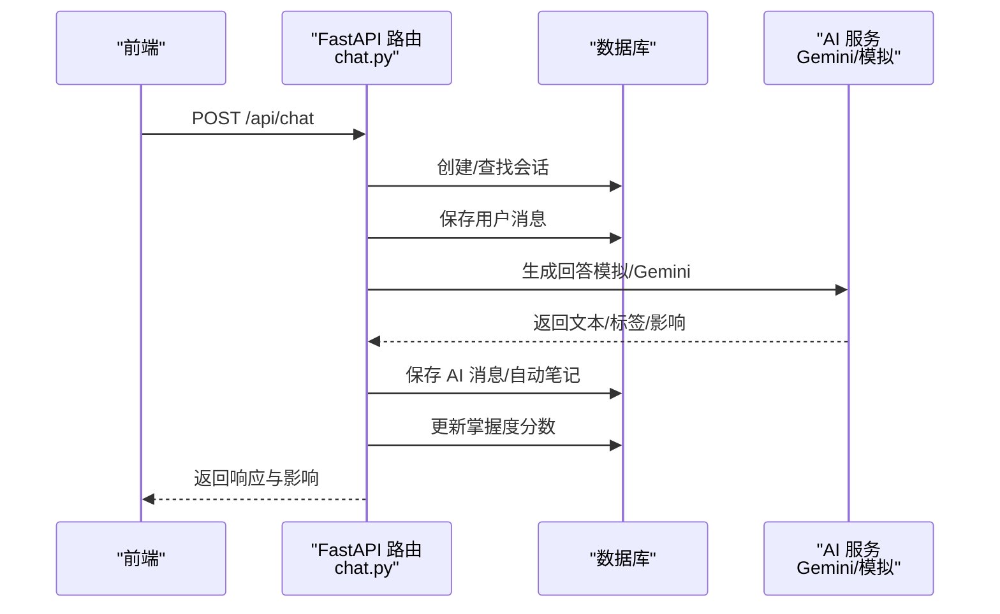
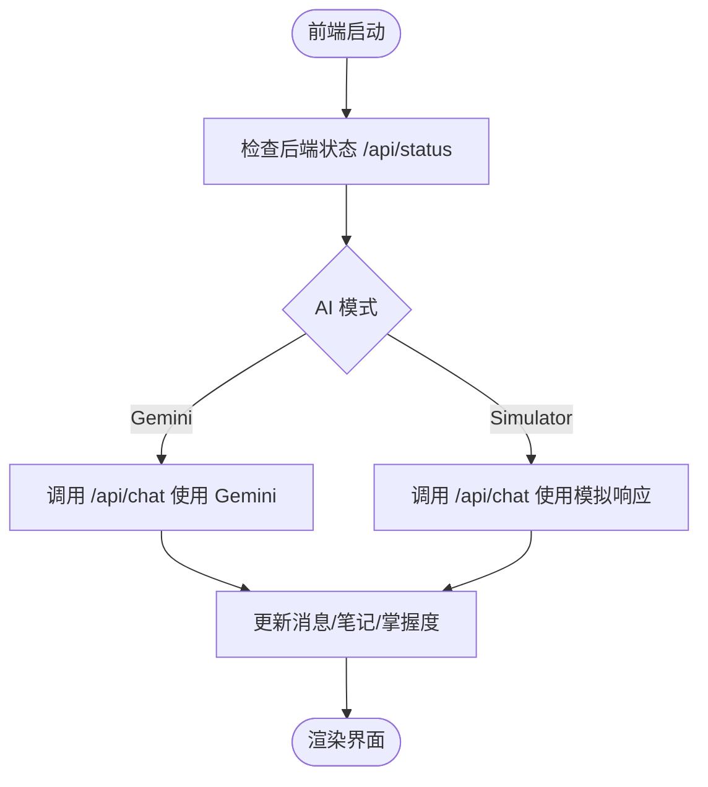
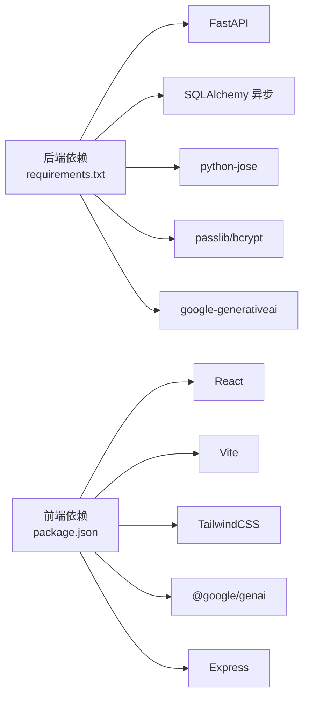

# 架构设计

<cite>
**本文引用的文件**
- [PROJECT_OVERVIEW.md](file://PROJECT_OVERVIEW.md)
- [backend/app/main.py](file://backend/app/main.py)
- [backend/app/core/config.py](file://backend/app/core/config.py)
- [backend/app/core/database.py](file://backend/app/core/database.py)
- [backend/app/core/security.py](file://backend/app/core/security.py)
- [backend/app/api/auth.py](file://backend/app/api/auth.py)
- [backend/app/api/chat.py](file://backend/app/api/chat.py)
- [backend/app/models/user.py](file://backend/app/models/user.py)
- [backend/app/schemas/user.py](file://backend/app/schemas/user.py)
- [backend/requirements.txt](file://backend/requirements.txt)
- [backend/.env.example](file://backend/.env.example)
- [front/src/App.tsx](file://front/src/App.tsx)
- [front/src/components/AuthPage.tsx](file://front/src/components/AuthPage.tsx)
- [front/src/types.ts](file://front/src/types.ts)
- [front/server.ts](file://front/server.ts)
- [front/package.json](file://front/package.json)
- [front/vite.config.ts](file://front/vite.config.ts)
</cite>

## 目录
1. [引言](#引言)
2. [项目结构](#项目结构)
3. [核心组件](#核心组件)
4. [架构总览](#架构总览)
5. [详细组件分析](#详细组件分析)
6. [依赖分析](#依赖分析)
7. [性能考量](#性能考量)
8. [故障排查指南](#故障排查指南)
9. [结论](#结论)
10. [附录](#附录)

## 引言
本文件为 Quickly 项目的架构设计文档，面向全栈分离的前后端架构，后端采用 FastAPI，前端采用 React + TypeScript + Vite。文档从系统边界、模块划分、数据流与交互协议、核心设计模式（MVC、依赖注入、异步编程）等方面，系统阐述整体架构，并给出部署拓扑与基础设施要求。

## 项目结构
Quickly 采用典型的前后端分离模式：
- 后端（Python + FastAPI）：提供 RESTful API，负责认证、聊天问答、笔记、掌握度、复习、设置等功能。
- 前端（React + TypeScript + Vite）：提供用户界面与交互，同时内置 Express 服务器用于代理与本地 AI 模拟。

图表来源
- [backend/app/main.py:1-66](file://backend/app/main.py#L1-L66)
- [backend/app/api/auth.py:1-99](file://backend/app/api/auth.py#L1-L99)
- [backend/app/api/chat.py:1-252](file://backend/app/api/chat.py#L1-L252)
- [backend/app/core/config.py:1-45](file://backend/app/core/config.py#L1-L45)
- [backend/app/core/database.py:1-46](file://backend/app/core/database.py#L1-L46)
- [backend/app/core/security.py:1-80](file://backend/app/core/security.py#L1-L80)
- [front/server.ts:1-402](file://front/server.ts#L1-L402)

章节来源
- [PROJECT_OVERVIEW.md:3-58](file://PROJECT_OVERVIEW.md#L3-L58)
- [backend/app/main.py:1-66](file://backend/app/main.py#L1-L66)
- [front/server.ts:1-402](file://front/server.ts#L1-L402)

## 核心组件
- 后端应用入口与生命周期管理：FastAPI 应用初始化、CORS 中间件、路由注册、应用生命周期事件。
- 核心配置与安全：应用配置、数据库连接、JWT 安全工具。
- API 路由：认证、聊天问答、笔记、掌握度、复习、设置等。
- 数据模型与序列化：SQLAlchemy 异步模型与 Pydantic 序列化模型。
- 前端应用与本地服务器：React 组件、类型定义、本地开发服务器与 AI 模拟。

章节来源
- [backend/app/main.py:15-66](file://backend/app/main.py#L15-L66)
- [backend/app/core/config.py:10-45](file://backend/app/core/config.py#L10-L45)
- [backend/app/core/database.py:10-46](file://backend/app/core/database.py#L10-L46)
- [backend/app/core/security.py:19-80](file://backend/app/core/security.py#L19-L80)
- [backend/app/api/auth.py:19-99](file://backend/app/api/auth.py#L19-L99)
- [backend/app/api/chat.py:22-252](file://backend/app/api/chat.py#L22-L252)
- [backend/app/models/user.py:11-39](file://backend/app/models/user.py#L11-L39)
- [backend/app/schemas/user.py:10-50](file://backend/app/schemas/user.py#L10-L50)
- [front/src/App.tsx:1-840](file://front/src/App.tsx#L1-L840)
- [front/server.ts:157-256](file://front/server.ts#L157-L256)

## 架构总览
Quickly 采用“前端单页应用 + 后端 API + 数据库”的三层架构：
- 表现层：React 应用负责 UI 渲染、状态管理与用户交互。
- 业务逻辑层：FastAPI 路由与安全中间件处理请求、校验与业务流程。
- 数据访问层：SQLAlchemy 异步 ORM 进行数据库操作，支持 SQLite 开发与 PostgreSQL 生产。

图表来源
- [backend/app/main.py:26-50](file://backend/app/main.py#L26-L50)
- [backend/app/core/config.py:26-37](file://backend/app/core/config.py#L26-L37)
- [backend/requirements.txt:13-27](file://backend/requirements.txt#L13-L27)
- [front/server.ts:157-256](file://front/server.ts#L157-L256)

## 详细组件分析

### 后端应用入口与路由组织
- 应用生命周期：通过 lifespan 在启动时创建数据库表并在关闭时释放资源。
- CORS 配置：允许前端开发端口访问。
- 路由注册：按模块划分注册认证、聊天、笔记、掌握度、复习、设置等路由。

图表来源
- [backend/app/main.py:15-50](file://backend/app/main.py#L15-L50)
- [backend/app/api/auth.py:52-99](file://backend/app/api/auth.py#L52-L99)
- [backend/app/core/config.py:10-45](file://backend/app/core/config.py#L10-L45)
- [backend/app/core/database.py:39-46](file://backend/app/core/database.py#L39-L46)

章节来源
- [backend/app/main.py:15-66](file://backend/app/main.py#L15-L66)
- [backend/app/api/auth.py:19-99](file://backend/app/api/auth.py#L19-L99)

### 认证与安全
- 密码哈希与校验：基于 bcrypt 的 passlib。
- JWT 签发与解析：HS256 算法，支持过期时间。
- OAuth2 密码流：通过依赖注入获取当前用户。
- 用户模型与关系：包含笔记、会话、掌握度、复习任务、设置等关联。

图表来源
- [backend/app/models/user.py:11-39](file://backend/app/models/user.py#L11-L39)
- [backend/app/core/security.py:23-80](file://backend/app/core/security.py#L23-L80)
- [backend/app/core/config.py:10-45](file://backend/app/core/config.py#L10-L45)

章节来源
- [backend/app/core/security.py:19-80](file://backend/app/core/security.py#L19-L80)
- [backend/app/models/user.py:11-39](file://backend/app/models/user.py#L11-L39)
- [backend/app/schemas/user.py:16-50](file://backend/app/schemas/user.py#L16-L50)

### 聊天问答与掌握度
- 聊天流程：保存用户消息 → 生成 AI 响应（模拟或 Gemini）→ 保存 AI 消息 → 自动笔记 → 更新掌握度分数。
- 掌握度影响：根据关键词匹配计算对逻辑回归、梯度下降、正则化三类指标的影响。
- 会话与消息：支持会话历史查询与消息列表查询。

图表来源
- [backend/app/api/chat.py:78-151](file://backend/app/api/chat.py#L78-L151)
- [backend/app/api/chat.py:153-184](file://backend/app/api/chat.py#L153-L184)
- [backend/app/api/chat.py:186-218](file://backend/app/api/chat.py#L186-L218)
- [backend/app/api/chat.py:220-252](file://backend/app/api/chat.py#L220-L252)

章节来源
- [backend/app/api/chat.py:22-252](file://backend/app/api/chat.py#L22-L252)
- [front/server.ts:167-256](file://front/server.ts#L167-L256)

### 前端应用与本地服务器
- 前端应用：App.tsx 管理全局状态（登录态、消息、笔记、掌握度、侧边栏与标签页），通过 fetch 调用后端 API。
- 本地开发服务器：Express + Vite，提供静态资源与代理，支持 Gemini API 集成与模拟模式切换。
- 类型定义：统一的消息、掌握度、笔记、测验题目等类型。

图表来源
- [front/src/App.tsx:108-121](file://front/src/App.tsx#L108-L121)
- [front/src/App.tsx:156-245](file://front/src/App.tsx#L156-L245)
- [front/server.ts:157-256](file://front/server.ts#L157-L256)

章节来源
- [front/src/App.tsx:1-840](file://front/src/App.tsx#L1-L840)
- [front/server.ts:157-256](file://front/server.ts#L157-L256)
- [front/src/types.ts:1-29](file://front/src/types.ts#L1-L29)

## 依赖分析
- 后端依赖：FastAPI、SQLAlchemy 异步、aiosqlite、python-jose、passlib、google-generativeai、httpx、pydantic-settings 等。
- 前端依赖：React、Vite、TailwindCSS、Lucide React、Motion、@google/genai、Express 等。
- 配置与环境：后端通过 .env.example 提供示例配置，前端通过 Vite 环境变量与本地服务器配置。

图表来源
- [backend/requirements.txt:1-37](file://backend/requirements.txt#L1-L37)
- [front/package.json:13-36](file://front/package.json#L13-L36)

章节来源
- [backend/requirements.txt:1-37](file://backend/requirements.txt#L1-L37)
- [front/package.json:13-36](file://front/package.json#L13-L36)
- [backend/.env.example:1-21](file://backend/.env.example#L1-L21)

## 性能考量
- 异步数据库：使用 SQLAlchemy 异步引擎，减少阻塞，提升并发。
- 连接池与预连接：生产环境启用 pool_pre_ping 与连接池参数，降低连接抖动。
- CORS 限制：仅允许开发端口，避免跨域风险。
- AI 集成降级：当 Gemini API 不可用时自动回退到本地模拟响应，保证服务可用性。
- 前端构建：Vite 提供快速热更新与生产构建优化。

章节来源
- [backend/app/core/database.py:16-30](file://backend/app/core/database.py#L16-L30)
- [backend/app/main.py:33-40](file://backend/app/main.py#L33-L40)
- [front/server.ts:175-181](file://front/server.ts#L175-L181)

## 故障排查指南
- 启动失败
  - 后端：确认虚拟环境与依赖安装，检查 Uvicorn 启动命令与端口占用。
  - 前端：确认 Node 版本与依赖安装，检查 Vite/Express 服务器端口。
- 认证问题
  - 检查 SECRET_KEY 与 ACCESS_TOKEN_EXPIRE_MINUTES 配置，确认 JWT 签发与校验流程。
- 数据库问题
  - 开发环境默认 SQLite，生产建议 PostgreSQL；检查 DATABASE_URL 与连接权限。
- AI 集成问题
  - 检查 GEMINI_API_KEY 是否配置，Gemini API 调用失败时会自动回退到模拟模式。
- CORS 问题
  - 确认 CORS_ORIGINS 包含前端开发端口，避免跨域错误。

章节来源
- [PROJECT_OVERVIEW.md:106-125](file://PROJECT_OVERVIEW.md#L106-L125)
- [backend/.env.example:6-21](file://backend/.env.example#L6-L21)
- [backend/app/core/config.py:29-30](file://backend/app/core/config.py#L29-L30)
- [front/server.ts:175-181](file://front/server.ts#L175-L181)

## 结论
Quickly 采用清晰的前后端分离架构：前端负责交互与状态管理，后端提供稳定的 API 与数据访问层。通过 FastAPI 的异步能力与 SQLAlchemy 的异步 ORM，系统具备良好的扩展性与性能基础。JWT 认证与 CORS 策略确保安全性，Gemini 集成与模拟模式兼顾灵活性与可用性。后续可在生产环境引入 Redis/Celery、完善 AI 模型与异步任务队列，进一步增强系统稳定性与可维护性。

## 附录
- 快速开始与 API 文档：参见项目概览中的启动步骤与端点说明。
- 环境变量：后端 .env.example 提供示例配置，前端通过 Vite 环境变量与本地服务器配置。

章节来源
- [PROJECT_OVERVIEW.md:106-142](file://PROJECT_OVERVIEW.md#L106-L142)
- [backend/.env.example:1-21](file://backend/.env.example#L1-21)