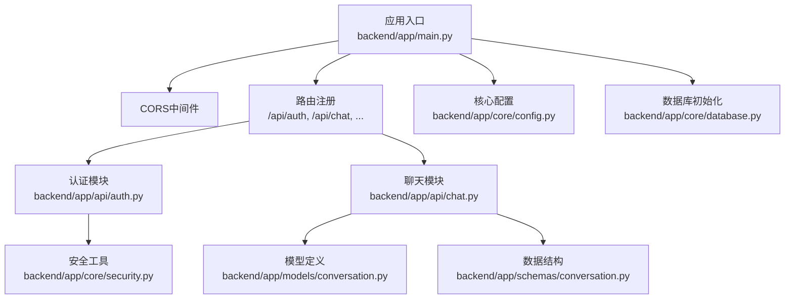
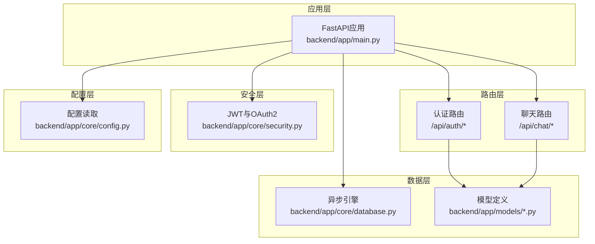
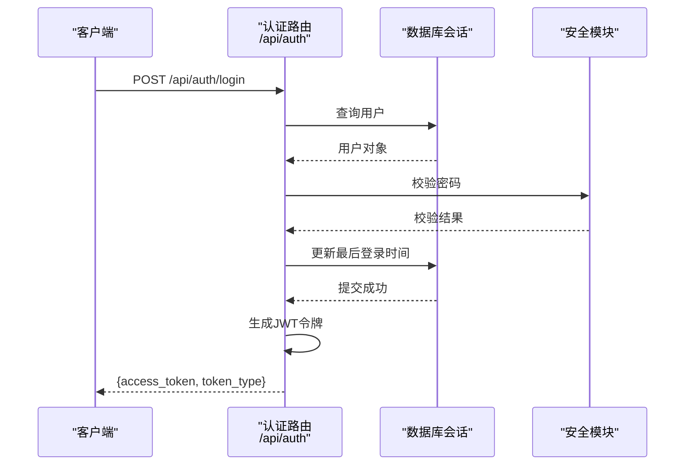
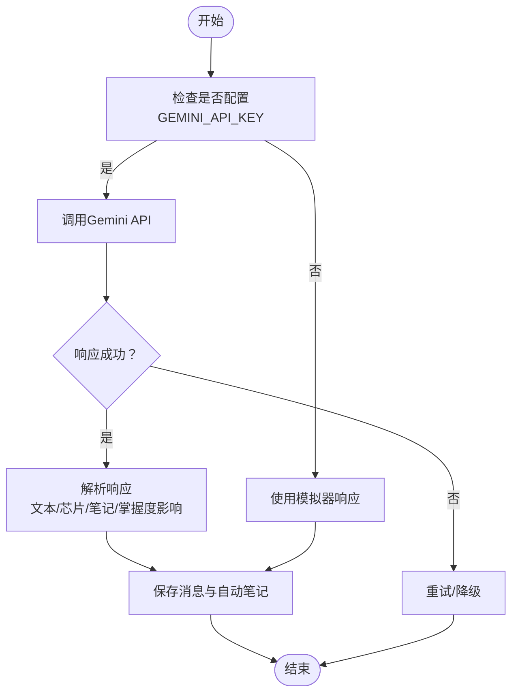
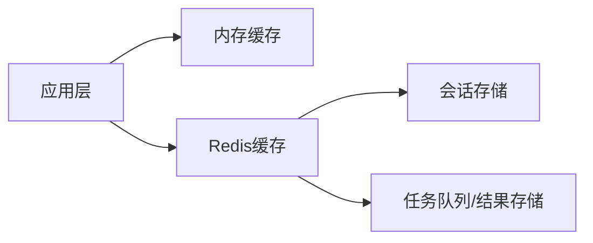
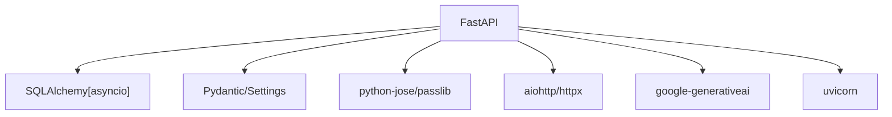

# 集成模式设计

<cite>
**本文引用的文件**
- [backend/app/main.py](file://backend/app/main.py)
- [backend/app/api/__init__.py](file://backend/app/api/__init__.py)
- [backend/app/api/auth.py](file://backend/app/api/auth.py)
- [backend/app/api/chat.py](file://backend/app/api/chat.py)
- [backend/app/core/config.py](file://backend/app/core/config.py)
- [backend/app/core/database.py](file://backend/app/core/database.py)
- [backend/app/core/security.py](file://backend/app/core/security.py)
- [backend/app/models/conversation.py](file://backend/app/models/conversation.py)
- [backend/app/schemas/conversation.py](file://backend/app/schemas/conversation.py)
- [backend/requirements.txt](file://backend/requirements.txt)
</cite>

## 目录
1. [简介](#简介)
2. [项目结构](#项目结构)
3. [核心组件](#核心组件)
4. [架构总览](#架构总览)
5. [详细组件分析](#详细组件分析)
6. [依赖分析](#依赖分析)
7. [性能考虑](#性能考虑)
8. [故障排查指南](#故障排查指南)
9. [结论](#结论)
10. [附录](#附录)

## 简介
本设计文档面向Quickly项目的集成模式，聚焦后端与前端的通信协议、认证与授权、数据库与缓存、AI服务集成策略、第三方服务最佳实践、以及监控与日志记录。文档基于现有代码库进行系统化梳理，提供可操作的架构说明、流程图示与排障建议，帮助开发者与运维人员快速理解并扩展系统。

## 项目结构
后端采用FastAPI框架，按功能模块组织API路由，并通过依赖注入管理数据库会话与用户认证。核心模块包括：
- 应用入口与生命周期：应用启动创建数据库表，关闭时释放资源
- API路由：认证、聊天、笔记、知识、掌握度、复习、设置等
- 核心配置：应用名称、调试开关、密钥、数据库、Redis、CORS、AI与任务队列配置
- 安全：密码哈希、JWT令牌签发与校验、OAuth2密码流
- 数据层：异步SQLAlchemy引擎、会话工厂、基础模型定义
- 前后端通信：CORS允许跨域访问；聊天接口支持对话历史查询

图表来源
- [backend/app/main.py:26-49](file://backend/app/main.py#L26-L49)
- [backend/app/api/auth.py:19-99](file://backend/app/api/auth.py#L19-L99)
- [backend/app/api/chat.py:22-252](file://backend/app/api/chat.py#L22-L252)
- [backend/app/core/config.py:10-45](file://backend/app/core/config.py#L10-L45)
- [backend/app/core/database.py:15-46](file://backend/app/core/database.py#L15-L46)
- [backend/app/core/security.py:19-80](file://backend/app/core/security.py#L19-L80)
- [backend/app/models/conversation.py:11-54](file://backend/app/models/conversation.py#L11-L54)
- [backend/app/schemas/conversation.py:11-73](file://backend/app/schemas/conversation.py#L11-L73)

章节来源
- [backend/app/main.py:15-66](file://backend/app/main.py#L15-L66)
- [backend/app/api/__init__.py:5-8](file://backend/app/api/__init__.py#L5-L8)

## 核心组件
- 应用入口与生命周期：通过lifespan事件在启动时创建数据库表，在关闭时释放连接
- 路由与中间件：统一前缀/api，标签化分组；启用CORS允许前端域名访问
- 认证与授权：基于OAuth2密码流，JWT令牌签发与校验，当前用户解析
- 数据库与会话：异步SQLAlchemy引擎，SQLite/PostgreSQL差异化配置，会话工厂与依赖注入
- 聊天与对话：支持新对话与续聊，保存用户消息与AI回复，自动创建笔记与更新掌握度
- 配置中心：从.env加载配置，包含数据库、Redis、CORS、AI与Celery参数

章节来源
- [backend/app/main.py:15-66](file://backend/app/main.py#L15-L66)
- [backend/app/core/config.py:10-45](file://backend/app/core/config.py#L10-L45)
- [backend/app/core/database.py:15-46](file://backend/app/core/database.py#L15-L46)
- [backend/app/api/chat.py:78-151](file://backend/app/api/chat.py#L78-L151)

## 架构总览
下图展示Quickly后端的整体架构：应用入口负责生命周期与中间件，路由模块承载业务API，安全模块提供认证能力，数据库模块提供持久化，配置模块集中管理外部依赖参数。

图表来源
- [backend/app/main.py:26-49](file://backend/app/main.py#L26-L49)
- [backend/app/api/auth.py:19-99](file://backend/app/api/auth.py#L19-L99)
- [backend/app/api/chat.py:22-252](file://backend/app/api/chat.py#L22-L252)
- [backend/app/core/security.py:19-80](file://backend/app/core/security.py#L19-L80)
- [backend/app/core/database.py:15-46](file://backend/app/core/database.py#L15-L46)
- [backend/app/core/config.py:10-45](file://backend/app/core/config.py#L10-L45)

## 详细组件分析

### RESTful API 设计与错误处理
- 路由前缀与标签：所有API以/api为前缀，按功能模块打上标签，便于OpenAPI文档与客户端识别
- 认证接口：登录采用OAuth2密码流，返回JWT令牌；注册检查邮箱唯一性；当前用户信息与登出接口
- 错误响应：使用HTTP状态码表达语义，如400用于重复注册或未激活用户，401用于凭据无效，404用于资源不存在
- 响应模型：Pydantic模型定义请求与响应结构，确保序列化一致性与类型安全

图表来源
- [backend/app/api/auth.py:52-87](file://backend/app/api/auth.py#L52-L87)
- [backend/app/core/security.py:54-80](file://backend/app/core/security.py#L54-L80)
- [backend/app/core/database.py:39-46](file://backend/app/core/database.py#L39-L46)

章节来源
- [backend/app/api/auth.py:22-99](file://backend/app/api/auth.py#L22-L99)
- [backend/app/api/chat.py:220-252](file://backend/app/api/chat.py#L220-L252)

### WebSocket 实时通信（现状与扩展建议）
- 现状：后端未实现WebSocket服务端；前端存在依赖但未见具体实现文件
- 扩展建议（概念性）：
  - 使用FastAPI的WebSocket路由，建立连接后鉴权并绑定用户上下文
  - 维护用户到连接的映射，支持一对一或房间广播
  - 实现心跳保活与断线重连策略（指数退避、最大重试次数）
  - 对消息进行幂等处理与去重，避免重复推送

[本节为概念性说明，不直接分析具体文件，故无章节来源]

### AI服务集成模式（Gemini）
- 当前实现：聊天接口在无GEMINI_API_KEY时进入模拟器模式，返回预设模板与知识点芯片、自动笔记与掌握度影响
- 集成策略（概念性）：
  - 在配置中读取GEMINI_API_KEY，根据是否存在切换“模拟器”或“Gemini”模式
  - 使用异步HTTP客户端调用Gemini API，设置合理超时与重试
  - 解析响应结构，提取文本、知识芯片、自动笔记与掌握度影响
  - 异常处理：网络错误、API限流、无效响应等场景的降级与重试
- 数据落库：将AI回复写入消息表，必要字段（如chips、auto_note、topic_mastery_impact）需与后端模型一致

图表来源
- [backend/app/main.py:58-66](file://backend/app/main.py#L58-L66)
- [backend/app/api/chat.py:153-174](file://backend/app/api/chat.py#L153-L174)
- [backend/app/core/config.py:33](file://backend/app/core/config.py#L33)

章节来源
- [backend/app/main.py:58-66](file://backend/app/main.py#L58-L66)
- [backend/app/api/chat.py:24-68](file://backend/app/api/chat.py#L24-L68)

### 第三方服务集成最佳实践
- API密钥管理：从环境变量读取，避免硬编码；生产环境建议使用密钥管理服务
- 速率限制：在调用Gemini等外部API时实施本地或全局限速，避免触发平台限流
- 超时与重试：设置请求超时与指数退避重试，区分可重试错误与不可重试错误
- 安全传输：使用HTTPS与TLS，避免明文传输敏感数据

章节来源
- [backend/app/core/config.py:33](file://backend/app/core/config.py#L33)
- [backend/requirements.txt:22-23](file://backend/requirements.txt#L22-L23)

### 缓存策略设计
- 内存缓存：适用于短期热点数据，如用户会话元信息、轻量查询结果
- 分布式缓存：推荐Redis，用于共享会话、排行榜、全局配置与跨实例状态
- 缓存失效：基于TTL与主动失效策略；对关键数据采用写后失效或版本号机制
- 当前依赖：已引入Redis与Celery相关依赖，可在配置中启用

图表来源
- [backend/app/core/config.py:26-37](file://backend/app/core/config.py#L26-L37)
- [backend/requirements.txt:14](file://backend/requirements.txt#L14)
- [backend/requirements.txt:25-27](file://backend/requirements.txt#L25-L27)

章节来源
- [backend/app/core/config.py:26-37](file://backend/app/core/config.py#L26-L37)
- [backend/requirements.txt:14](file://backend/requirements.txt#L14)
- [backend/requirements.txt:25-27](file://backend/requirements.txt#L25-L27)

### 监控与日志记录
- 性能指标：建议采集请求延迟、吞吐量、错误率、数据库连接池使用率、Redis命中率
- 日志规范：区分请求日志、业务日志与错误日志；记录关键操作与异常堆栈
- 追踪链路：为每个请求分配Trace ID，贯穿认证、路由、数据库与外部调用
- 报警阈值：针对错误率、P95/P99延迟、数据库连接池耗尽等设定阈值

[本节为通用指导，不直接分析具体文件，故无章节来源]

## 依赖分析
后端依赖以FastAPI为核心，围绕数据库、认证、序列化与AI集成展开；部分缓存与任务队列依赖处于可选状态，便于按环境启用。

图表来源
- [backend/requirements.txt:4-37](file://backend/requirements.txt#L4-L37)

章节来源
- [backend/requirements.txt:4-37](file://backend/requirements.txt#L4-L37)

## 性能考虑
- 数据库：SQLite适合开发测试，生产建议PostgreSQL并启用pool_pre_ping、合理pool_size与max_overflow
- 异步I/O：使用异步SQLAlchemy与异步HTTP客户端，减少阻塞
- 缓存：对高频查询与计算结果进行缓存，结合TTL与失效策略
- 并发：合理设置Uvicorn工作进程数与并发，避免CPU与IO瓶颈
- 限流与熔断：对外部API调用实施限流与熔断，防止雪崩效应

章节来源
- [backend/app/core/database.py:16-30](file://backend/app/core/database.py#L16-L30)
- [backend/requirements.txt:22-23](file://backend/requirements.txt#L22-L23)

## 故障排查指南
- 认证失败：检查JWT密钥、算法与过期时间；确认OAuth2密码流参数正确
- 数据库连接：核对DATABASE_URL与驱动；SQLite无需池参数，其他数据库需设置池参数
- CORS问题：确认CORS_ORIGINS包含前端域名，允许方法与头
- AI集成：检查GEMINI_API_KEY是否配置；观察模拟器与真实模式切换
- 会话与依赖：确认依赖注入get_db在路由中正确使用，避免会话泄漏

章节来源
- [backend/app/core/security.py:33-52](file://backend/app/core/security.py#L33-L52)
- [backend/app/core/database.py:15-46](file://backend/app/core/database.py#L15-L46)
- [backend/app/core/config.py:29-30](file://backend/app/core/config.py#L29-L30)
- [backend/app/main.py:58-66](file://backend/app/main.py#L58-L66)

## 结论
Quickly后端以FastAPI为基础，构建了清晰的模块化架构：认证与授权、数据库与模型、配置与中间件协同工作。聊天模块当前采用模拟器模式，具备无缝接入Gemini的能力；未来可通过配置切换与增强错误处理实现稳定生产集成。建议尽快补齐WebSocket实时通信、完善缓存与监控体系，并在生产环境启用Redis与Celery以提升可扩展性与可靠性。

## 附录
- OpenAPI文档：应用启动后可通过默认路由查看自动生成的API文档
- 健康检查：根路径与/api/status提供服务健康与运行模式信息

章节来源
- [backend/app/main.py:52-66](file://backend/app/main.py#L52-L66)