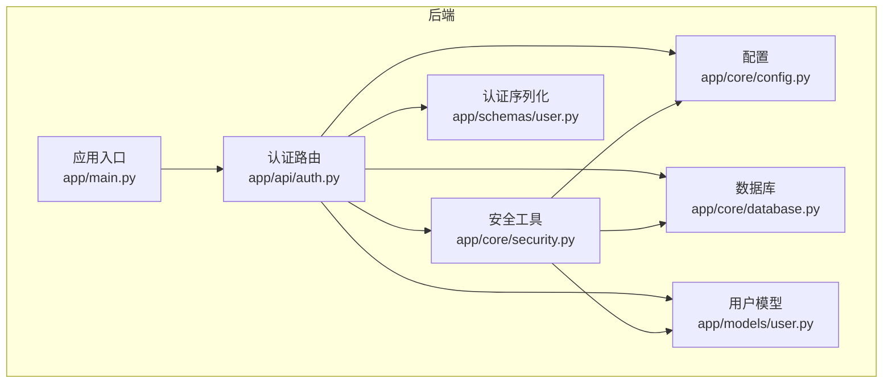
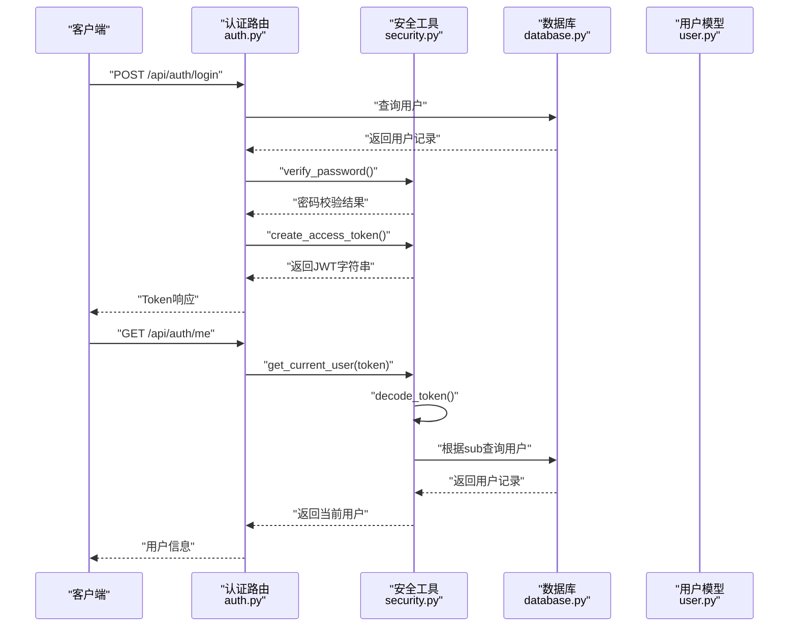
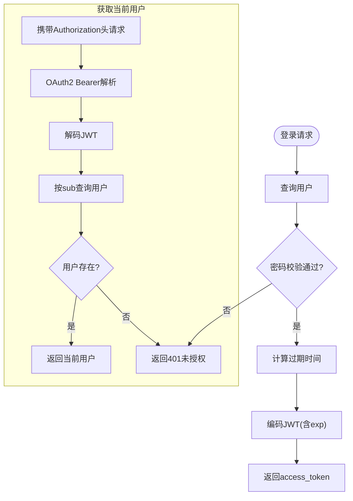
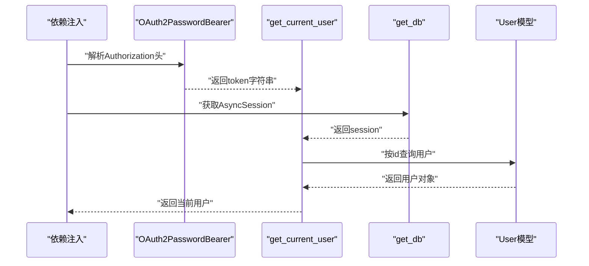
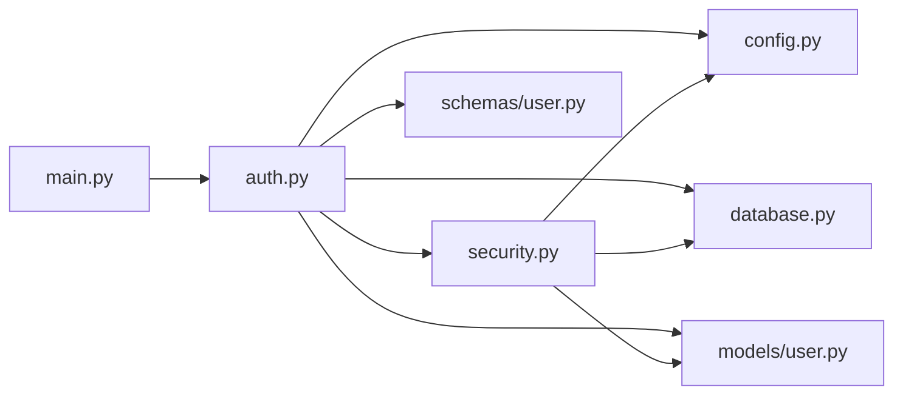

# JWT令牌认证

<cite>
**本文引用的文件**
- [backend/app/api/auth.py](file://backend/app/api/auth.py)
- [backend/app/core/security.py](file://backend/app/core/security.py)
- [backend/app/core/config.py](file://backend/app/core/config.py)
- [backend/app/models/user.py](file://backend/app/models/user.py)
- [backend/app/schemas/user.py](file://backend/app/schemas/user.py)
- [backend/app/main.py](file://backend/app/main.py)
- [backend/app/core/database.py](file://backend/app/core/database.py)
- [backend/README.md](file://backend/README.md)
- [front/src/components/AuthPage.tsx](file://front/src/components/AuthPage.tsx)
</cite>

## 目录
1. [引言](#引言)
2. [项目结构](#项目结构)
3. [核心组件](#核心组件)
4. [架构总览](#架构总览)
5. [详细组件分析](#详细组件分析)
6. [依赖关系分析](#依赖关系分析)
7. [性能考量](#性能考量)
8. [故障排查指南](#故障排查指南)
9. [结论](#结论)
10. [附录](#附录)

## 引言
本文件面向Quickly项目的JWT令牌认证系统，提供从设计到实现的完整技术说明。内容涵盖JWT令牌的生成、验证与依赖注入流程；访问令牌的生命周期管理（过期时间、刷新策略）；FastAPI中依赖注入在认证中的应用；访问令牌与刷新令牌的区别与使用场景；HTTP头部传递方式与客户端处理策略；以及安全最佳实践与常见攻击防护。

## 项目结构
后端采用FastAPI + SQLAlchemy异步ORM + python-jose进行JWT处理。认证相关代码集中在以下模块：
- 路由层：认证接口定义于认证路由模块
- 核心安全：密码哈希、JWT生成/解码、OAuth2 Bearer方案、当前用户解析
- 配置：密钥、算法、过期时间等安全参数
- 数据模型与序列化：用户模型与认证响应模型
- 应用入口：路由挂载、CORS中间件、数据库初始化

图示来源
- [backend/app/main.py:1-66](file://backend/app/main.py#L1-L66)
- [backend/app/api/auth.py:1-99](file://backend/app/api/auth.py#L1-L99)
- [backend/app/core/security.py:1-80](file://backend/app/core/security.py#L1-L80)
- [backend/app/core/config.py:1-45](file://backend/app/core/config.py#L1-L45)
- [backend/app/core/database.py:1-46](file://backend/app/core/database.py#L1-L46)
- [backend/app/models/user.py:1-39](file://backend/app/models/user.py#L1-L39)
- [backend/app/schemas/user.py:1-50](file://backend/app/schemas/user.py#L1-L50)

章节来源
- [backend/app/main.py:1-66](file://backend/app/main.py#L1-L66)
- [backend/README.md:1-75](file://backend/README.md#L1-L75)

## 核心组件
- 认证路由模块：提供注册、登录、获取当前用户、登出等端点
- 安全工具模块：密码哈希/校验、JWT生成/解码、OAuth2 Bearer方案、当前用户解析
- 配置模块：密钥、算法、访问令牌过期时间、CORS等
- 数据库与会话：异步引擎、会话工厂、依赖注入
- 用户模型与认证序列化：用户表结构、Token与User响应模型

章节来源
- [backend/app/api/auth.py:1-99](file://backend/app/api/auth.py#L1-L99)
- [backend/app/core/security.py:1-80](file://backend/app/core/security.py#L1-L80)
- [backend/app/core/config.py:1-45](file://backend/app/core/config.py#L1-L45)
- [backend/app/core/database.py:1-46](file://backend/app/core/database.py#L1-L46)
- [backend/app/models/user.py:1-39](file://backend/app/models/user.py#L1-L39)
- [backend/app/schemas/user.py:1-50](file://backend/app/schemas/user.py#L1-L50)

## 架构总览
下图展示了认证请求从客户端到数据库的完整调用链，以及依赖注入如何贯穿其中。

图示来源
- [backend/app/api/auth.py:52-98](file://backend/app/api/auth.py#L52-L98)
- [backend/app/core/security.py:23-79](file://backend/app/core/security.py#L23-L79)
- [backend/app/core/database.py:39-45](file://backend/app/core/database.py#L39-L45)
- [backend/app/models/user.py:11-39](file://backend/app/models/user.py#L11-L39)

## 详细组件分析

### JWT生成与验证流程
- 登录时生成访问令牌：路由层接收表单数据，校验用户与密码后，基于配置的过期时间生成JWT
- 当前用户解析：通过OAuth2 Bearer方案提取Authorization头中的Bearer令牌，解码并从数据库加载用户

图示来源
- [backend/app/api/auth.py:52-86](file://backend/app/api/auth.py#L52-L86)
- [backend/app/core/security.py:33-51](file://backend/app/core/security.py#L33-L51)
- [backend/app/core/security.py:54-79](file://backend/app/core/security.py#L54-L79)

章节来源
- [backend/app/api/auth.py:52-86](file://backend/app/api/auth.py#L52-L86)
- [backend/app/core/security.py:33-51](file://backend/app/core/security.py#L33-L51)
- [backend/app/core/security.py:54-79](file://backend/app/core/security.py#L54-L79)

### 依赖注入与认证流程
- OAuth2PasswordBearer：定义tokenUrl，自动从Authorization头解析Bearer令牌
- get_current_user：依赖注入获取token与数据库会话，解码payload并加载用户
- get_db：异步会话依赖，确保每个请求有独立会话

图示来源
- [backend/app/core/security.py:20](file://backend/app/core/security.py#L20)
- [backend/app/core/security.py:54-79](file://backend/app/core/security.py#L54-L79)
- [backend/app/core/database.py:39-45](file://backend/app/core/database.py#L39-L45)

章节来源
- [backend/app/core/security.py:20](file://backend/app/core/security.py#L20)
- [backend/app/core/security.py:54-79](file://backend/app/core/security.py#L54-L79)
- [backend/app/core/database.py:39-45](file://backend/app/core/database.py#L39-L45)

### 访问令牌与刷新令牌
- 访问令牌：用于保护受保护资源，短期有效，通常在请求头中携带
- 刷新令牌：用于在访问令牌过期后换取新的访问令牌，通常长期有效且更严格的安全控制
- 当前实现：仅实现了访问令牌生成与验证，未实现刷新令牌机制

章节来源
- [backend/app/api/auth.py:81-84](file://backend/app/api/auth.py#L81-L84)
- [backend/app/core/security.py:33-42](file://backend/app/core/security.py#L33-L42)

### 令牌生命周期管理
- 过期时间：由配置项决定，默认约7天；登录成功后生成的令牌带有exp声明
- 刷新策略：当前未实现刷新令牌；建议引入刷新令牌表、黑名单机制与短期访问令牌配合

章节来源
- [backend/app/core/config.py:18-21](file://backend/app/core/config.py#L18-L21)
- [backend/app/api/auth.py:81-84](file://backend/app/api/auth.py#L81-L84)
- [backend/app/core/security.py:33-42](file://backend/app/core/security.py#L33-L42)

### HTTP头部传递与客户端处理
- 传递方式：Authorization: Bearer <access_token>
- 客户端策略：建议将令牌存储在安全的HttpOnly Cookie或内存状态中，避免localStorage泄露；每次请求自动附加令牌头；捕获401错误后引导用户重新登录并清理本地存储

章节来源
- [backend/app/core/security.py:20](file://backend/app/core/security.py#L20)
- [backend/app/api/auth.py:81-86](file://backend/app/api/auth.py#L81-L86)

### 错误处理与安全考虑
- 401未授权：凭据无效或令牌解码失败时返回
- 400错误：邮箱已存在、密码长度不足、用户非活跃等
- 安全要点：使用强随机密钥、HS256算法、HTTPS传输、短令牌有效期、避免在URL中传递令牌、防止XSS与CSRF

章节来源
- [backend/app/api/auth.py:25-31](file://backend/app/api/auth.py#L25-L31)
- [backend/app/api/auth.py:62-73](file://backend/app/api/auth.py#L62-L73)
- [backend/app/core/security.py:59-67](file://backend/app/core/security.py#L59-L67)
- [backend/app/core/config.py:18-21](file://backend/app/core/config.py#L18-L21)

## 依赖关系分析
- 认证路由依赖安全工具与数据库会话
- 安全工具依赖配置与数据库
- 应用入口负责挂载路由与中间件

图示来源
- [backend/app/api/auth.py:1-99](file://backend/app/api/auth.py#L1-L99)
- [backend/app/core/security.py:1-80](file://backend/app/core/security.py#L1-L80)
- [backend/app/core/config.py:1-45](file://backend/app/core/config.py#L1-L45)
- [backend/app/core/database.py:1-46](file://backend/app/core/database.py#L1-L46)
- [backend/app/models/user.py:1-39](file://backend/app/models/user.py#L1-L39)
- [backend/app/schemas/user.py:1-50](file://backend/app/schemas/user.py#L1-L50)
- [backend/app/main.py:1-66](file://backend/app/main.py#L1-L66)

章节来源
- [backend/app/api/auth.py:1-99](file://backend/app/api/auth.py#L1-L99)
- [backend/app/core/security.py:1-80](file://backend/app/core/security.py#L1-L80)
- [backend/app/core/config.py:1-45](file://backend/app/core/config.py#L1-L45)
- [backend/app/core/database.py:1-46](file://backend/app/core/database.py#L1-L46)
- [backend/app/models/user.py:1-39](file://backend/app/models/user.py#L1-L39)
- [backend/app/schemas/user.py:1-50](file://backend/app/schemas/user.py#L1-L50)
- [backend/app/main.py:1-66](file://backend/app/main.py#L1-L66)

## 性能考量
- 异步数据库：使用SQLAlchemy异步引擎与会话，减少I/O阻塞
- 令牌解码：轻量级操作，主要开销在数据库查询
- 建议：对频繁认证的端点启用缓存（如Redis），但需注意令牌撤销与黑名单

章节来源
- [backend/app/core/database.py:16-36](file://backend/app/core/database.py#L16-L36)
- [backend/app/core/security.py:45-51](file://backend/app/core/security.py#L45-L51)

## 故障排查指南
- 401未授权
  - 检查Authorization头格式是否为Bearer
  - 确认令牌未过期、算法与密钥匹配
  - 核对用户是否存在且状态正常
- 400错误
  - 注册邮箱重复、密码长度不足
  - 登录时用户非活跃
- 常见问题
  - 令牌泄露：避免存储在localStorage；优先使用HttpOnly Cookie
  - CORS跨域：确认允许凭证与正确源
  - 本地开发：确保HTTPS或使用受支持的开发证书

章节来源
- [backend/app/api/auth.py:25-31](file://backend/app/api/auth.py#L25-L31)
- [backend/app/api/auth.py:62-73](file://backend/app/api/auth.py#L62-L73)
- [backend/app/core/security.py:59-67](file://backend/app/core/security.py#L59-L67)
- [backend/app/main.py:33-40](file://backend/app/main.py#L33-L40)

## 结论
Quickly的JWT认证以FastAPI依赖注入为核心，结合bcrypt密码哈希与python-jose完成令牌生成与验证。当前实现聚焦访问令牌与OAuth2 Bearer方案，具备清晰的扩展路径以引入刷新令牌与黑名单机制。建议在生产环境中强化令牌存储与传输安全，并结合短期访问令牌与刷新令牌策略提升整体安全性。

## 附录
- 端点概览
  - POST /api/auth/register：用户注册
  - POST /api/auth/login：用户登录并获取访问令牌
  - GET /api/auth/me：获取当前用户信息
  - POST /api/auth/logout：登出提示（客户端应删除令牌）
- 客户端交互建议
  - 使用HttpOnly Cookie存储令牌
  - 请求拦截器统一添加Authorization头
  - 捕获401后重定向至登录页并清理本地状态

章节来源
- [backend/README.md:41-66](file://backend/README.md#L41-L66)
- [backend/app/api/auth.py:22-98](file://backend/app/api/auth.py#L22-L98)