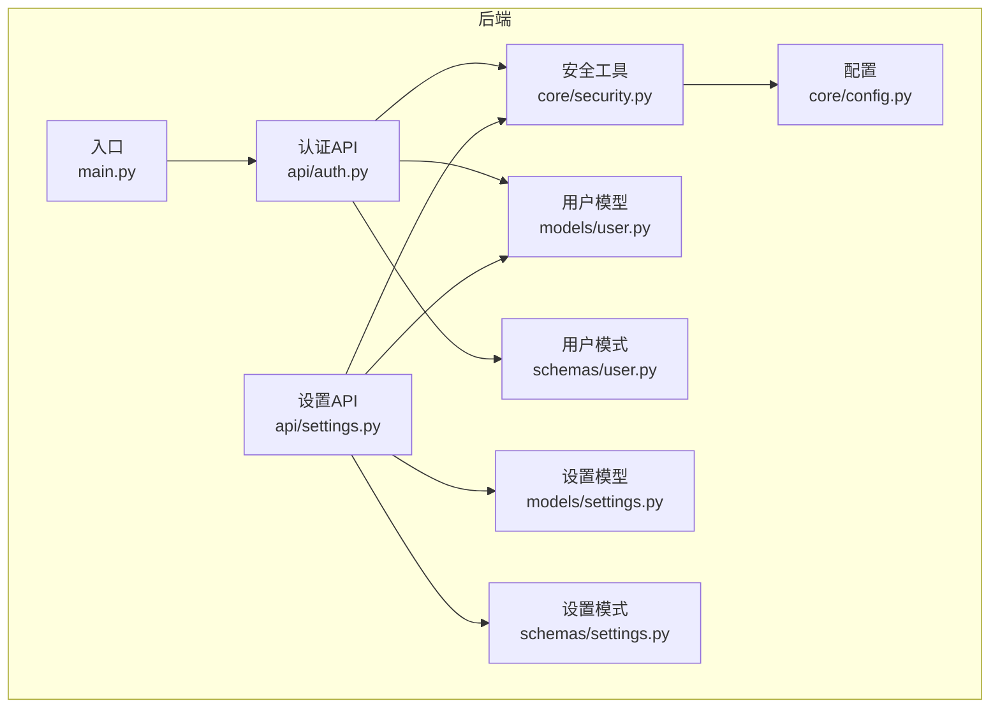
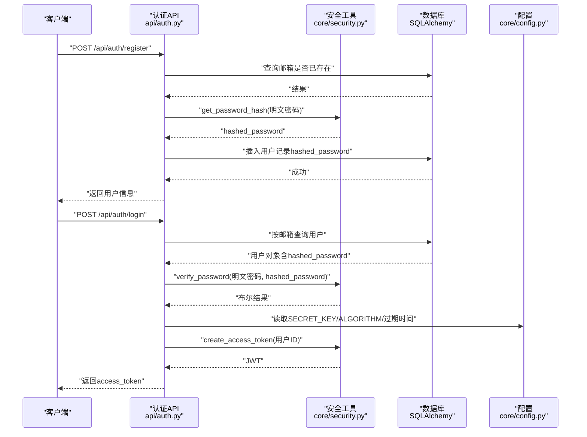
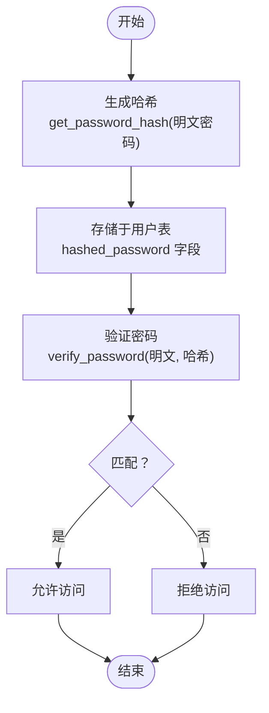
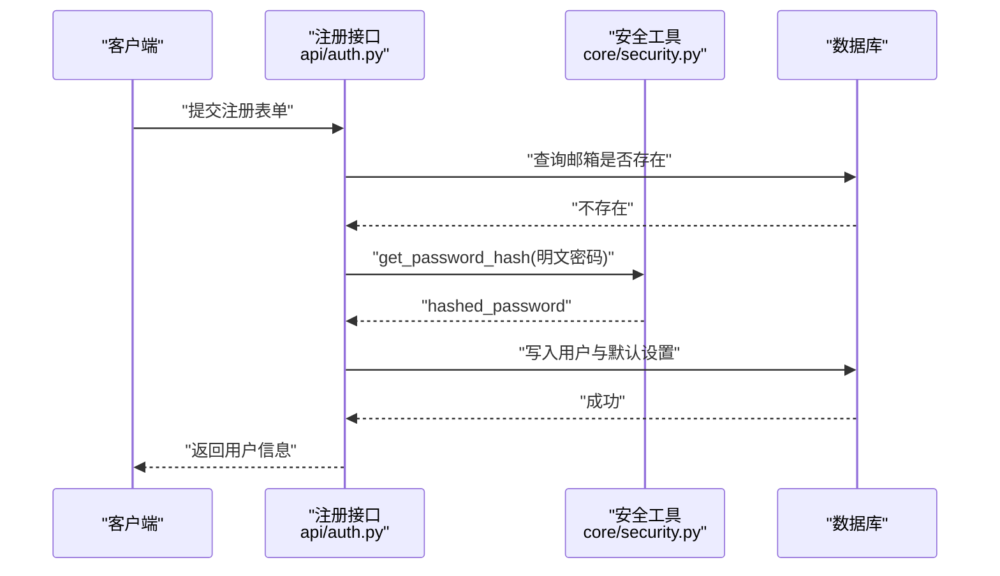
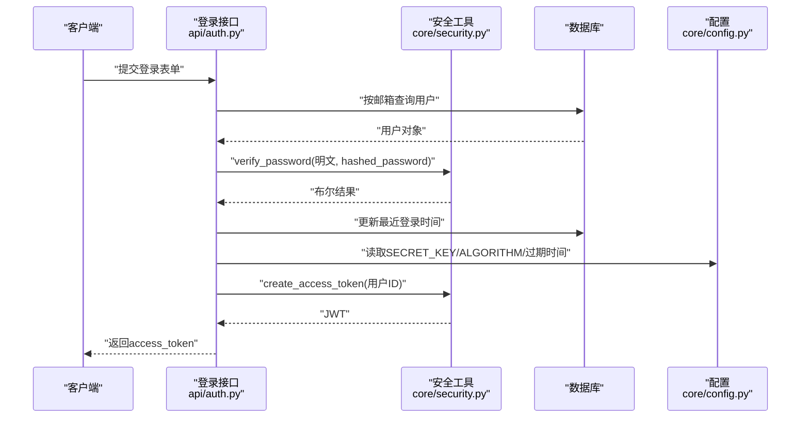
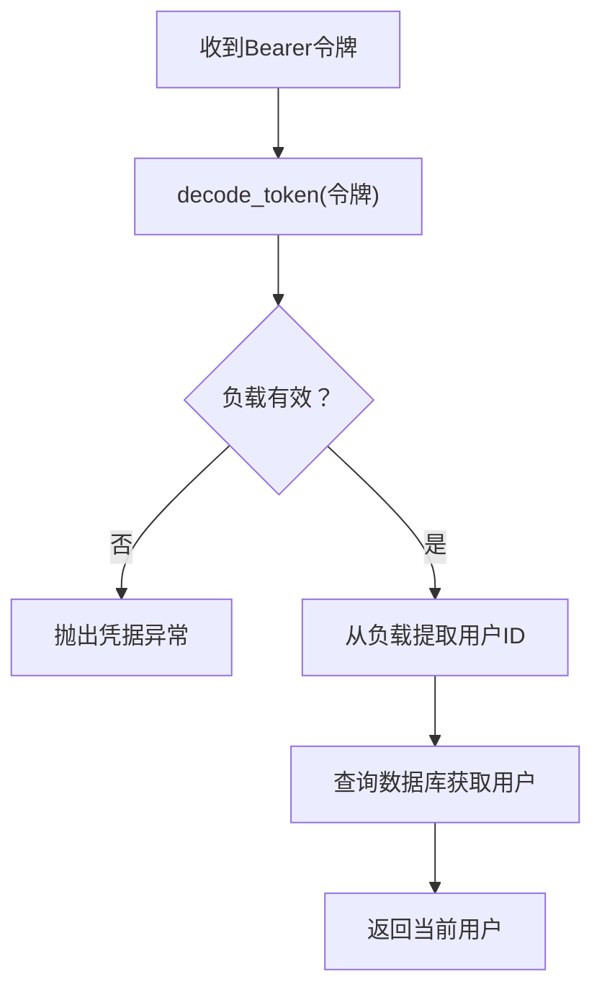
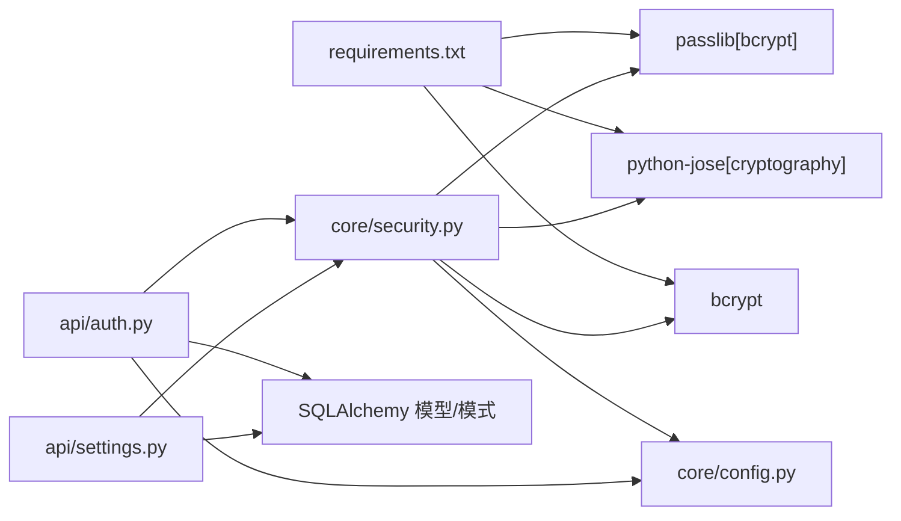

# 密码安全

<cite>
**本文引用的文件**
- [security.py](file://backend/app/core/security.py)
- [auth.py](file://backend/app/api/auth.py)
- [user.py（模型）](file://backend/app/models/user.py)
- [user.py（模式）](file://backend/app/schemas/user.py)
- [config.py](file://backend/app/core/config.py)
- [main.py](file://backend/app/main.py)
- [requirements.txt](file://backend/requirements.txt)
- [settings.py（模型）](file://backend/app/models/settings.py)
- [settings.py（模式）](file://backend/app/schemas/settings.py)
- [settings.py（API）](file://backend/app/api/settings.py)
</cite>

## 目录
1. [简介](#简介)
2. [项目结构](#项目结构)
3. [核心组件](#核心组件)
4. [架构总览](#架构总览)
5. [详细组件分析](#详细组件分析)
6. [依赖分析](#依赖分析)
7. [性能考虑](#性能考虑)
8. [故障排查指南](#故障排查指南)
9. [结论](#结论)
10. [附录：最佳实践与威胁防护](#附录最佳实践与威胁防护)

## 简介
本文件面向Quickly密码安全系统，围绕bcrypt密码哈希算法的实现与使用进行深入技术说明，涵盖盐值生成、密码加密与验证流程；同时阐述密码强度校验规则与安全策略，解释密码哈希在用户注册与登录流程中的应用，以及密码重置与修改的安全机制现状与建议。文档还提供可操作的最佳实践与常见安全威胁的防护措施，并通过图示展示认证流程与数据流。

## 项目结构
后端采用FastAPI + SQLAlchemy异步ORM，密码安全相关代码集中在以下模块：
- 安全工具与认证：backend/app/core/security.py
- 认证API：backend/app/api/auth.py
- 用户模型与模式：backend/app/models/user.py、backend/app/schemas/user.py
- 应用配置：backend/app/core/config.py
- 入口与路由挂载：backend/app/main.py
- 依赖声明：backend/requirements.txt
- 设置模型/模式/API：backend/app/models/settings.py、backend/app/schemas/settings.py、backend/app/api/settings.py

图表来源
- [main.py:42-49](file://backend/app/main.py#L42-L49)
- [auth.py:12](file://backend/app/api/auth.py#L12)
- [security.py:14-16](file://backend/app/core/security.py#L14-L16)
- [user.py（模型）:11-39](file://backend/app/models/user.py#L11-L39)
- [user.py（模式）:10-50](file://backend/app/schemas/user.py#L10-L50)
- [config.py:10-45](file://backend/app/core/config.py#L10-L45)
- [settings.py（API）:16-64](file://backend/app/api/settings.py#L16-L64)
- [settings.py（模型）:11-41](file://backend/app/models/settings.py#L11-L41)
- [settings.py（模式）:10-50](file://backend/app/schemas/settings.py#L10-L50)

章节来源
- [main.py:42-49](file://backend/app/main.py#L42-L49)
- [requirements.txt:16-19](file://backend/requirements.txt#L16-L19)

## 核心组件
- bcrypt密码上下文与工具函数
  - 使用passlib的CryptContext配置bcrypt方案，自动处理盐值与哈希生成
  - 提供密码哈希函数与验证函数，封装底层差异
- JWT令牌管理
  - 生成访问令牌（含过期时间），解码与校验令牌，提取用户标识
- 认证流程
  - 注册：邮箱唯一性检查，明文密码经bcrypt哈希后存入数据库
  - 登录：根据邮箱查询用户，使用verify_password比对哈希，成功则签发JWT
- 配置
  - SECRET_KEY、ALGORITHM、ACCESS_TOKEN_EXPIRE_MINUTES等安全参数由环境配置加载

章节来源
- [security.py:19-30](file://backend/app/core/security.py#L19-L30)
- [security.py:33-51](file://backend/app/core/security.py#L33-L51)
- [auth.py:22-49](file://backend/app/api/auth.py#L22-L49)
- [auth.py:52-86](file://backend/app/api/auth.py#L52-L86)
- [config.py:18-21](file://backend/app/core/config.py#L18-L21)

## 架构总览
下图展示了从客户端到后端服务的认证路径，重点体现bcrypt哈希在注册与登录阶段的应用，以及JWT令牌的签发与校验。

图表来源
- [auth.py:22-49](file://backend/app/api/auth.py#L22-L49)
- [auth.py:52-86](file://backend/app/api/auth.py#L52-L86)
- [security.py:19-30](file://backend/app/core/security.py#L19-L30)
- [security.py:33-42](file://backend/app/core/security.py#L33-L42)
- [config.py:18-21](file://backend/app/core/config.py#L18-L21)

## 详细组件分析

### bcrypt密码哈希与验证
- 实现要点
  - 通过CryptContext启用bcrypt方案，自动处理盐值生成与哈希计算
  - 提供verify_password与get_password_hash两个核心函数，分别用于验证与生成哈希
- 复杂度与安全性
  - bcrypt内置成本因子，可在配置层调整以平衡安全与性能
  - 验证过程为常数时间比较，降低侧信道攻击风险
- 数据存储
  - 用户表字段存储完整哈希字符串（包含算法标识、成本因子与盐值）

图表来源
- [security.py:19-30](file://backend/app/core/security.py#L19-L30)
- [user.py（模型）:18](file://backend/app/models/user.py#L18)

章节来源
- [security.py:19-30](file://backend/app/core/security.py#L19-L30)
- [user.py（模型）:18](file://backend/app/models/user.py#L18)

### 密码强度验证规则与安全策略
- 后端模式约束
  - 注册模式要求密码最小长度（例如6位）
  - 邮箱格式通过EmailStr与email-validator保障
- 前端交互约束
  - 前端表单对邮箱格式与密码长度进行即时校验
  - 注册时要求确认密码一致
- 安全策略建议
  - 引入更严格的密码复杂度规则（大小写字母、数字、特殊字符）
  - 增加密码历史与重复检测
  - 引入速率限制与账户锁定策略

章节来源
- [user.py（模式）:16-18](file://backend/app/schemas/user.py#L16-L18)
- [AuthPage.tsx:31-57](file://front/src/components/AuthPage.tsx#L31-L57)

### 注册流程中的密码哈希应用
- 关键步骤
  - 检查邮箱唯一性
  - 将明文密码交由get_password_hash生成哈希
  - 写入用户记录与默认设置
- 错误处理
  - 邮箱重复时返回400错误

图表来源
- [auth.py:22-49](file://backend/app/api/auth.py#L22-L49)
- [security.py:28-30](file://backend/app/core/security.py#L28-L30)

章节来源
- [auth.py:22-49](file://backend/app/api/auth.py#L22-L49)

### 登录流程中的密码验证与令牌签发
- 关键步骤
  - 根据邮箱查询用户
  - 使用verify_password对比哈希
  - 校验用户状态（如是否激活）
  - 更新最近登录时间
  - 生成JWT访问令牌
- 错误处理
  - 凭据无效或用户不存在返回401
  - 非激活用户返回400

图表来源
- [auth.py:52-86](file://backend/app/api/auth.py#L52-L86)
- [security.py:23-30](file://backend/app/core/security.py#L23-L30)
- [security.py:33-42](file://backend/app/core/security.py#L33-L42)
- [config.py:18-21](file://backend/app/core/config.py#L18-L21)

章节来源
- [auth.py:52-86](file://backend/app/api/auth.py#L52-L86)

### 密码重置与修改的安全机制
- 当前实现状态
  - 注册与登录流程已完整覆盖bcrypt哈希与JWT令牌
  - 密码重置与修改功能未在后端找到对应API与实现
- 建议方案
  - 密码重置：基于邮箱发送一次性令牌，校验通过后允许修改；修改密码时仍需bcrypt哈希
  - 密码修改：登录态下校验旧密码（verify_password），再写入新哈希
  - 安全增强：引入令牌过期、防暴力破解、日志审计

章节来源
- [auth.py:22-86](file://backend/app/api/auth.py#L22-L86)

### JWT令牌与当前用户解析
- 令牌生成
  - 以用户ID为sub，附加过期时间，使用SECRET_KEY与指定算法签名
- 令牌解析
  - 解码并校验签名，失败则返回空负载
  - 通过OAuth2PasswordBearer从请求中提取令牌
- 当前用户解析
  - 依赖令牌解析结果，查询数据库获取用户实体

图表来源
- [security.py:45-80](file://backend/app/core/security.py#L45-L80)
- [security.py:33-51](file://backend/app/core/security.py#L33-L51)

章节来源
- [security.py:45-80](file://backend/app/core/security.py#L45-L80)

## 依赖分析
- 外部库
  - passlib[bcrypt]：提供bcrypt哈希与验证
  - python-jose[cryptography]：提供JWT编码/解码与签名验证
  - bcrypt：底层C扩展，确保高性能与安全性
- 内部依赖
  - security.py依赖config.py提供的密钥与算法配置
  - auth.py依赖security.py完成密码哈希与令牌操作
  - settings.py系列依赖security.py进行用户鉴权

图表来源
- [requirements.txt:16-19](file://backend/requirements.txt#L16-L19)
- [security.py:7-16](file://backend/app/core/security.py#L7-L16)
- [config.py:18-21](file://backend/app/core/config.py#L18-L21)
- [auth.py:12](file://backend/app/api/auth.py#L12)
- [settings.py（API）:10](file://backend/app/api/settings.py#L10)

章节来源
- [requirements.txt:16-19](file://backend/requirements.txt#L16-L19)

## 性能考虑
- bcrypt成本因子
  - 可通过调整CryptContext的成本参数提升安全性，但会增加CPU开销
  - 建议在生产环境评估服务器性能，选择合适的成本因子
- 令牌签名
  - HS256算法性能优异，但需妥善保管SECRET_KEY
- 数据库I/O
  - 登录与注册均涉及数据库查询与写入，建议开启连接池与索引优化

## 故障排查指南
- 常见问题
  - 登录失败：检查邮箱是否存在、密码是否正确、用户是否激活
  - 令牌无效：确认请求头携带Bearer令牌、算法与密钥配置一致、未过期
  - 注册失败：检查邮箱唯一性、密码长度与格式
- 排查步骤
  - 启用调试日志，定位具体异常分支
  - 校验配置项（SECRET_KEY、ALGORITHM、ACCESS_TOKEN_EXPIRE_MINUTES）
  - 对比前端提交的明文密码与后端存储的哈希值是否匹配

章节来源
- [auth.py:58-73](file://backend/app/api/auth.py#L58-L73)
- [security.py:45-51](file://backend/app/core/security.py#L45-L51)
- [config.py:18-21](file://backend/app/core/config.py#L18-L21)

## 结论
Quickly密码安全系统以bcrypt为核心，结合JWT令牌实现了可靠的用户认证流程。注册与登录均遵循“明文入、哈希存、哈希验”的原则，配合邮箱唯一性与基本密码长度校验，满足基础安全需求。建议后续补充密码重置与修改流程，并引入更强的密码策略与安全防护措施，以进一步提升整体安全性。

## 附录：最佳实践与威胁防护
- 最佳实践
  - 使用强随机盐值（bcrypt自动处理）
  - 严格控制令牌生命周期与刷新策略
  - 对敏感操作（如修改密码）强制二次验证
  - 定期轮换SECRET_KEY并限制其暴露范围
- 威胁防护
  - 防暴力破解：登录尝试次数限制、IP封禁、验证码
  - 防重放攻击：短有效期令牌、服务端会话校验
  - 防侧信道：常量时间比较、避免泄露错误细节
  - 防XSS/CSRF：同源策略、CSRF令牌、安全Cookie属性