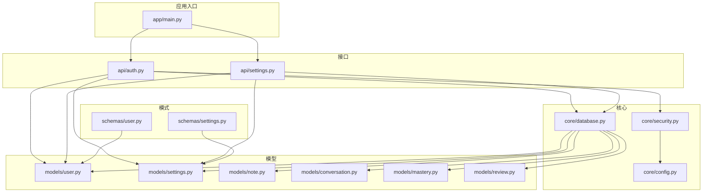
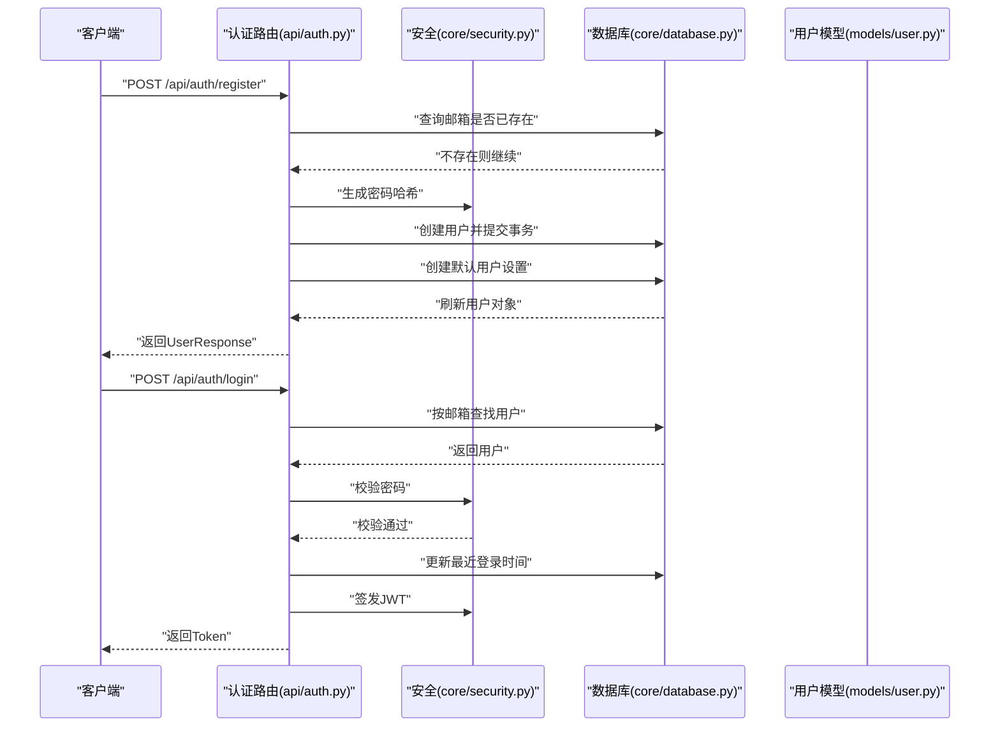
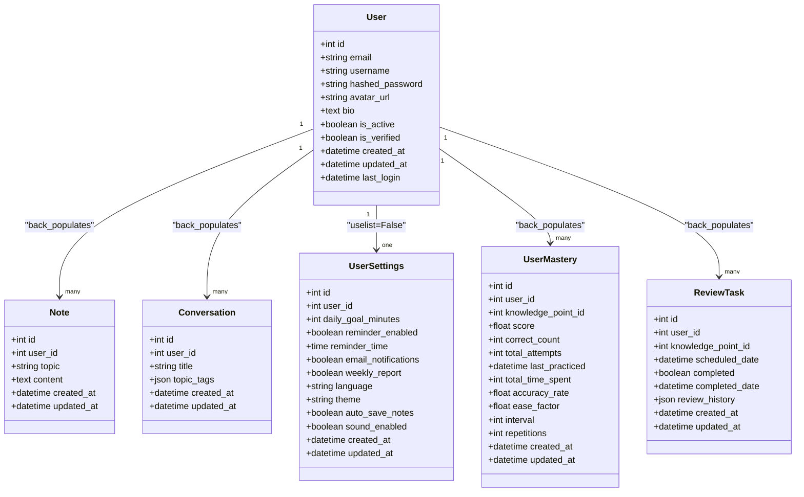
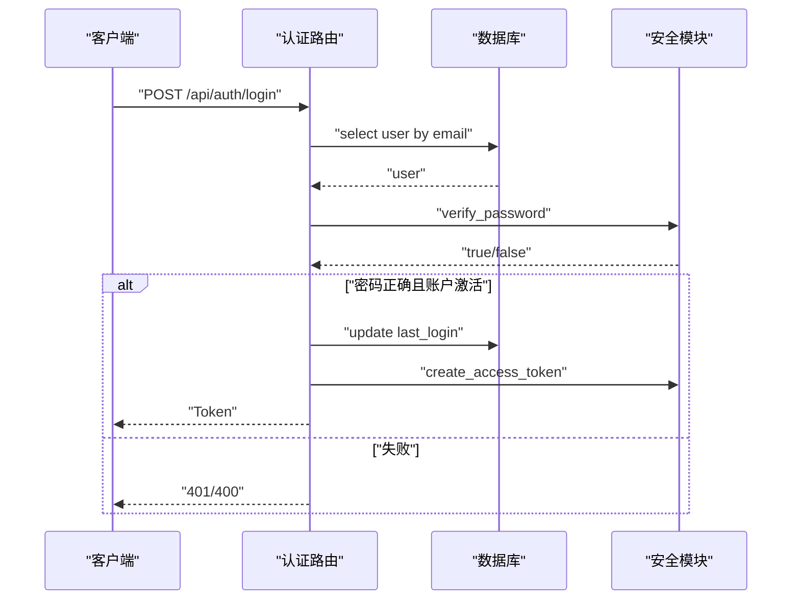
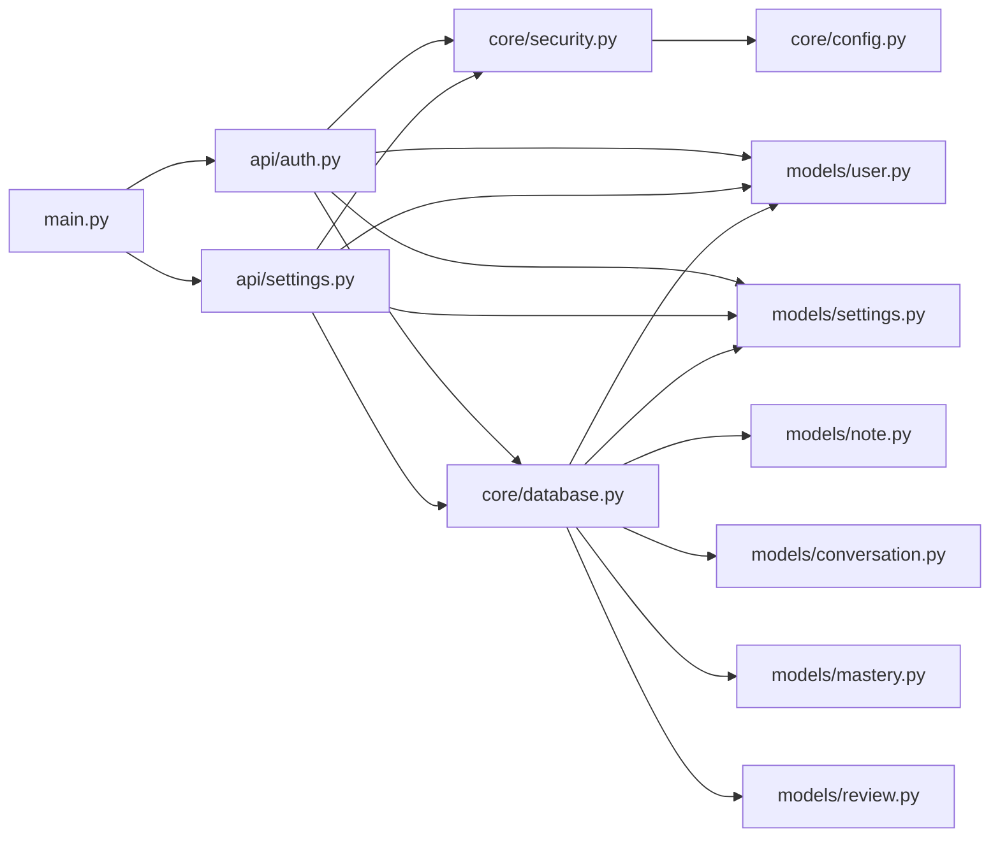

# 用户管理

<cite>
**本文引用的文件**
- [backend/app/models/user.py](file://backend/app/models/user.py)
- [backend/app/schemas/user.py](file://backend/app/schemas/user.py)
- [backend/app/api/auth.py](file://backend/app/api/auth.py)
- [backend/app/core/security.py](file://backend/app/core/security.py)
- [backend/app/core/database.py](file://backend/app/core/database.py)
- [backend/app/main.py](file://backend/app/main.py)
- [backend/app/models/settings.py](file://backend/app/models/settings.py)
- [backend/app/schemas/settings.py](file://backend/app/schemas/settings.py)
- [backend/app/api/settings.py](file://backend/app/api/settings.py)
- [backend/app/models/note.py](file://backend/app/models/note.py)
- [backend/app/models/conversation.py](file://backend/app/models/conversation.py)
- [backend/app/models/mastery.py](file://backend/app/models/mastery.py)
- [backend/app/models/review.py](file://backend/app/models/review.py)
- [backend/app/core/config.py](file://backend/app/core/config.py)
</cite>

## 目录
1. [简介](#简介)
2. [项目结构](#项目结构)
3. [核心组件](#核心组件)
4. [架构总览](#架构总览)
5. [详细组件分析](#详细组件分析)
6. [依赖关系分析](#依赖关系分析)
7. [性能考虑](#性能考虑)
8. [故障排查指南](#故障排查指南)
9. [结论](#结论)
10. [附录](#附录)

## 简介
本文件为 Quicky 用户管理系统的技术文档，聚焦用户模型设计与实现、用户注册流程（含邮箱唯一性校验与默认设置创建）、用户信息获取与管理、用户状态与激活机制，以及 Pydantic 序列化/反序列化规范。文档同时说明用户模型与其他模块（笔记、对话、掌握度、复习任务、用户设置）的关系与依赖，并提供关键流程的时序图与类图，帮助开发者快速理解与扩展系统。

## 项目结构
后端采用 FastAPI + SQLAlchemy Async 架构，数据库模型位于 models 目录，数据传输对象（DTO）位于 schemas 目录，认证与设置等业务路由位于 api 目录；核心安全、配置与数据库连接在 core 目录中。

图表来源
- [backend/app/main.py:1-66](file://backend/app/main.py#L1-L66)
- [backend/app/api/auth.py:1-99](file://backend/app/api/auth.py#L1-L99)
- [backend/app/api/settings.py:1-65](file://backend/app/api/settings.py#L1-L65)
- [backend/app/core/security.py:1-80](file://backend/app/core/security.py#L1-L80)
- [backend/app/core/config.py:1-45](file://backend/app/core/config.py#L1-L45)
- [backend/app/core/database.py:1-46](file://backend/app/core/database.py#L1-L46)
- [backend/app/models/user.py:1-39](file://backend/app/models/user.py#L1-L39)
- [backend/app/models/settings.py:1-41](file://backend/app/models/settings.py#L1-L41)
- [backend/app/models/note.py:1-35](file://backend/app/models/note.py#L1-L35)
- [backend/app/models/conversation.py:1-54](file://backend/app/models/conversation.py#L1-L54)
- [backend/app/models/mastery.py:1-44](file://backend/app/models/mastery.py#L1-L44)
- [backend/app/models/review.py:1-35](file://backend/app/models/review.py#L1-L35)
- [backend/app/schemas/user.py:1-50](file://backend/app/schemas/user.py#L1-L50)
- [backend/app/schemas/settings.py:1-50](file://backend/app/schemas/settings.py#L1-L50)

章节来源
- [backend/app/main.py:1-66](file://backend/app/main.py#L1-L66)
- [backend/app/core/database.py:1-46](file://backend/app/core/database.py#L1-L46)

## 核心组件
- 用户模型（SQLAlchemy）
  - 字段：id、email（唯一索引）、username、hashed_password、avatar_url、bio、is_active、is_verified、created_at、updated_at、last_login
  - 关系：与笔记、对话、掌握度、复习任务、用户设置的一对多或一对一关系
- 用户模式（Pydantic）
  - UserBase：email、username
  - UserCreate：继承 UserBase 并增加 password
  - UserLogin：登录用 email/password
  - UserResponse：对外返回的用户信息，包含 id、头像、个人简介、状态、时间戳等
  - Token/TokenData：JWT 相关
- 认证 API
  - 注册：邮箱唯一性检查、密码哈希、默认设置创建
  - 登录：密码校验、状态检查、签发访问令牌、记录最近登录时间
  - 获取当前用户信息：基于令牌解析与数据库查询
- 安全与配置
  - 密码哈希/校验、JWT 编解码、令牌提取策略
  - 数据库引擎与会话管理、应用配置（密钥、过期时间、CORS、数据库地址）

章节来源
- [backend/app/models/user.py:1-39](file://backend/app/models/user.py#L1-L39)
- [backend/app/schemas/user.py:1-50](file://backend/app/schemas/user.py#L1-L50)
- [backend/app/api/auth.py:1-99](file://backend/app/api/auth.py#L1-L99)
- [backend/app/core/security.py:1-80](file://backend/app/core/security.py#L1-L80)
- [backend/app/core/config.py:1-45](file://backend/app/core/config.py#L1-L45)

## 架构总览
用户管理贯穿“请求—令牌—用户对象—数据库”的链路。FastAPI 路由接收请求，通过安全模块解析令牌或表单认证，再访问数据库层完成读写。

图表来源
- [backend/app/api/auth.py:22-86](file://backend/app/api/auth.py#L22-L86)
- [backend/app/core/security.py:23-80](file://backend/app/core/security.py#L23-L80)
- [backend/app/core/database.py:39-46](file://backend/app/core/database.py#L39-L46)
- [backend/app/models/user.py:11-39](file://backend/app/models/user.py#L11-L39)

## 详细组件分析

### 用户模型（SQLAlchemy）
- 设计要点
  - 主键自增 id，email 唯一且带索引，username 非空
  - 头像与简介可为空，便于后续扩展
  - 状态字段 is_active 控制账户启用/禁用；is_verified 可用于邮箱验证标记
  - 时间戳 created_at/updated_at/last_login 支持审计与统计
  - 关系定义：与笔记、对话、掌握度、复习任务、用户设置的级联删除，保证数据一致性
- 复杂度与性能
  - 查询 email 的唯一性与登录场景均依赖索引，写入成本主要受数据库 I/O 与事务提交影响
  - 级联删除在删除用户时可能触发较多子表清理，建议在批量删除时评估性能

图表来源
- [backend/app/models/user.py:11-39](file://backend/app/models/user.py#L11-L39)
- [backend/app/models/note.py:11-35](file://backend/app/models/note.py#L11-L35)
- [backend/app/models/conversation.py:11-54](file://backend/app/models/conversation.py#L11-L54)
- [backend/app/models/settings.py:11-41](file://backend/app/models/settings.py#L11-L41)
- [backend/app/models/mastery.py:11-44](file://backend/app/models/mastery.py#L11-L44)
- [backend/app/models/review.py:11-35](file://backend/app/models/review.py#L11-L35)

章节来源
- [backend/app/models/user.py:11-39](file://backend/app/models/user.py#L11-L39)

### 用户模式（Pydantic）
- 规范要点
  - UserBase：email 使用 EmailStr 类型，username 长度限制在 2–100
  - UserCreate：password 最小长度为 6
  - UserResponse：对外返回字段包含 id、头像、个人简介、状态、时间戳等；Config.from_attributes=True 支持从 ORM 对象直接构造
  - Token/TokenData：标准 JWT 结构
- 序列化/反序列化
  - 模式到对象：FastAPI 自动进行请求体校验与反序列化
  - 对象到模式：response_model 返回时自动序列化
  - ORM 对象到模式：通过 from_attributes 实现

章节来源
- [backend/app/schemas/user.py:10-50](file://backend/app/schemas/user.py#L10-L50)

### 认证流程与状态管理
- 注册流程
  - 输入：UserCreate（邮箱、用户名、密码）
  - 步骤：检查邮箱唯一性 → 哈希密码 → 创建用户 → 创建默认用户设置 → 提交事务 → 刷新用户
  - 错误处理：邮箱重复返回 400
- 登录流程
  - 输入：OAuth2 表单（邮箱/用户名 + 密码）
  - 步骤：按邮箱查找用户 → 校验密码 → 检查 is_active → 更新 last_login → 生成访问令牌
  - 错误处理：凭据错误/非活跃账户返回相应 4xx
- 当前用户信息
  - 通过令牌解析获取用户 ID → 数据库查询 → 返回 UserResponse
- 退出登录
  - 服务端不维护会话，仅返回成功消息（客户端负责删除本地令牌）

图表来源
- [backend/app/api/auth.py:52-86](file://backend/app/api/auth.py#L52-L86)
- [backend/app/core/security.py:23-80](file://backend/app/core/security.py#L23-L80)

章节来源
- [backend/app/api/auth.py:22-99](file://backend/app/api/auth.py#L22-L99)
- [backend/app/core/security.py:54-80](file://backend/app/core/security.py#L54-L80)

### 用户信息获取与管理
- 获取当前用户信息
  - 路由：GET /api/auth/me
  - 依赖：get_current_user（基于 OAuth2PasswordBearer 令牌）
  - 返回：UserResponse
- 用户设置管理
  - 获取设置：若不存在则创建默认设置并返回
  - 更新设置：支持部分字段更新（exclude_unset），提交后刷新对象

章节来源
- [backend/app/api/auth.py:89-99](file://backend/app/api/auth.py#L89-L99)
- [backend/app/api/settings.py:19-65](file://backend/app/api/settings.py#L19-L65)
- [backend/app/core/security.py:54-80](file://backend/app/core/security.py#L54-L80)

### 用户状态与激活机制
- 字段
  - is_active：控制账户是否可用（登录前检查）
  - is_verified：可用于邮箱验证标记（当前未在登录流程中使用）
- 流程
  - 注册成功后账户处于激活状态（is_active=True）
  - 登录时若 is_active=False，则拒绝访问

章节来源
- [backend/app/models/user.py:24-26](file://backend/app/models/user.py#L24-L26)
- [backend/app/api/auth.py:69-73](file://backend/app/api/auth.py#L69-L73)

### 与其他模块的关系与依赖
- 笔记（Note）：用户与笔记为一对多关系，用户删除时级联删除其笔记
- 对话（Conversation/Message）：用户与对话为一对多，对话与消息为一对多，用户删除时级联删除
- 掌握度（UserMastery）：用户与掌握度为一对多，记录学习进度与复习参数
- 复习任务（ReviewTask）：用户与复习任务为一对多，记录复习计划与历史
- 用户设置（UserSettings）：用户与设置为一对一（unique=True），注册时自动创建默认设置

章节来源
- [backend/app/models/user.py:34-38](file://backend/app/models/user.py#L34-L38)
- [backend/app/models/note.py:34-35](file://backend/app/models/note.py#L34-L35)
- [backend/app/models/conversation.py:29-30](file://backend/app/models/conversation.py#L29-L30)
- [backend/app/models/conversation.py:53-54](file://backend/app/models/conversation.py#L53-L54)
- [backend/app/models/mastery.py:43-44](file://backend/app/models/mastery.py#L43-L44)
- [backend/app/models/review.py:34-35](file://backend/app/models/review.py#L34-L35)
- [backend/app/models/settings.py:16-16](file://backend/app/models/settings.py#L16-L16)

## 依赖关系分析
- 组件耦合
  - 认证路由依赖安全模块（密码哈希/校验、JWT、令牌提取）、数据库会话与用户模型
  - 设置路由依赖当前用户上下文与设置模型
  - 应用入口负责生命周期事件（创建所有表）与中间件配置
- 外部依赖
  - FastAPI（路由与依赖注入）
  - SQLAlchemy Async（异步 ORM）
  - passlib（密码哈希）
  - python-jose（JWT 编解码）
  - Pydantic（数据校验与序列化）

图表来源
- [backend/app/api/auth.py:1-99](file://backend/app/api/auth.py#L1-L99)
- [backend/app/api/settings.py:1-65](file://backend/app/api/settings.py#L1-L65)
- [backend/app/core/security.py:1-80](file://backend/app/core/security.py#L1-L80)
- [backend/app/core/database.py:1-46](file://backend/app/core/database.py#L1-L46)
- [backend/app/main.py:1-66](file://backend/app/main.py#L1-L66)
- [backend/app/core/config.py:1-45](file://backend/app/core/config.py#L1-L45)
- [backend/app/models/user.py:1-39](file://backend/app/models/user.py#L1-L39)
- [backend/app/models/settings.py:1-41](file://backend/app/models/settings.py#L1-L41)
- [backend/app/models/note.py:1-35](file://backend/app/models/note.py#L1-L35)
- [backend/app/models/conversation.py:1-54](file://backend/app/models/conversation.py#L1-L54)
- [backend/app/models/mastery.py:1-44](file://backend/app/models/mastery.py#L1-L44)
- [backend/app/models/review.py:1-35](file://backend/app/models/review.py#L1-L35)

章节来源
- [backend/app/main.py:10-50](file://backend/app/main.py#L10-L50)
- [backend/app/core/database.py:39-46](file://backend/app/core/database.py#L39-L46)

## 性能考虑
- 数据库连接池
  - 非 SQLite 场景启用 pool_pre_ping、pool_size、max_overflow，提升并发稳定性
- 事务与锁
  - 注册与设置创建在同一事务内提交，减少中间状态
- 索引与查询
  - email 唯一索引与索引列有助于高频查询（登录、注册）
- 级联删除
  - 删除用户时涉及多表清理，建议在高并发场景下评估批量删除策略

章节来源
- [backend/app/core/database.py:16-36](file://backend/app/core/database.py#L16-L36)

## 故障排查指南
- 注册失败：邮箱已存在
  - 现象：返回 400，提示邮箱已被注册
  - 排查：确认邮箱唯一性约束与查询逻辑
- 登录失败：凭据错误或账户未激活
  - 现象：401 未授权；或 400 账户未激活
  - 排查：核对密码哈希、令牌签名算法与密钥、is_active 状态
- 获取当前用户失败
  - 现象：401 无法验证凭据
  - 排查：确认令牌格式、签名密钥、payload 中的用户 ID 是否存在
- 设置未创建
  - 现象：首次获取设置返回默认值
  - 排查：确认注册流程是否创建默认设置，或手动创建

章节来源
- [backend/app/api/auth.py:25-31](file://backend/app/api/auth.py#L25-L31)
- [backend/app/api/auth.py:62-73](file://backend/app/api/auth.py#L62-L73)
- [backend/app/api/auth.py:89-92](file://backend/app/api/auth.py#L89-L92)
- [backend/app/api/settings.py:30-37](file://backend/app/api/settings.py#L30-L37)
- [backend/app/core/security.py:58-79](file://backend/app/core/security.py#L58-L79)

## 结论
用户管理模块以清晰的模型与模式分离为基础，结合 FastAPI 的依赖注入与 Pydantic 的强校验能力，实现了从注册、登录到信息获取与设置管理的完整闭环。通过合理的索引、事务与关系设计，保障了数据一致性与可扩展性。后续可在邮箱验证、账户锁定、令牌黑名单等方面进一步增强安全与治理能力。

## 附录

### 用户对象创建、查询与更新操作（代码片段路径）
- 创建用户（注册）
  - [注册流程实现:22-49](file://backend/app/api/auth.py#L22-L49)
  - [密码哈希工具:28-30](file://backend/app/core/security.py#L28-L30)
- 查询用户
  - [获取当前用户信息:89-92](file://backend/app/api/auth.py#L89-L92)
  - [令牌解析与用户查询:54-80](file://backend/app/core/security.py#L54-L80)
- 更新用户设置
  - [获取与默认创建设置:19-37](file://backend/app/api/settings.py#L19-L37)
  - [部分字段更新设置:40-65](file://backend/app/api/settings.py#L40-L65)

章节来源
- [backend/app/api/auth.py:22-99](file://backend/app/api/auth.py#L22-L99)
- [backend/app/api/settings.py:19-65](file://backend/app/api/settings.py#L19-L65)
- [backend/app/core/security.py:54-80](file://backend/app/core/security.py#L54-L80)