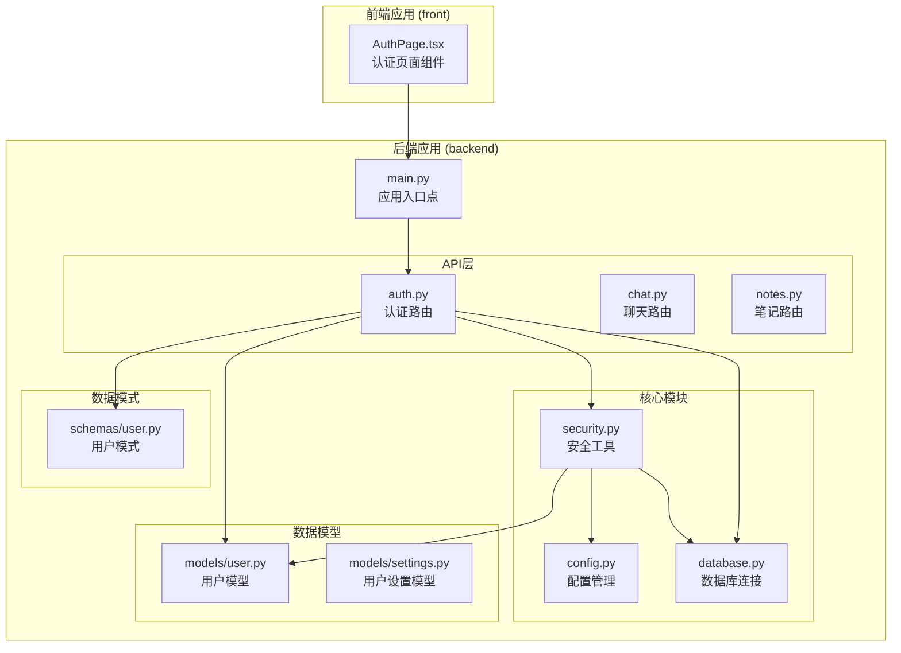
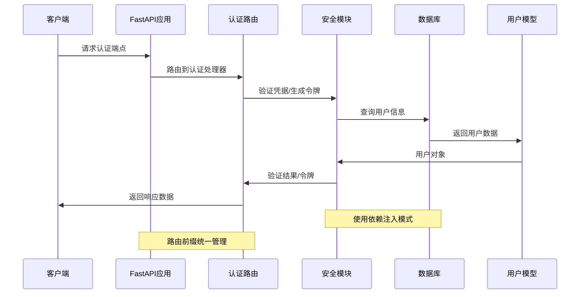
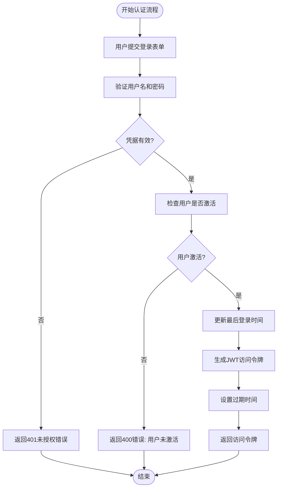
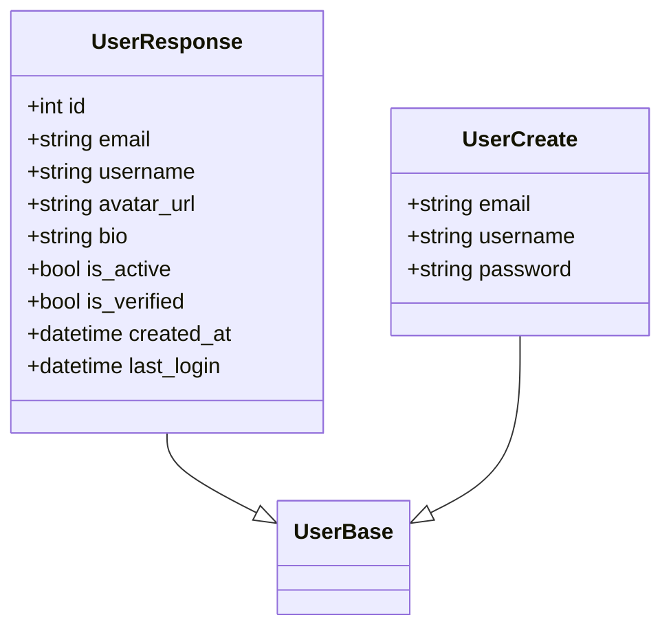
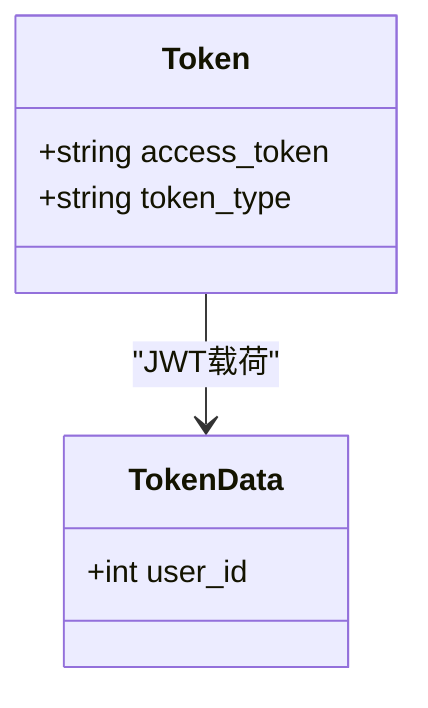
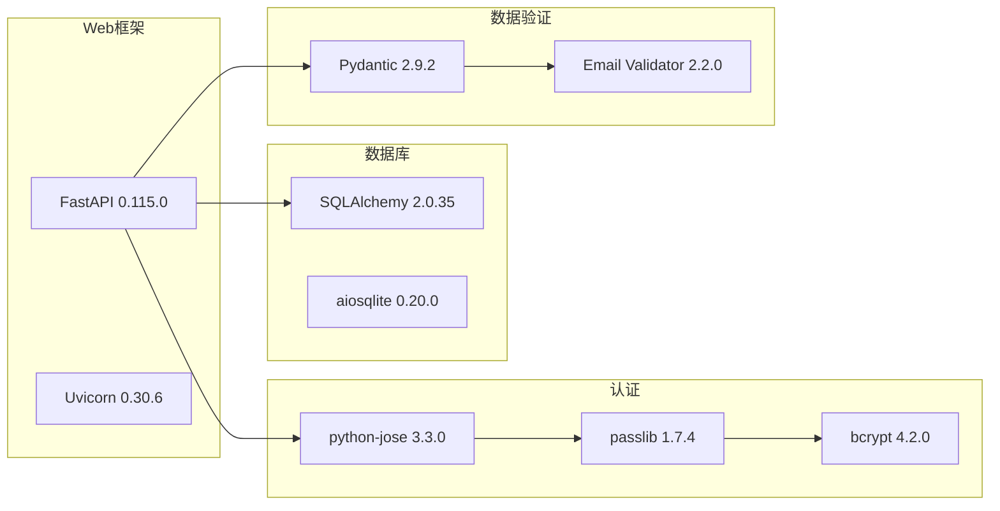
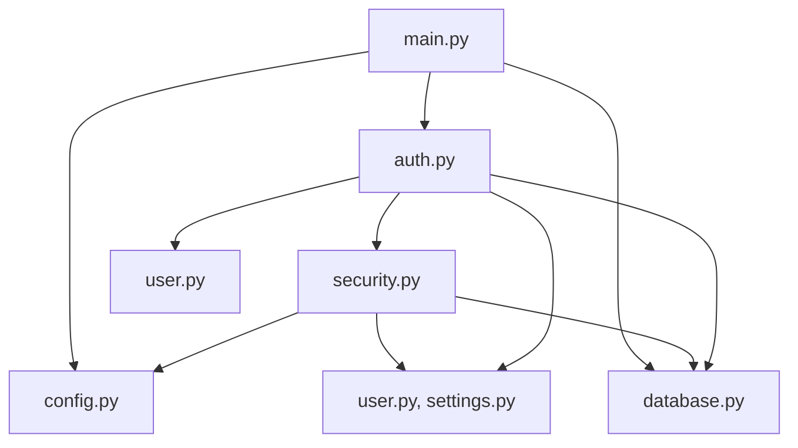

# 认证API接口

<cite>
**本文档引用的文件**
- [backend/app/api/auth.py](file://backend/app/api/auth.py)
- [backend/app/core/security.py](file://backend/app/core/security.py)
- [backend/app/core/config.py](file://backend/app/core/config.py)
- [backend/app/core/database.py](file://backend/app/core/database.py)
- [backend/app/models/user.py](file://backend/app/models/user.py)
- [backend/app/models/settings.py](file://backend/app/models/settings.py)
- [backend/app/schemas/user.py](file://backend/app/schemas/user.py)
- [backend/app/main.py](file://backend/app/main.py)
- [backend/requirements.txt](file://backend/requirements.txt)
- [front/src/components/AuthPage.tsx](file://front/src/components/AuthPage.tsx)
</cite>

## 目录
1. [简介](#简介)
2. [项目结构](#项目结构)
3. [核心组件](#核心组件)
4. [架构概览](#架构概览)
5. [详细组件分析](#详细组件分析)
6. [依赖分析](#依赖分析)
7. [性能考虑](#性能考虑)
8. [故障排除指南](#故障排除指南)
9. [结论](#结论)
10. [附录](#附录)

## 简介

Quickly是一个基于FastAPI构建的AI学习平台，认证系统是整个应用的核心基础设施。本文档详细记录了所有认证相关的RESTful API接口，包括用户注册、登录、获取当前用户信息和登出功能。系统采用OAuth2密码流实现，使用JWT令牌进行身份验证，并通过依赖注入机制实现安全的中间件。

## 项目结构

Quickly项目采用分层架构设计，认证相关的代码主要分布在以下目录中：



**图表来源**
- [backend/app/api/auth.py:1-99](file://backend/app/api/auth.py#L1-L99)
- [backend/app/core/security.py:1-80](file://backend/app/core/security.py#L1-L80)
- [backend/app/main.py:1-66](file://backend/app/main.py#L1-L66)

**章节来源**
- [backend/app/main.py:42-49](file://backend/app/main.py#L42-L49)
- [backend/app/api/auth.py:19](file://backend/app/api/auth.py#L19)

## 核心组件

### 认证路由器
认证路由位于`/api/auth`路径下，包含四个主要端点：
- POST `/api/auth/register` - 用户注册
- POST `/api/auth/login` - 用户登录
- GET `/api/auth/me` - 获取当前用户信息
- POST `/api/auth/logout` - 用户登出

### 安全工具
安全模块提供了密码哈希、JWT令牌生成和验证、以及OAuth2密码流支持：
- 密码哈希：使用bcrypt算法
- JWT令牌：HS256算法签名
- OAuth2密码流：基于FastAPI的OAuth2PasswordBearer

### 数据模型
用户模型包含完整的用户信息和状态字段：
- 基本信息：邮箱、用户名、密码哈希
- 个人资料：头像URL、个人简介
- 状态信息：活跃状态、验证状态
- 时间戳：创建时间、更新时间、最后登录时间

**章节来源**
- [backend/app/api/auth.py:22-98](file://backend/app/api/auth.py#L22-L98)
- [backend/app/core/security.py:19-80](file://backend/app/core/security.py#L19-L80)
- [backend/app/models/user.py:11-39](file://backend/app/models/user.py#L11-L39)

## 架构概览

Quickly认证系统的整体架构采用分层设计，确保了安全性、可维护性和可扩展性：



**图表来源**
- [backend/app/api/auth.py:52-86](file://backend/app/api/auth.py#L52-L86)
- [backend/app/core/security.py:54-79](file://backend/app/core/security.py#L54-L79)
- [backend/app/main.py:43](file://backend/app/main.py#L43)

### OAuth2密码流实现

系统实现了标准的OAuth2密码流，具体流程如下：



**图表来源**
- [backend/app/api/auth.py:52-86](file://backend/app/api/auth.py#L52-L86)
- [backend/app/core/security.py:33-42](file://backend/app/core/security.py#L33-L42)

## 详细组件分析

### 用户注册接口

#### 接口定义
- **方法**: POST
- **路径**: `/api/auth/register`
- **响应模型**: UserResponse

#### 请求参数
| 参数名 | 类型 | 必填 | 描述 | 验证规则 |
|--------|------|------|------|----------|
| email | string | 是 | 用户邮箱地址 | 邮箱格式验证 |
| username | string | 是 | 用户名 | 2-100字符长度限制 |
| password | string | 是 | 用户密码 | 至少6字符 |

#### 响应格式
成功时返回UserResponse模型：



**图表来源**
- [backend/app/schemas/user.py:27-39](file://backend/app/schemas/user.py#L27-L39)
- [backend/app/schemas/user.py:16-18](file://backend/app/schemas/user.py#L16-L18)

#### 状态码
- 200: 注册成功
- 400: 邮箱已存在

#### 错误处理
- 邮箱重复：返回400错误，提示"Email already registered"

**章节来源**
- [backend/app/api/auth.py:22-49](file://backend/app/api/auth.py#L22-L49)
- [backend/app/schemas/user.py:16-18](file://backend/app/schemas/user.py#L16-L18)

### 用户登录接口

#### 接口定义
- **方法**: POST
- **路径**: `/api/auth/login`
- **响应模型**: Token

#### 请求参数
使用OAuth2PasswordRequestForm标准格式：
- **grant_type**: 必须为"password"
- **username**: 用户邮箱
- **password**: 用户密码
- **scope**: 空或默认
- **client_id**: 可选
- **client_secret**: 可选

#### 响应格式
返回标准的OAuth2令牌响应：



**图表来源**
- [backend/app/schemas/user.py:41-44](file://backend/app/schemas/user.py#L41-L44)
- [backend/app/schemas/user.py:47-49](file://backend/app/schemas/user.py#L47-L49)

#### 状态码
- 200: 登录成功
- 401: 凭据无效
- 400: 用户未激活

#### 错误处理
- 凭据无效：返回401错误，包含WWW-Authenticate头部
- 用户未激活：返回400错误

**章节来源**
- [backend/app/api/auth.py:52-86](file://backend/app/api/auth.py#L52-L86)
- [backend/app/core/security.py:59-63](file://backend/app/core/security.py#L59-L63)

### 获取当前用户信息接口

#### 接口定义
- **方法**: GET
- **路径**: `/api/auth/me`
- **响应模型**: UserResponse
- **认证**: 需要Bearer令牌

#### 请求参数
- **Authorization**: Bearer <access_token>

#### 响应格式
返回当前认证用户的完整信息

#### 状态码
- 200: 成功获取用户信息
- 401: 令牌无效或过期

#### 错误处理
- 令牌验证失败：返回401错误

**章节来源**
- [backend/app/api/auth.py:89-92](file://backend/app/api/auth.py#L89-L92)
- [backend/app/core/security.py:54-79](file://backend/app/core/security.py#L54-L79)

### 用户登出接口

#### 接口定义
- **方法**: POST
- **路径**: `/api/auth/logout`
- **响应模型**: JSON对象
- **认证**: 需要Bearer令牌

#### 请求参数
- **Authorization**: Bearer <access_token>

#### 响应格式
```json
{
  "message": "Successfully logged out"
}
```

#### 状态码
- 200: 登出成功

#### 错误处理
- 令牌无效：返回401错误

**章节来源**
- [backend/app/api/auth.py:95-98](file://backend/app/api/auth.py#L95-L98)
- [backend/app/core/security.py:54-79](file://backend/app/core/security.py#L54-L79)

## 依赖分析

### 外部依赖

系统使用以下关键外部依赖：



**图表来源**
- [backend/requirements.txt:4-37](file://backend/requirements.txt#L4-L37)

### 内部依赖关系



**图表来源**
- [backend/app/api/auth.py:11-16](file://backend/app/api/auth.py#L11-L16)
- [backend/app/core/security.py:14-16](file://backend/app/core/security.py#L14-L16)
- [backend/app/main.py:10](file://backend/app/main.py#L10)

**章节来源**
- [backend/app/api/auth.py:11-16](file://backend/app/api/auth.py#L11-L16)
- [backend/app/core/security.py:14-16](file://backend/app/core/security.py#L14-L16)
- [backend/app/main.py:10](file://backend/app/main.py#L10)

## 性能考虑

### 数据库优化
- 使用异步SQLAlchemy引擎提高并发性能
- 连接池配置：SQLite使用echo调试模式，其他数据库使用连接池
- 会话管理：expire_on_commit=False减少ORM开销

### 缓存策略
- JWT令牌在内存中验证，避免数据库查询
- 密码哈希使用bcrypt，提供安全的密码存储

### 安全配置
- 默认令牌有效期：7天（可配置）
- HS256算法签名，密钥随机生成
- OAuth2密码流标准实现

## 故障排除指南

### 常见问题及解决方案

#### 1. 认证失败
**症状**: 登录返回401错误
**可能原因**:
- 用户名或密码错误
- 用户未激活
- 令牌过期

**解决方法**:
- 检查用户名和密码
- 确认用户状态为激活
- 重新登录获取新令牌

#### 2. 数据库连接问题
**症状**: 注册或登录时报数据库错误
**可能原因**:
- 数据库URL配置错误
- SQLite文件权限问题

**解决方法**:
- 检查DATABASE_URL配置
- 确保数据库文件有读写权限

#### 3. CORS跨域问题
**症状**: 前端无法访问API
**可能原因**:
- CORS配置不正确
- 前端域名不在允许列表中

**解决方法**:
- 检查CORS_ORIGINS配置
- 添加前端域名到允许列表

**章节来源**
- [backend/app/api/auth.py:28-31](file://backend/app/api/auth.py#L28-L31)
- [backend/app/core/config.py:30](file://backend/app/core/config.py#L30)
- [backend/app/core/security.py:59-63](file://backend/app/core/security.py#L59-L63)

## 结论

Quickly认证系统采用现代Web开发的最佳实践，实现了安全、可扩展的身份验证机制。系统的主要优势包括：

1. **安全性**: 使用JWT令牌和OAuth2密码流，支持密码哈希和令牌过期
2. **可维护性**: 清晰的分层架构和依赖注入模式
3. **可扩展性**: 支持多种数据库和部署环境
4. **用户体验**: 提供完整的认证流程和错误处理

建议在生产环境中：
- 配置HTTPS和安全的Cookie设置
- 实施速率限制和防暴力破解机制
- 定期轮换密钥和监控异常登录行为

## 附录

### API调用示例

#### 用户注册
```bash
curl -X POST "http://localhost:8000/api/auth/register" \
  -H "Content-Type: application/json" \
  -d '{
    "email": "user@example.com",
    "username": "username",
    "password": "password123"
  }'
```

#### 用户登录
```bash
curl -X POST "http://localhost:8000/api/auth/login" \
  -H "Content-Type: application/x-www-form-urlencoded" \
  -d "username=user@example.com&password=password123"
```

#### 获取用户信息
```bash
curl -X GET "http://localhost:8000/api/auth/me" \
  -H "Authorization: Bearer YOUR_ACCESS_TOKEN"
```

### 客户端集成指南

#### 前端集成步骤
1. **安装依赖**: 确保前端项目包含必要的HTTP客户端库
2. **配置API端点**: 设置正确的API基础URL
3. **令牌存储**: 在本地存储中保存JWT令牌
4. **自动重试**: 实现令牌刷新和自动重试机制
5. **错误处理**: 统一处理认证相关的错误

#### 最佳实践
- 将令牌存储在HttpOnly Cookie中而不是localStorage
- 实现令牌刷新机制避免频繁重新登录
- 添加网络错误处理和重试逻辑
- 实现优雅的登出流程