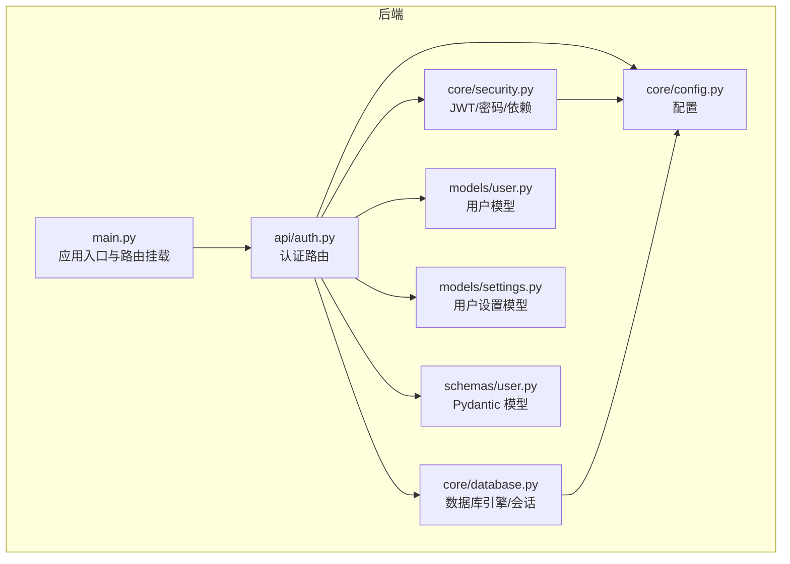
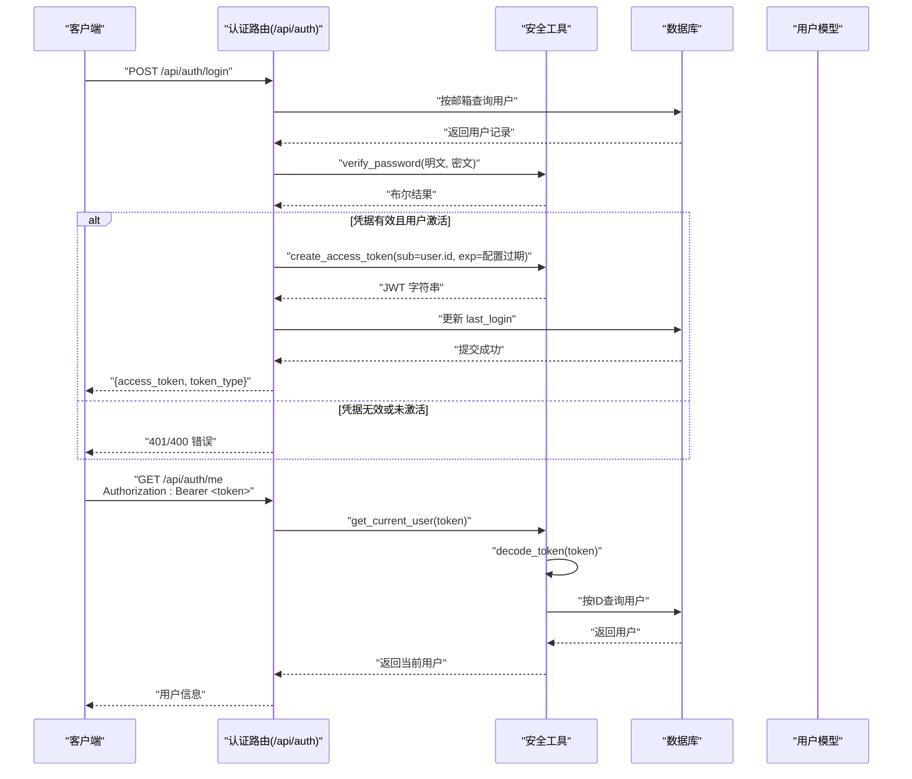
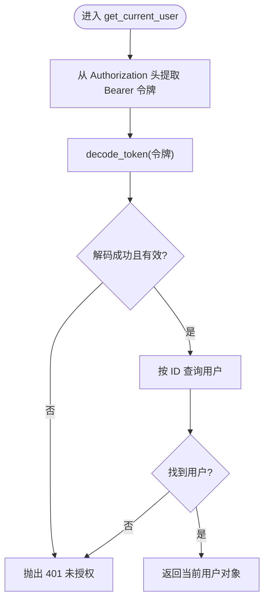
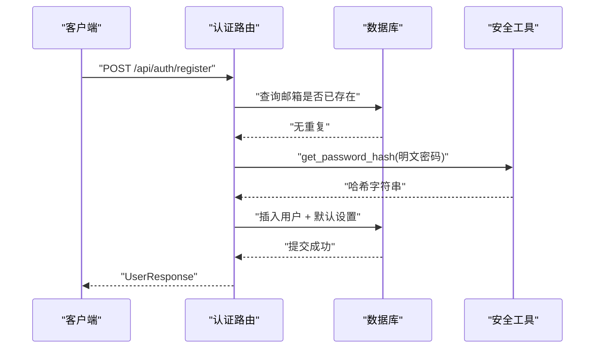
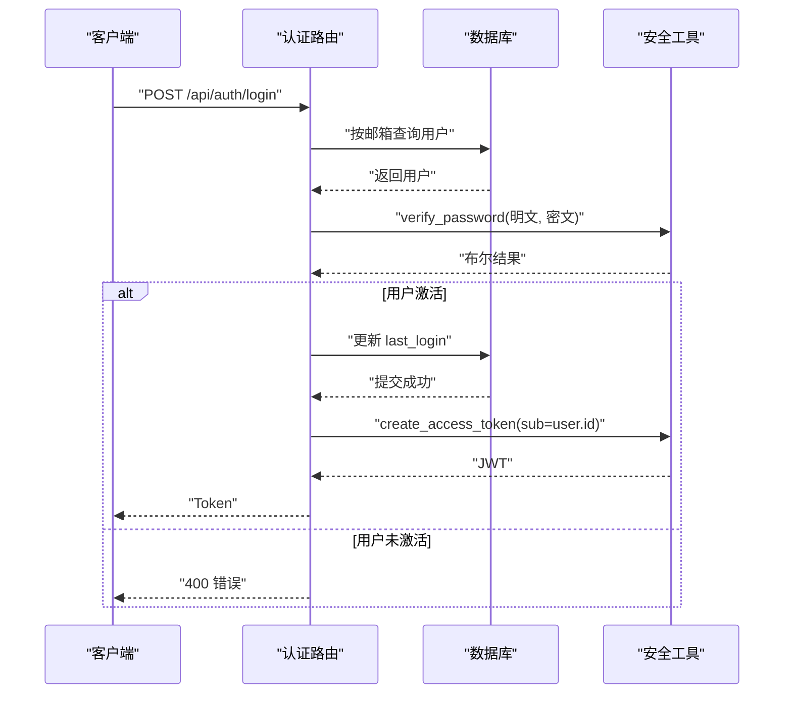
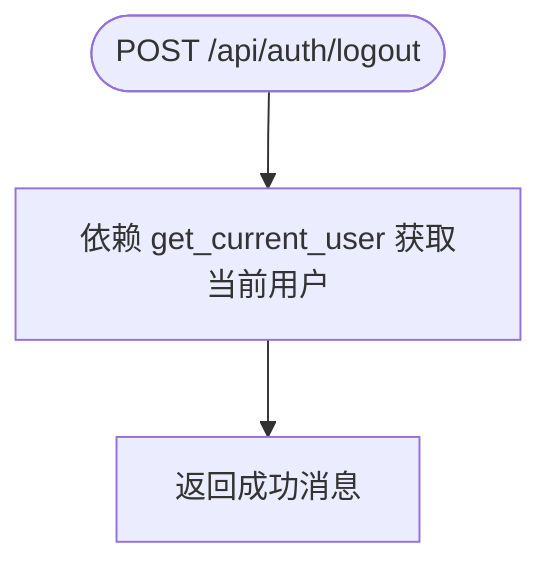
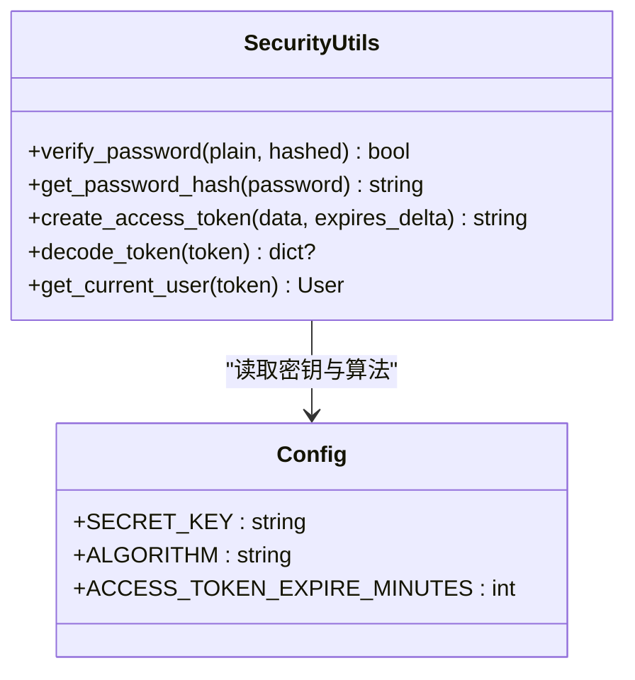
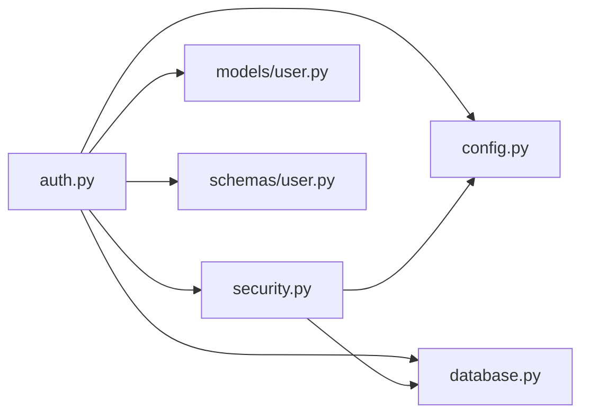

# 认证系统

<cite>
**本文引用的文件**
- [backend/app/api/auth.py](file://backend/app/api/auth.py)
- [backend/app/core/security.py](file://backend/app/core/security.py)
- [backend/app/core/config.py](file://backend/app/core/config.py)
- [backend/app/core/database.py](file://backend/app/core/database.py)
- [backend/app/models/user.py](file://backend/app/models/user.py)
- [backend/app/models/settings.py](file://backend/app/models/settings.py)
- [backend/app/schemas/user.py](file://backend/app/schemas/user.py)
- [backend/app/main.py](file://backend/app/main.py)
- [backend/requirements.txt](file://backend/requirements.txt)
- [PROJECT_OVERVIEW.md](file://PROJECT_OVERVIEW.md)
- [backend/README.md](file://backend/README.md)
- [front/src/components/AuthPage.tsx](file://front/src/components/AuthPage.tsx)
</cite>

## 目录
1. [引言](#引言)
2. [项目结构](#项目结构)
3. [核心组件](#核心组件)
4. [架构总览](#架构总览)
5. [详细组件分析](#详细组件分析)
6. [依赖分析](#依赖分析)
7. [性能考虑](#性能考虑)
8. [故障排查指南](#故障排查指南)
9. [结论](#结论)
10. [附录](#附录)

## 引言
本文件为 Quicky 认证系统的权威技术文档，聚焦于基于 JWT 的令牌认证机制，覆盖令牌生成、验证与“登出”流程；用户注册、登录、登出的完整流程与安全策略；密码加密（bcrypt）与盐值管理；用户模型设计（字段、约束、业务逻辑）；API 接口规范（HTTP 方法、URL 模式、请求参数与响应格式）；错误处理策略、安全考虑与最佳实践，并提供具体代码示例与使用场景。

## 项目结构
后端采用 FastAPI + SQLAlchemy 异步 ORM 架构，认证模块位于 app/api/auth.py，核心安全工具在 app/core/security.py，配置在 app/core/config.py，数据库连接在 app/core/database.py，用户模型与设置模型在 app/models 下，数据校验模型在 app/schemas 下。



图表来源
- [backend/app/main.py:1-66](file://backend/app/main.py#L1-L66)
- [backend/app/api/auth.py:1-99](file://backend/app/api/auth.py#L1-L99)
- [backend/app/core/security.py:1-80](file://backend/app/core/security.py#L1-L80)
- [backend/app/core/config.py:1-45](file://backend/app/core/config.py#L1-L45)
- [backend/app/core/database.py:1-46](file://backend/app/core/database.py#L1-L46)
- [backend/app/models/user.py:1-39](file://backend/app/models/user.py#L1-L39)
- [backend/app/models/settings.py:1-41](file://backend/app/models/settings.py#L1-L41)
- [backend/app/schemas/user.py:1-50](file://backend/app/schemas/user.py#L1-L50)

章节来源
- [backend/app/main.py:1-66](file://backend/app/main.py#L1-L66)
- [PROJECT_OVERVIEW.md:1-200](file://PROJECT_OVERVIEW.md#L1-L200)

## 核心组件
- 认证路由：提供注册、登录、获取当前用户、登出等端点。
- 安全工具：密码哈希/验证、JWT 生成/解码、OAuth2 密码流依赖、当前用户解析。
- 配置：密钥、算法、过期时间、数据库、CORS 等。
- 数据库：异步引擎、会话工厂、依赖注入。
- 模型：用户表、用户设置表（一对一体现）。
- 模式：Pydantic 校验模型（注册、登录、响应、Token、TokenData）。

章节来源
- [backend/app/api/auth.py:1-99](file://backend/app/api/auth.py#L1-L99)
- [backend/app/core/security.py:1-80](file://backend/app/core/security.py#L1-L80)
- [backend/app/core/config.py:1-45](file://backend/app/core/config.py#L1-L45)
- [backend/app/core/database.py:1-46](file://backend/app/core/database.py#L1-L46)
- [backend/app/models/user.py:1-39](file://backend/app/models/user.py#L1-L39)
- [backend/app/models/settings.py:1-41](file://backend/app/models/settings.py#L1-L41)
- [backend/app/schemas/user.py:1-50](file://backend/app/schemas/user.py#L1-L50)

## 架构总览
认证系统围绕“OAuth2 密码流 + JWT”的标准流程构建：
- 客户端向 /api/auth/login 提交用户名/密码。
- 服务端验证凭据，若通过则签发访问令牌（access_token），类型为 bearer。
- 客户端在后续受保护请求中携带 Authorization: Bearer <token>。
- 服务端通过依赖 get_current_user 解析并验证令牌，获取用户上下文。



图表来源
- [backend/app/api/auth.py:52-98](file://backend/app/api/auth.py#L52-L98)
- [backend/app/core/security.py:23-79](file://backend/app/core/security.py#L23-L79)
- [backend/app/core/config.py:18-21](file://backend/app/core/config.py#L18-L21)

## 详细组件分析

### JWT 令牌认证机制
- 令牌生成
  - 使用 HS256 算法，密钥来自配置项 SECRET_KEY。
  - 令牌载荷包含 sub（用户ID）与 exp（过期时间）。
  - 过期时长默认为 7 天，可通过 ACCESS_TOKEN_EXPIRE_MINUTES 配置。
- 令牌验证
  - 通过 OAuth2PasswordBearer 指定 tokenUrl="/api/auth/login"。
  - get_current_user 依赖该依赖项自动从 Authorization 头提取 Bearer 令牌。
  - decode_token 使用 SECRET_KEY 与 ALGORITHM 解码并校验签名。
  - 若载荷缺失或用户不存在，抛出 401 未授权异常。
- 刷新流程
  - 当前实现未提供 refresh_token 端点；建议在生产环境引入刷新令牌机制，或采用短令牌 + 自动续签策略（如前端轮询刷新）。



图表来源
- [backend/app/core/security.py:54-79](file://backend/app/core/security.py#L54-L79)

章节来源
- [backend/app/core/security.py:33-51](file://backend/app/core/security.py#L33-L51)
- [backend/app/core/config.py:18-21](file://backend/app/core/config.py#L18-L21)
- [backend/app/core/security.py:19-20](file://backend/app/core/security.py#L19-L20)

### 用户注册流程
- 请求路径：POST /api/auth/register
- 输入：UserCreate（邮箱、用户名、密码）
- 校验：邮箱唯一性检查
- 处理：密码经 bcrypt 哈希后存入数据库；同时创建默认用户设置
- 输出：UserResponse（含基础信息与状态）



图表来源
- [backend/app/api/auth.py:22-49](file://backend/app/api/auth.py#L22-L49)
- [backend/app/core/security.py:28-30](file://backend/app/core/security.py#L28-L30)

章节来源
- [backend/app/api/auth.py:22-49](file://backend/app/api/auth.py#L22-L49)
- [backend/app/schemas/user.py:16-18](file://backend/app/schemas/user.py#L16-L18)

### 用户登录流程
- 请求路径：POST /api/auth/login（OAuth2 密码流）
- 输入：OAuth2PasswordRequestForm（username/password）
- 校验：邮箱存在且密码匹配；用户必须 is_active=True
- 处理：更新 last_login；签发 access_token
- 输出：Token（access_token, token_type=bearer）



图表来源
- [backend/app/api/auth.py:52-86](file://backend/app/api/auth.py#L52-L86)
- [backend/app/core/security.py:23-30](file://backend/app/core/security.py#L23-L30)

章节来源
- [backend/app/api/auth.py:52-86](file://backend/app/api/auth.py#L52-L86)

### 登出流程
- 请求路径：POST /api/auth/logout
- 行为：当前实现仅返回成功消息；实际登出应由客户端删除本地令牌
- 建议：生产环境可引入黑名单（Redis）或短期令牌 + 前端轮询刷新



图表来源
- [backend/app/api/auth.py:95-98](file://backend/app/api/auth.py#L95-L98)

章节来源
- [backend/app/api/auth.py:95-98](file://backend/app/api/auth.py#L95-L98)

### 密码加密机制（bcrypt）
- 使用 passlib 的 CryptContext，算法为 bcrypt
- 注册时对明文密码调用 get_password_hash 生成哈希
- 登录时对输入密码调用 verify_password 与数据库存储的哈希比对
- 盐值由 bcrypt 自动生成并嵌入哈希值中，无需手动管理



图表来源
- [backend/app/core/security.py:19-79](file://backend/app/core/security.py#L19-L79)
- [backend/app/core/config.py:18-21](file://backend/app/core/config.py#L18-L21)

章节来源
- [backend/app/core/security.py:19-30](file://backend/app/core/security.py#L19-L30)
- [backend/requirements.txt:16-19](file://backend/requirements.txt#L16-L19)

### 用户模型设计
- 表 users
  - 主键：id
  - 唯一索引：email
  - 字段：username、hashed_password、avatar_url、bio、is_active、is_verified、created_at、updated_at、last_login
  - 关系：与 Note、Conversation、UserMastery、ReviewTask、UserSettings（一对一）级联删除
- 表 user_settings
  - 主键：id，唯一外键 user_id 指向 users.id
  - 字段：学习目标、提醒、通知、偏好、高级设置、时间戳
  - 关系：与 User 一对一反向关联

```mermaid
erDiagram
USERS {
int id PK
string email UK
string username
string hashed_password
string avatar_url
text bio
boolean is_active
boolean is_verified
timestamp created_at
timestamp updated_at
timestamp last_login
}
USER_SETTINGS {
int id PK
int user_id UK FK
int daily_goal_minutes
boolean reminder_enabled
time reminder_time
boolean email_notifications
boolean weekly_report
string language
string theme
boolean auto_save_notes
boolean sound_enabled
timestamp created_at
timestamp updated_at
}
USERS ||--o| USER_SETTINGS : "一对一"
```

图表来源
- [backend/app/models/user.py:11-39](file://backend/app/models/user.py#L11-L39)
- [backend/app/models/settings.py:11-41](file://backend/app/models/settings.py#L11-L41)

章节来源
- [backend/app/models/user.py:11-39](file://backend/app/models/user.py#L11-L39)
- [backend/app/models/settings.py:11-41](file://backend/app/models/settings.py#L11-L41)

### API 接口规范
- 认证
  - POST /api/auth/register
    - 请求体：UserCreate（email, username, password）
    - 成功：200，响应体：UserResponse
    - 错误：400（邮箱已存在）
  - POST /api/auth/login
    - 请求体：OAuth2PasswordRequestForm（username, password）
    - 成功：200，响应体：Token（access_token, token_type）
    - 错误：401（凭据无效），400（用户未激活）
  - GET /api/auth/me
    - 认证：Bearer <token>
    - 成功：200，响应体：UserResponse
    - 错误：401（令牌无效）
  - POST /api/auth/logout
    - 认证：Bearer <token>
    - 成功：200，响应体：{"message": "Successfully logged out"}

章节来源
- [backend/app/api/auth.py:22-98](file://backend/app/api/auth.py#L22-L98)
- [backend/app/schemas/user.py:16-44](file://backend/app/schemas/user.py#L16-L44)
- [backend/README.md:41-47](file://backend/README.md#L41-L47)

## 依赖分析
- 组件耦合
  - 认证路由依赖安全工具（密码哈希/验证、JWT）、数据库（查询/更新）、配置（密钥/算法/过期时间）、模型（User/UserSettings）、模式（UserCreate/UserResponse/Token）。
  - 安全工具依赖配置与数据库，用于令牌解码与当前用户解析。
- 外部依赖
  - python-jose（JWT 编解码）、passlib[bcrypt]（密码哈希）、SQLAlchemy 异步（数据库）、FastAPI（Web 框架）。
- 潜在循环依赖
  - 当前模块间为单向依赖，无明显循环。



图表来源
- [backend/app/api/auth.py:1-99](file://backend/app/api/auth.py#L1-L99)
- [backend/app/core/security.py:1-80](file://backend/app/core/security.py#L1-L80)
- [backend/app/core/database.py:1-46](file://backend/app/core/database.py#L1-L46)
- [backend/app/core/config.py:1-45](file://backend/app/core/config.py#L1-L45)
- [backend/app/models/user.py:1-39](file://backend/app/models/user.py#L1-L39)
- [backend/app/schemas/user.py:1-50](file://backend/app/schemas/user.py#L1-L50)

章节来源
- [backend/requirements.txt:16-31](file://backend/requirements.txt#L16-L31)

## 性能考虑
- 令牌过期时间
  - 默认 7 天，建议根据业务调整；过短影响用户体验，过长增加泄露风险。
- 数据库查询
  - 登录与注册均执行单条查询，索引（email 唯一）有助于提升性能。
- 会话管理
  - 使用异步会话工厂，避免阻塞；注意连接池配置（SQLite 不支持部分参数）。
- 前端交互
  - 前端认证页面包含表单校验与加载态，建议在真实网络请求中结合后端错误提示。

[本节为通用指导，不直接分析具体文件]

## 故障排查指南
- 401 未授权
  - 可能原因：令牌无效、签名不匹配、用户不存在、令牌过期。
  - 处理：重新登录获取新令牌；确认 Authorization 头格式为 Bearer <token>。
- 400 邮箱已存在
  - 可能原因：注册时邮箱重复。
  - 处理：更换邮箱或直接登录。
- 400 用户未激活
  - 可能原因：is_active=False。
  - 处理：联系管理员或检查激活流程。
- CORS 问题
  - 可能原因：前端域名不在 CORS_ORIGINS 中。
  - 处理：在配置中添加允许的源。
- 密钥与算法
  - 可能原因：SECRET_KEY 为空或被修改，ALGORITHM 不匹配。
  - 处理：确保 .env 中配置正确且前后端一致。

章节来源
- [backend/app/api/auth.py:25-31](file://backend/app/api/auth.py#L25-L31)
- [backend/app/api/auth.py:62-73](file://backend/app/api/auth.py#L62-L73)
- [backend/app/core/security.py:45-51](file://backend/app/core/security.py#L45-L51)
- [backend/app/core/config.py:18-30](file://backend/app/core/config.py#L18-L30)

## 结论
Quickly 认证系统基于 FastAPI 与 SQLAlchemy 异步 ORM，采用 OAuth2 密码流 + JWT 的标准方案，实现了安全可靠的用户注册、登录与当前用户查询。密码采用 bcrypt 哈希，令牌使用 HS256 算法并具备合理过期时间。建议在生产环境中补充刷新令牌机制、令牌黑名单、CORS 严格配置与密钥轮换策略，以进一步提升安全性与可用性。

[本节为总结，不直接分析具体文件]

## 附录

### 前端认证页面交互要点
- 支持登录/注册切换、表单校验（邮箱格式、密码长度、确认密码一致性）。
- 登录成功后回调 onLogin，前端负责存储并携带令牌访问受保护资源。
- 与后端约定的 API 端点与响应格式保持一致。

章节来源
- [front/src/components/AuthPage.tsx:19-70](file://front/src/components/AuthPage.tsx#L19-L70)
- [PROJECT_OVERVIEW.md:127-142](file://PROJECT_OVERVIEW.md#L127-L142)