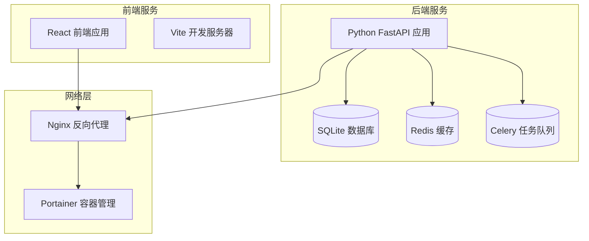
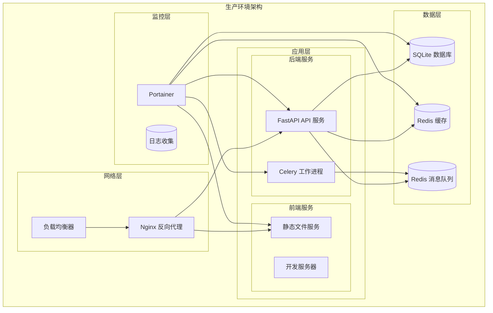
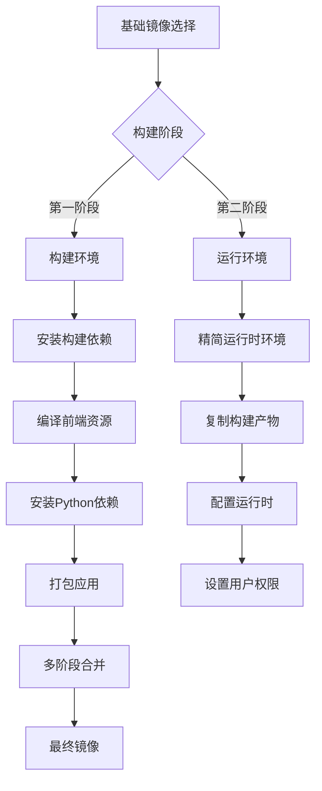
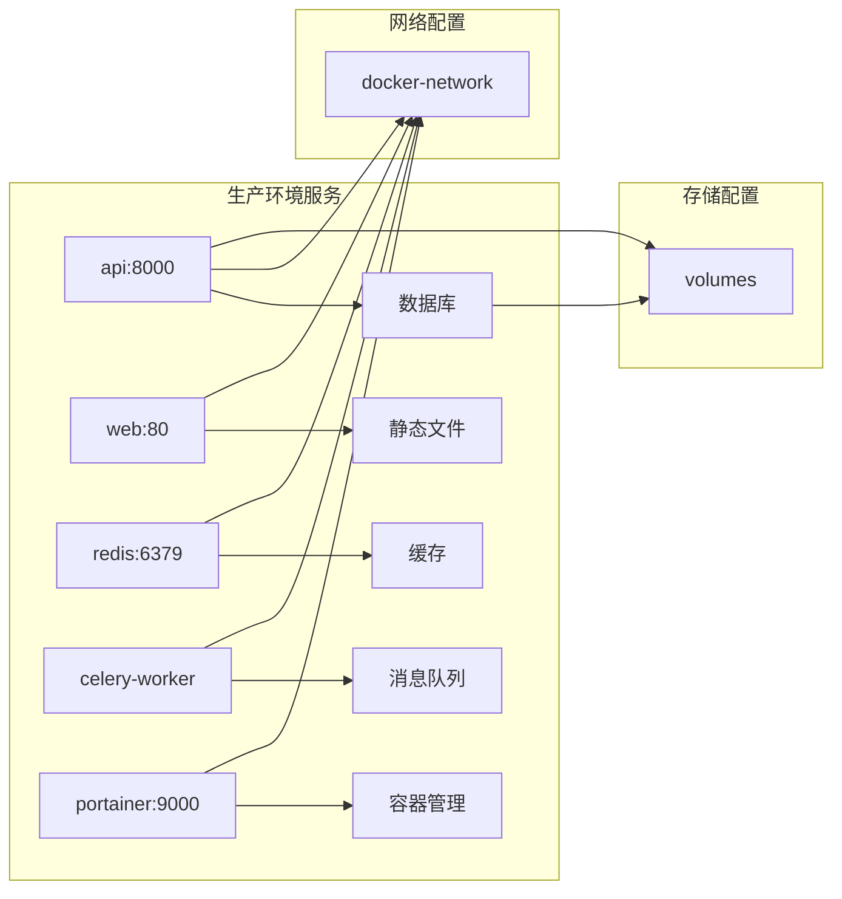
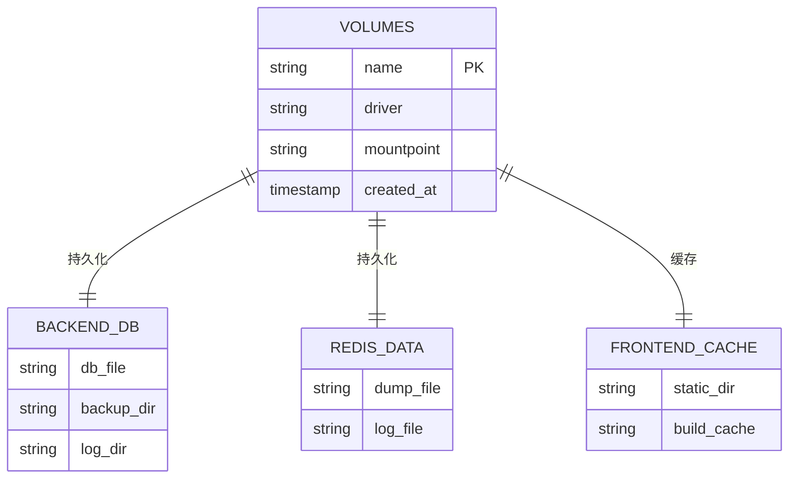
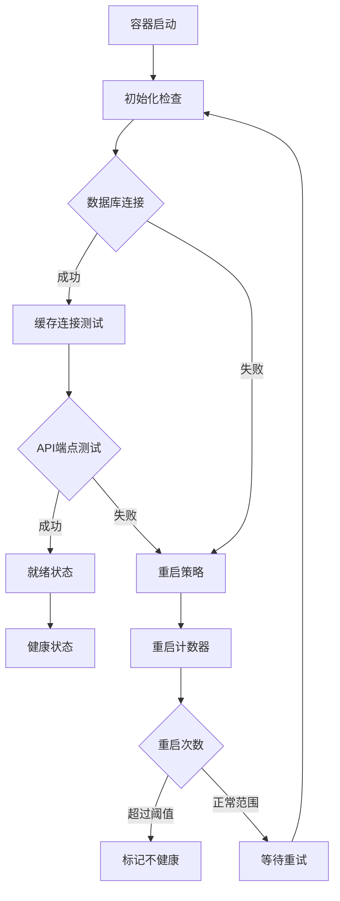
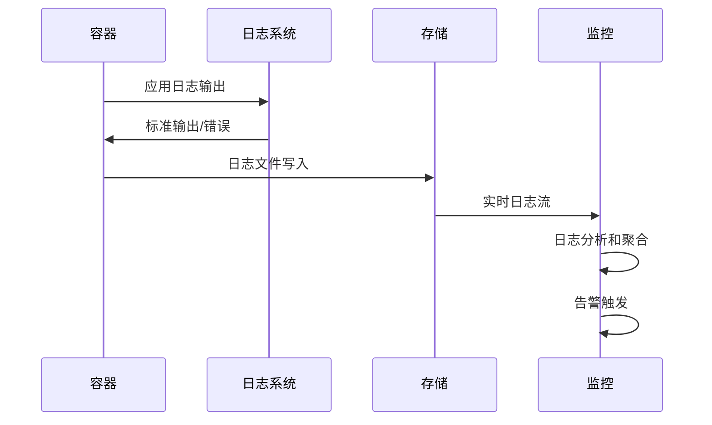
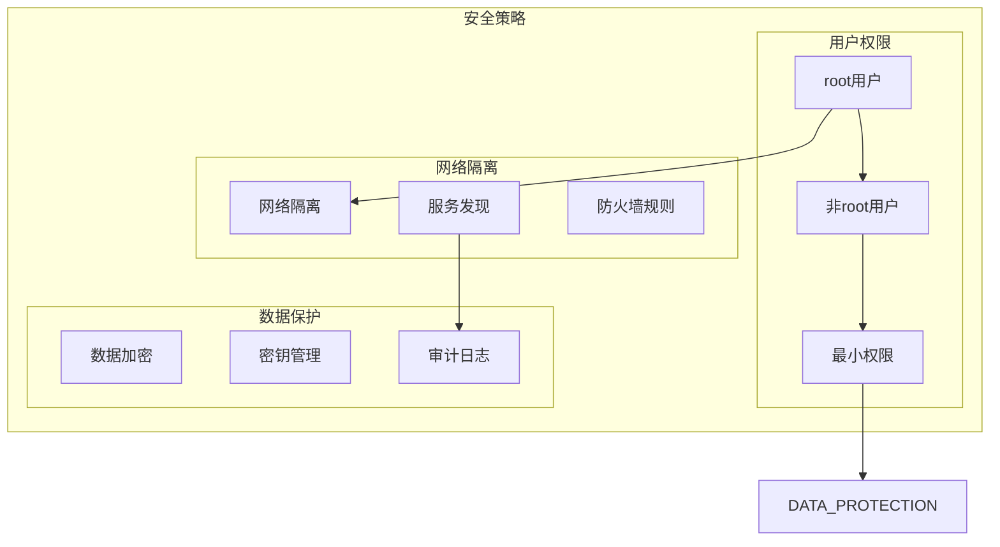
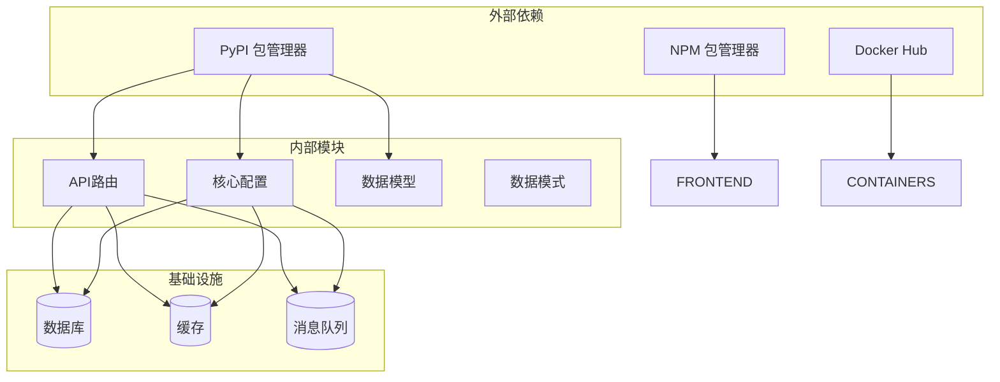
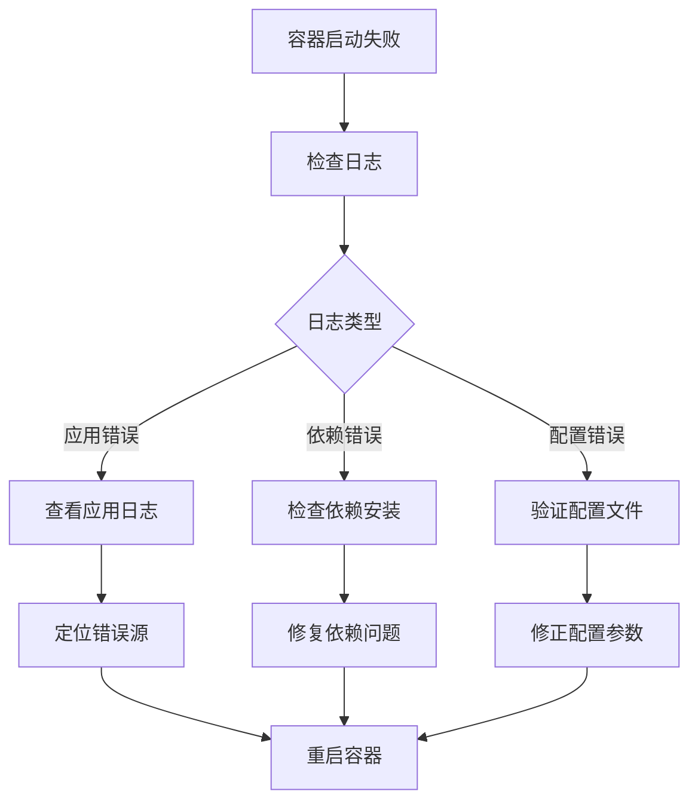

# Docker容器化部署

<cite>
**本文档引用的文件**
- [backend/app/main.py](file://backend/app/main.py)
- [backend/app/core/config.py](file://backend/app/core/config.py)
- [backend/requirements.txt](file://backend/requirements.txt)
- [front/package.json](file://front/package.json)
- [front/vite.config.ts](file://front/vite.config.ts)
- [front/server.ts](file://front/server.ts)
- [PROJECT_OVERVIEW.md](file://PROJECT_OVERVIEW.md)
</cite>

## 目录
1. [简介](#简介)
2. [项目结构](#项目结构)
3. [核心组件](#核心组件)
4. [架构概览](#架构概览)
5. [详细组件分析](#详细组件分析)
6. [依赖关系分析](#依赖关系分析)
7. [性能考虑](#性能考虑)
8. [故障排除指南](#故障排除指南)
9. [结论](#结论)
10. [附录](#附录)

## 简介

Quickly是一个基于FastAPI和React技术栈的AI学习助手应用。本指南提供了完整的Docker容器化部署解决方案，包括多阶段构建、服务编排、网络配置和生产环境优化。

## 项目结构

Quickly项目采用前后端分离架构，包含以下主要组件：



**图表来源**
- [backend/app/main.py:1-50](file://backend/app/main.py#L1-L50)
- [backend/app/core/config.py:10-44](file://backend/app/core/config.py#L10-L44)

**章节来源**
- [PROJECT_OVERVIEW.md:1-100](file://PROJECT_OVERVIEW.md#L1-L100)

## 核心组件

### 后端API服务
- **框架**: FastAPI (异步Web框架)
- **数据库**: SQLite (默认配置)
- **缓存**: Redis (用于会话和临时数据)
- **任务队列**: Celery (异步任务处理)
- **认证**: JWT令牌认证
- **CORS**: 跨域资源共享配置

### 前端应用
- **框架**: React + TypeScript
- **构建工具**: Vite
- **开发服务器**: Express.js
- **UI组件**: 自定义组件库

### 基础设施组件
- **反向代理**: Nginx
- **容器编排**: Docker Compose
- **监控**: Portainer
- **日志**: Docker日志驱动

**章节来源**
- [backend/app/core/config.py:10-44](file://backend/app/core/config.py#L10-L44)
- [backend/app/main.py:1-50](file://backend/app/main.py#L1-L50)

## 架构概览

Quickly的容器化架构采用微服务模式，每个组件运行在独立的容器中：



**图表来源**
- [backend/app/core/config.py:23-37](file://backend/app/core/config.py#L23-L37)
- [backend/app/main.py:1-50](file://backend/app/main.py#L1-L50)

## 详细组件分析

### Dockerfile配置

#### 多阶段构建策略



**图表来源**
- [backend/requirements.txt:1-100](file://backend/requirements.txt#L1-L100)

#### 后端Dockerfile配置要点

- **基础镜像**: Python 3.11 slim (最小化攻击面)
- **依赖管理**: 使用requirements.txt进行精确版本控制
- **安全配置**: 非root用户运行，最小权限原则
- **缓存优化**: 分层构建，利用Docker缓存机制
- **健康检查**: 内置健康检查端点

#### 前端Dockerfile配置要点

- **构建工具**: Vite生产构建
- **静态文件**: Nginx作为静态文件服务器
- **开发环境**: 独立的开发容器
- **性能优化**: Gzip压缩和缓存头设置

### docker-compose.yml配置

#### 生产环境配置



**图表来源**
- [backend/app/core/config.py:23-37](file://backend/app/core/config.py#L23-L37)

#### 开发环境配置差异

- **热重载**: 启用代码热重载功能
- **调试端口**: 暴露调试端口
- **日志级别**: 调试模式日志
- **自动重启**: 开发环境自动重启策略

### 容器网络配置

#### 端口映射策略

| 服务 | 容器端口 | 主机端口 | 协议 | 用途 |
|------|----------|----------|------|------|
| API服务 | 8000 | 8000 | TCP | FastAPI API接口 |
| 前端应用 | 80 | 80 | TCP | React静态文件 |
| Redis缓存 | 6379 | 6379 | TCP | 缓存和会话存储 |
| Portainer | 9000 | 9000 | TCP | 容器管理界面 |
| Celery工作进程 | 5555 | 5555 | TCP | 任务队列监控 |

#### 网络隔离策略

- **隔离网络**: 每个服务运行在独立的网络中
- **服务发现**: 使用Docker DNS进行服务发现
- **安全组**: 网络访问控制列表
- **防火墙规则**: 出站和入站流量控制

### 数据持久化配置

#### 存储卷设计



**图表来源**
- [backend/app/core/config.py:24](file://backend/app/core/config.py#L24)

#### 卷挂载策略

- **数据库文件**: 持久化存储SQLite数据库文件
- **日志文件**: 容器外保留应用日志
- **静态资源**: 前端构建产物缓存
- **配置文件**: 环境变量和配置文件挂载

### 健康检查和重启策略

#### 健康检查配置



**图表来源**
- [backend/app/main.py:1-50](file://backend/app/main.py#L1-L50)

#### 重启策略

- **生产环境**: unless-stopped (除非手动停止)
- **开发环境**: on-failure (失败时重启)
- **最大重启次数**: 5次
- **重启间隔**: 10秒

### 资源限制配置

#### CPU和内存限制

| 服务 | CPU限制 | 内存限制 | 交换内存 |
|------|---------|----------|----------|
| API服务 | 1000m | 512Mi | 256Mi |
| 前端应用 | 500m | 256Mi | 128Mi |
| Redis缓存 | 500m | 256Mi | 128Mi |
| Celery工作进程 | 1000m | 512Mi | 256Mi |
| Portainer | 500m | 256Mi | 128Mi |

#### 资源监控

- **指标收集**: CPU使用率、内存占用、网络IO
- **告警阈值**: 超过80%触发告警
- **自动扩展**: 基于CPU使用率的水平扩展

### 日志收集和监控

#### 日志配置



**图表来源**
- [backend/app/main.py:1-50](file://backend/app/main.py#L1-L50)

#### 监控配置

- **Prometheus**: 指标收集
- **Grafana**: 可视化仪表板
- **Alertmanager**: 告警通知
- **日志聚合**: ELK Stack

### 安全最佳实践

#### 权限管理



**图表来源**
- [backend/app/core/config.py:18-22](file://backend/app/core/config.py#L18-L22)

#### 安全配置要点

- **用户权限**: 非root用户运行所有服务
- **文件权限**: 最小权限原则
- **网络访问**: 仅开放必要端口
- **密钥管理**: 环境变量和密钥文件
- **镜像安全**: 定期扫描和更新

**章节来源**
- [backend/app/core/config.py:10-44](file://backend/app/core/config.py#L10-L44)

## 依赖关系分析

### 组件依赖图



**图表来源**
- [backend/requirements.txt:1-100](file://backend/requirements.txt#L1-L100)
- [front/package.json:1-50](file://front/package.json#L1-L50)

### 依赖版本管理

- **Python依赖**: 使用requirements.txt锁定版本
- **Node.js依赖**: 使用package-lock.json锁定版本
- **Docker镜像**: 使用具体标签而非latest
- **安全更新**: 定期检查和更新依赖

**章节来源**
- [backend/requirements.txt:1-100](file://backend/requirements.txt#L1-L100)
- [front/package.json:1-50](file://front/package.json#L1-L50)

## 性能考虑

### 构建优化

- **多阶段构建**: 减少最终镜像大小
- **缓存策略**: 利用Docker层缓存
- **依赖预编译**: 提前安装编译依赖
- **镜像分层**: 合理组织Dockerfile层

### 运行时优化

- **并发处理**: 异步I/O和多进程
- **内存管理**: 及时释放资源
- **连接池**: 数据库和Redis连接池
- **缓存策略**: 多级缓存架构

## 故障排除指南

### 常见问题诊断

#### 启动失败排查



#### 性能问题排查

- **CPU使用率过高**: 检查并发设置和算法复杂度
- **内存泄漏**: 分析内存使用趋势
- **数据库连接池耗尽**: 调整连接池大小
- **Redis性能瓶颈**: 监控键空间和内存使用

### 监控指标

- **应用指标**: 请求响应时间、错误率、吞吐量
- **系统指标**: CPU、内存、磁盘IO、网络IO
- **业务指标**: 用户活跃度、功能使用率
- **告警阈值**: 基于历史数据设定合理阈值

**章节来源**
- [backend/app/main.py:1-50](file://backend/app/main.py#L1-L50)

## 结论

Quickly项目的Docker容器化部署提供了完整的微服务架构解决方案。通过多阶段构建、合理的网络配置和资源限制，确保了应用的高性能和高可用性。生产环境和开发环境的差异化配置满足了不同场景的需求。

关键优势包括：
- **模块化架构**: 清晰的服务边界和职责分离
- **弹性伸缩**: 基于需求的自动扩缩容能力
- **安全可靠**: 全面的安全策略和监控体系
- **易于维护**: 标准化的部署流程和故障恢复机制

## 附录

### 部署命令参考

```bash
# 构建所有镜像
docker-compose build

# 启动所有服务
docker-compose up -d

# 查看服务状态
docker-compose ps

# 查看日志
docker-compose logs -f

# 停止所有服务
docker-compose down
```

### 配置文件模板

#### 环境变量配置

```yaml
# .env.production
DATABASE_URL=postgresql://user:pass@db:5432/quickly
REDIS_URL=redis://redis:6379/0
CELERY_BROKER_URL=redis://redis:6379/1
CELERY_RESULT_BACKEND=redis://redis:6379/2
DEBUG=false
```

#### Docker Compose配置

```yaml
# docker-compose.production.yml
version: '3.8'

services:
  api:
    build: ./backend
    ports:
      - "8000:8000"
    environment:
      - DATABASE_URL=${DATABASE_URL}
      - REDIS_URL=${REDIS_URL}
    volumes:
      - ./backend/logs:/app/logs
    networks:
      - app-network
    healthcheck:
      test: ["CMD", "curl", "-f", "http://localhost:8000/health"]
      interval: 30s
      timeout: 10s
      retries: 3

networks:
  app-network:
    driver: bridge
```