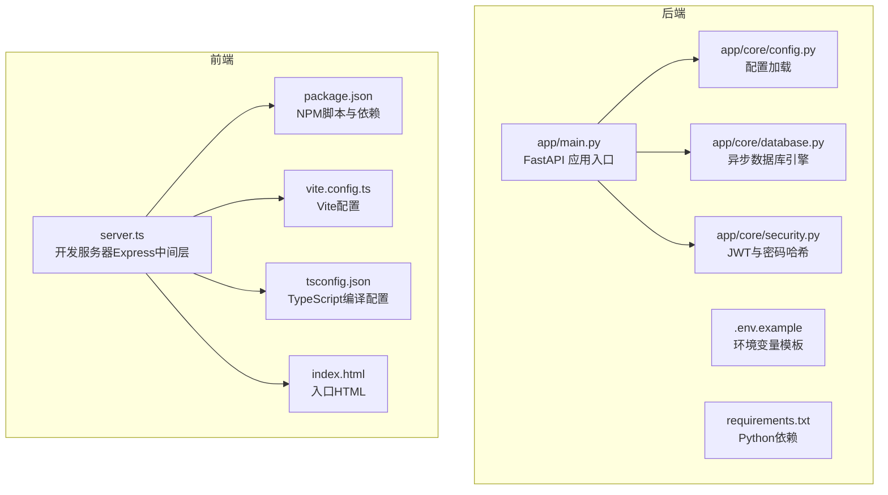
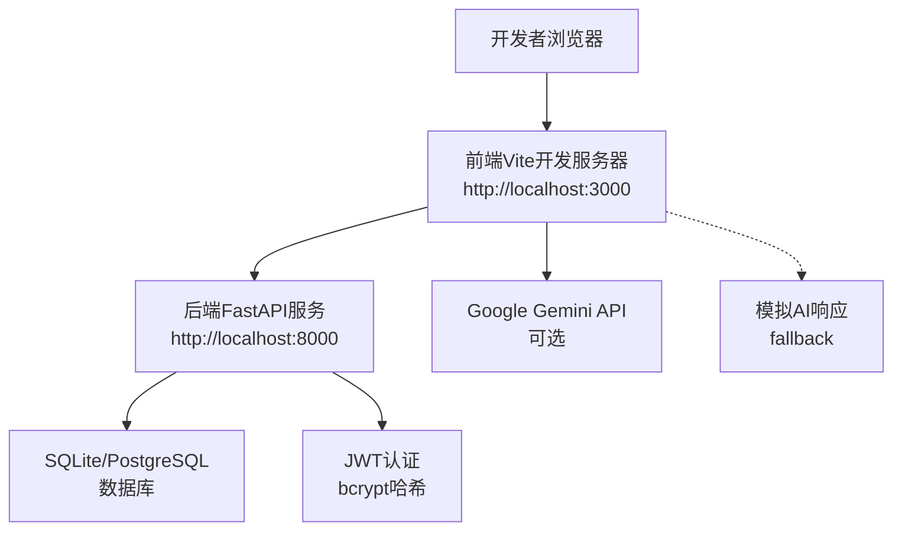
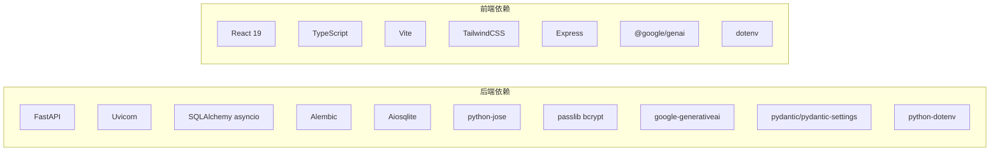

# 开发环境配置

<cite>
**本文引用的文件**
- [PROJECT_OVERVIEW.md](file://PROJECT_OVERVIEW.md)
- [backend/requirements.txt](file://backend/requirements.txt)
- [backend/app/main.py](file://backend/app/main.py)
- [backend/app/core/config.py](file://backend/app/core/config.py)
- [backend/app/core/database.py](file://backend/app/core/database.py)
- [backend/app/core/security.py](file://backend/app/core/security.py)
- [backend/.env.example](file://backend/.env.example)
- [front/package.json](file://front/package.json)
- [front/vite.config.ts](file://front/vite.config.ts)
- [front/server.ts](file://front/server.ts)
- [front/tsconfig.json](file://front/tsconfig.json)
- [front/index.html](file://front/index.html)
</cite>

## 目录
1. [简介](#简介)
2. [项目结构](#项目结构)
3. [核心组件](#核心组件)
4. [架构总览](#架构总览)
5. [详细组件分析](#详细组件分析)
6. [依赖分析](#依赖分析)
7. [性能考虑](#性能考虑)
8. [故障排除指南](#故障排除指南)
9. [结论](#结论)
10. [附录](#附录)

## 简介
本指南面向Quickly项目的开发者，提供从零开始搭建Python后端与Node.js前端开发环境的完整流程，涵盖版本要求、依赖安装、环境变量配置、开发服务器启动、热重载与调试设置，以及常见问题排查。项目采用前后端分离架构：后端基于FastAPI + SQLAlchemy异步ORM，前端基于React + TypeScript + Vite，AI能力通过Google Gemini API集成，并提供模拟模式以支持离线开发。

## 项目结构
Quickly采用双仓库结构，前后端分别独立开发与部署：
- 后端目录 backend：Python + FastAPI + SQLAlchemy异步ORM + Uvicorn ASGI服务器
- 前端目录 front：React + TypeScript + Vite + Express中间层（开发时）

图表来源
- [backend/app/main.py:1-66](file://backend/app/main.py#L1-L66)
- [backend/app/core/config.py:1-45](file://backend/app/core/config.py#L1-L45)
- [backend/app/core/database.py:1-46](file://backend/app/core/database.py#L1-L46)
- [backend/app/core/security.py:1-80](file://backend/app/core/security.py#L1-L80)
- [backend/.env.example:1-21](file://backend/.env.example#L1-L21)
- [backend/requirements.txt:1-37](file://backend/requirements.txt#L1-L37)
- [front/package.json:1-36](file://front/package.json#L1-L36)
- [front/vite.config.ts:1-23](file://front/vite.config.ts#L1-L23)
- [front/server.ts:1-402](file://front/server.ts#L1-L402)
- [front/tsconfig.json:1-27](file://front/tsconfig.json#L1-L27)
- [front/index.html:1-14](file://front/index.html#L1-L14)

章节来源
- [PROJECT_OVERVIEW.md:1-200](file://PROJECT_OVERVIEW.md#L1-L200)

## 核心组件
- 后端核心组件
  - FastAPI应用入口与生命周期管理
  - 配置加载（pydantic-settings + python-dotenv）
  - 异步数据库引擎（SQLAlchemy 2.0 asyncio）
  - 安全模块（JWT + bcrypt）
- 前端核心组件
  - Vite开发服务器与热重载
  - Express中间层用于代理与静态资源
  - TypeScript类型系统与别名路径配置
  - AI集成（Gemini API）与模拟模式

章节来源
- [backend/app/main.py:1-66](file://backend/app/main.py#L1-L66)
- [backend/app/core/config.py:1-45](file://backend/app/core/config.py#L1-L45)
- [backend/app/core/database.py:1-46](file://backend/app/core/database.py#L1-L46)
- [backend/app/core/security.py:1-80](file://backend/app/core/security.py#L1-L80)
- [front/vite.config.ts:1-23](file://front/vite.config.ts#L1-L23)
- [front/server.ts:1-402](file://front/server.ts#L1-L402)
- [front/tsconfig.json:1-27](file://front/tsconfig.json#L1-L27)

## 架构总览
Quickly的开发环境由两套独立的服务组成：后端FastAPI服务与前端Vite开发服务器。后端通过Uvicorn提供REST API；前端通过Vite提供开发时的热重载体验，并通过Express中间层处理AI请求与静态资源。

图表来源
- [backend/app/main.py:26-66](file://backend/app/main.py#L26-L66)
- [front/server.ts:157-256](file://front/server.ts#L157-L256)
- [front/vite.config.ts:14-22](file://front/vite.config.ts#L14-L22)

## 详细组件分析

### Python后端环境配置
- 版本要求
  - Python 3.8+（项目使用3.8+特性）
- 虚拟环境
  - 使用venv创建隔离环境
  - Windows激活方式：venv\Scripts\activate
  - Linux/Mac激活方式：source venv/bin/activate
- 依赖安装
  - pip install -r backend/requirements.txt
  - 依赖清单包含FastAPI、Uvicorn、SQLAlchemy异步、Redis/Celery（可选）、JWT/bcrypt、Gemini SDK、Pydantic等
- 环境变量
  - 复制 .env.example 为 .env 并按需修改
  - 关键变量：DEBUG、SECRET_KEY、DATABASE_URL、REDIS_URL、CORS_ORIGINS、GEMINI_API_KEY
- 开发服务器启动
  - uvicorn app.main:app --reload --host 0.0.0.0 --port 8000
  - 访问 http://localhost:8000/docs 查看OpenAPI文档
- 数据库初始化
  - 应用启动时自动创建表结构（SQLite默认）
- 安全与认证
  - JWT密钥与算法配置
  - 密码哈希使用bcrypt
- AI集成
  - Gemini API Key为空时进入模拟模式
  - 模拟模式提供预设知识点与高仿真响应

章节来源
- [PROJECT_OVERVIEW.md:106-125](file://PROJECT_OVERVIEW.md#L106-L125)
- [backend/requirements.txt:1-37](file://backend/requirements.txt#L1-L37)
- [backend/.env.example:1-21](file://backend/.env.example#L1-L21)
- [backend/app/main.py:15-66](file://backend/app/main.py#L15-L66)
- [backend/app/core/config.py:10-45](file://backend/app/core/config.py#L10-L45)
- [backend/app/core/database.py:15-46](file://backend/app/core/database.py#L15-L46)
- [backend/app/core/security.py:19-80](file://backend/app/core/security.py#L19-L80)

### Node.js前端环境配置
- 版本要求
  - Node.js 16+（Vite 6与TypeScript 5.8.2要求）
- 依赖安装
  - npm install
  - 包含React 19、Vite、TailwindCSS、@google/genai、Express等
- 环境变量
  - VITE_API_BASE_URL=http://localhost:8000（指向后端API）
- 开发服务器启动
  - npm run dev 启动Express中间层与Vite热重载
  - 访问 http://localhost:3000
- 热重载与文件监控
  - HMR开关受DISABLE_HMR环境变量控制
  - 当DISABLE_HMR为true时禁用HMR并关闭文件监控以节省CPU
- TypeScript配置
  - ES2022目标、bundler模块解析、路径别名@/*
- AI集成与模拟模式
  - 通过Express中间层调用Gemini API
  - 未配置API Key时自动降级为模拟响应

章节来源
- [PROJECT_OVERVIEW.md:106-114](file://PROJECT_OVERVIEW.md#L106-L114)
- [front/package.json:1-36](file://front/package.json#L1-L36)
- [front/vite.config.ts:14-22](file://front/vite.config.ts#L14-L22)
- [front/tsconfig.json:18-25](file://front/tsconfig.json#L18-L25)
- [front/server.ts:1-402](file://front/server.ts#L1-L402)

### 环境变量配置详解
- 后端（.env）
  - APP_NAME、DEBUG、SECRET_KEY（生产环境务必修改）
  - DATABASE_URL（开发默认SQLite，生产建议PostgreSQL）
  - REDIS_URL、CELERY_BROKER_URL、CELERY_RESULT_BACKEND（可选）
  - CORS_ORIGINS（允许的前端源）
  - GEMINI_API_KEY（留空启用模拟模式）
- 前端（.env）
  - VITE_API_BASE_URL=http://localhost:8000

章节来源
- [backend/.env.example:1-21](file://backend/.env.example#L1-L21)
- [PROJECT_OVERVIEW.md:164-178](file://PROJECT_OVERVIEW.md#L164-L178)

### 开发服务器启动指南
- 后端
  - 创建并激活虚拟环境
  - 安装依赖
  - 启动Uvicorn开发服务器
- 前端
  - 安装依赖
  - 启动开发服务器
- 联调
  - 确保前端VITE_API_BASE_URL指向后端地址
  - 后端CORS允许前端源

章节来源
- [PROJECT_OVERVIEW.md:106-125](file://PROJECT_OVERVIEW.md#L106-L125)

### 热重载与调试设置
- 前端热重载
  - Vite默认启用HMR
  - DISABLE_HMR=true时禁用HMR并关闭文件监控
- 后端调试
  - Uvicorn --reload自动重启
  - DEBUG=true时SQLAlchemy echo输出SQL
- 前端调试
  - Vite开发服务器支持SourceMap
  - Express中间层打印AI初始化与错误日志

章节来源
- [front/vite.config.ts:14-22](file://front/vite.config.ts#L14-L22)
- [backend/app/core/database.py:18-30](file://backend/app/core/database.py#L18-L30)
- [front/server.ts:18-40](file://front/server.ts#L18-L40)

## 依赖分析
- 后端依赖
  - Web框架：FastAPI、Uvicorn
  - 数据库：SQLAlchemy asyncio、Alembic、Aiosqlite
  - 安全：python-jose、passlib bcrypt
  - AI：google-generativeai、aiohttp
  - 验证与序列化：pydantic、pydantic-settings、email-validator
  - 工具：python-dotenv、httpx
- 前端依赖
  - 框架：React 19、TypeScript
  - 构建：Vite、esbuild
  - 样式：TailwindCSS
  - 工具：dotenv、tsx、express

图表来源
- [backend/requirements.txt:1-37](file://backend/requirements.txt#L1-L37)
- [front/package.json:13-34](file://front/package.json#L13-L34)

章节来源
- [backend/requirements.txt:1-37](file://backend/requirements.txt#L1-L37)
- [front/package.json:1-36](file://front/package.json#L1-L36)

## 性能考虑
- 数据库连接池
  - SQLite开发环境：无需连接池
  - PostgreSQL生产环境：启用pool_pre_ping、合理设置pool_size与max_overflow
- 文件监控与CPU占用
  - DISABLE_HMR=true时关闭文件监控，减少CPU消耗
- AI调用
  - Gemini API失败时自动回退到模拟响应，保证可用性
- 缓存与队列
  - Redis与Celery为可选扩展，按需启用

章节来源
- [backend/app/core/database.py:15-30](file://backend/app/core/database.py#L15-L30)
- [front/vite.config.ts:14-22](file://front/vite.config.ts#L14-L22)
- [front/server.ts:251-256](file://front/server.ts#L251-L256)

## 故障排除指南
- 后端启动失败
  - 检查Python版本是否满足3.8+
  - 确认虚拟环境已激活且依赖安装成功
  - 核对DATABASE_URL与权限（SQLite文件路径）
- CORS错误
  - 确认CORS_ORIGINS包含前端源（如http://localhost:3000）
- JWT认证失败
  - 确认SECRET_KEY未使用默认值
  - 检查Token过期时间与算法配置
- 前端无法访问后端API
  - 检查VITE_API_BASE_URL是否指向后端地址
  - 确认后端CORS允许前端源
- Gemini API不可用
  - 未配置API Key时自动进入模拟模式
  - 配置后端GEMINI_API_KEY或前端GEMINI_API_KEY（Express中间层）
- 热重载无效
  - 检查DISABLE_HMR环境变量
  - 确认Vite端口未被占用

章节来源
- [backend/.env.example:19-21](file://backend/.env.example#L19-L21)
- [backend/app/core/config.py:18-31](file://backend/app/core/config.py#L18-L31)
- [backend/app/core/security.py:33-52](file://backend/app/core/security.py#L33-L52)
- [front/server.ts:18-40](file://front/server.ts#L18-L40)
- [front/vite.config.ts:14-22](file://front/vite.config.ts#L14-L22)

## 结论
Quickly提供了清晰的前后端分离开发环境配置方案。后端使用FastAPI与异步数据库，前端采用现代工具链与热重载，AI能力通过Gemini API与模拟模式双重保障。遵循本指南可快速搭建并高效开发，同时具备良好的扩展性与可维护性。

## 附录
- 快速开始命令
  - 后端：cd backend && python -m venv venv && venv\Scripts\activate（Windows）或 source venv/bin/activate（Linux/Mac）&& pip install -r requirements.txt && uvicorn app.main:app --reload --host 0.0.0.0 --port 8000
  - 前端：cd front && npm install && npm run dev
- 常用端口
  - 后端：8000（API文档：/docs）
  - 前端：3000（Vite + Express中间层）

章节来源
- [PROJECT_OVERVIEW.md:106-125](file://PROJECT_OVERVIEW.md#L106-L125)