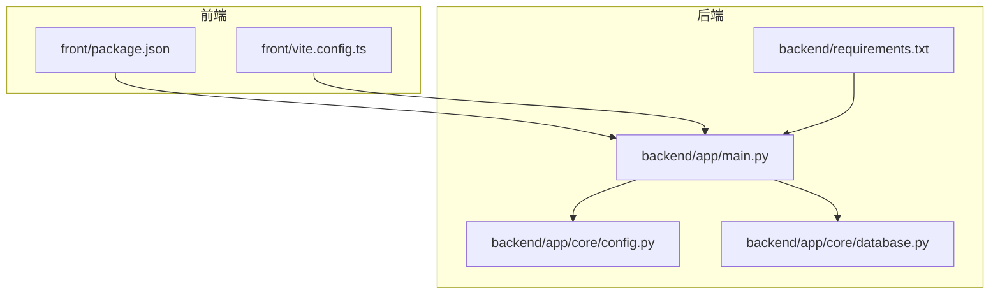
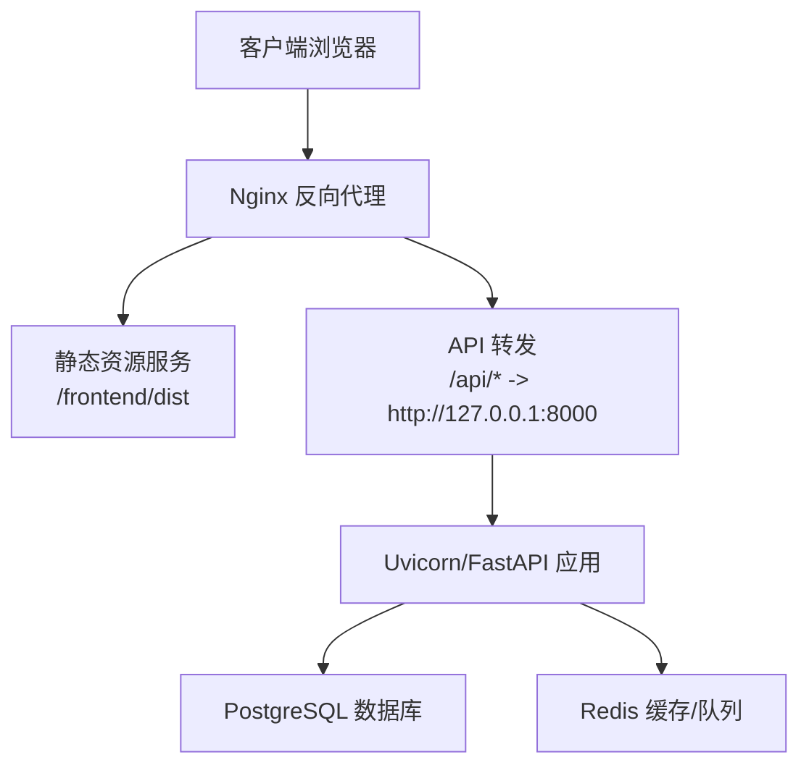
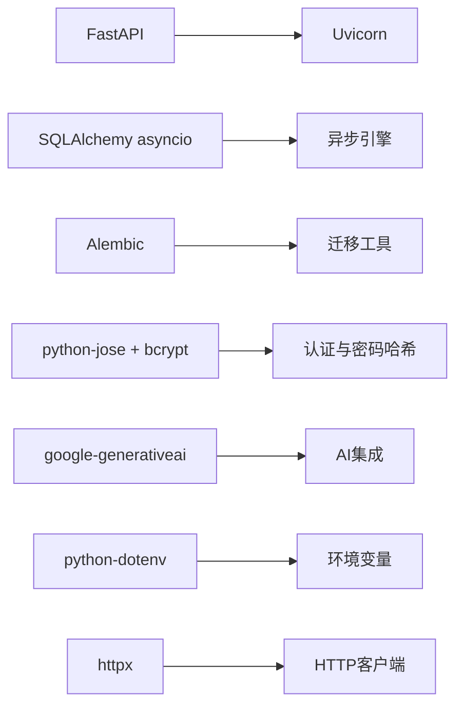

# 生产环境部署

<cite>
**本文引用的文件**
- [backend/app/main.py](file://backend/app/main.py)
- [backend/app/core/config.py](file://backend/app/core/config.py)
- [backend/app/core/database.py](file://backend/app/core/database.py)
- [backend/requirements.txt](file://backend/requirements.txt)
- [backend/.env.example](file://backend/.env.example)
- [backend/README.md](file://backend/README.md)
- [PROJECT_OVERVIEW.md](file://PROJECT_OVERVIEW.md)
- [front/package.json](file://front/package.json)
- [front/vite.config.ts](file://front/vite.config.ts)
</cite>

## 目录
1. [引言](#引言)
2. [项目结构](#项目结构)
3. [核心组件](#核心组件)
4. [架构总览](#架构总览)
5. [详细组件分析](#详细组件分析)
6. [依赖分析](#依赖分析)
7. [性能考虑](#性能考虑)
8. [故障排查指南](#故障排查指南)
9. [结论](#结论)
10. [附录](#附录)

## 引言
本文件面向Quickly项目的生产环境部署，覆盖系统要求与硬件配置建议、多种部署方式（传统服务器、Docker容器化、云平台）、Nginx反向代理配置（静态资源服务、API转发、SSL证书）、Gunicorn/Uvicorn生产服务器配置与启动、数据库生产配置（PostgreSQL与连接池）、域名与HTTPS配置、备份与日志轮转、监控与自动化部署流程等。内容基于仓库中的后端FastAPI应用、配置与依赖清单进行梳理与扩展，确保读者可按步骤完成从开发到生产的落地。

## 项目结构
Quickly采用前后端分离架构：前端使用React/Vite构建，后端使用FastAPI提供REST API；数据库默认开发态使用SQLite，生产态推荐PostgreSQL；通过Redis用于缓存与可选的任务队列（Celery）。

图表来源
- [backend/app/main.py:1-66](file://backend/app/main.py#L1-L66)
- [backend/app/core/config.py:1-45](file://backend/app/core/config.py#L1-L45)
- [backend/app/core/database.py:1-46](file://backend/app/core/database.py#L1-L46)
- [backend/requirements.txt:1-37](file://backend/requirements.txt#L1-L37)
- [front/package.json:1-36](file://front/package.json#L1-L36)
- [front/vite.config.ts:1-23](file://front/vite.config.ts#L1-L23)

章节来源
- [PROJECT_OVERVIEW.md:1-200](file://PROJECT_OVERVIEW.md#L1-L200)
- [backend/README.md:1-75](file://backend/README.md#L1-L75)

## 核心组件
- 应用入口与路由：后端以FastAPI应用作为入口，注册认证、聊天、笔记、知识、掌握度、复习、设置等路由，并在根路径提供健康检查与状态检查端点。
- 配置体系：通过Pydantic Settings加载环境变量，支持调试开关、密钥、数据库URL、Redis/Celery、CORS、AI密钥等。
- 数据库层：异步SQLAlchemy引擎，针对SQLite与PostgreSQL分别配置连接池参数；提供会话依赖注入。
- 依赖清单：明确Web框架、数据库、认证、AI集成、序列化与HTTP客户端等生产所需依赖。

章节来源
- [backend/app/main.py:15-66](file://backend/app/main.py#L15-L66)
- [backend/app/core/config.py:10-45](file://backend/app/core/config.py#L10-L45)
- [backend/app/core/database.py:10-46](file://backend/app/core/database.py#L10-L46)
- [backend/requirements.txt:1-37](file://backend/requirements.txt#L1-L37)

## 架构总览
下图展示了生产环境典型拓扑：Nginx作为反向代理与静态资源服务，后端FastAPI通过Uvicorn运行，数据库使用PostgreSQL，Redis用于缓存与可选任务队列。

图表来源
- [backend/app/main.py:42-49](file://backend/app/main.py#L42-L49)
- [backend/app/core/config.py:24](file://backend/app/core/config.py#L24)
- [backend/app/core/database.py:22-30](file://backend/app/core/database.py#L22-L30)

## 详细组件分析

### 1) 系统要求与硬件配置建议
- 操作系统：Linux发行版（如Ubuntu 20.04+/CentOS Stream），内核版本满足现代Python与Nginx生态。
- CPU：至少2核（建议4核以上以支撑并发请求与AI调用）。
- 内存：至少4GB（建议8GB以上，含数据库与缓存占用）。
- 存储：SSD优先；SQLite开发态建议>10GB剩余空间；生产态PostgreSQL根据数据量预留充足空间。
- 网络：开放TCP 80/443（HTTPS）与应用端口（默认8000），防火墙放行Nginx与数据库端口。
- Python：3.10+（与依赖版本兼容）。
- 前端构建：Node.js 18+（用于Vite构建），生产态建议离线构建产物交由Nginx托管。

章节来源
- [backend/requirements.txt:1-37](file://backend/requirements.txt#L1-L37)
- [front/package.json:13-34](file://front/package.json#L13-L34)

### 2) 多种部署方式

#### 2.1 传统服务器部署
- 步骤概览
  - 安装系统依赖：Python 3.10+、Git、Nginx、PostgreSQL、Redis。
  - 准备应用目录与虚拟环境，克隆代码至生产目录。
  - 安装后端依赖并生成生产构建（前端Vite构建产物）。
  - 配置环境变量（见“环境变量与配置”）。
  - 启动后端服务（Uvicorn）与Nginx。
  - 配置系统服务（systemd）与开机自启。
- 关键要点
  - 使用非root用户运行应用，限制权限。
  - 将静态资源指向前端构建目录（dist）。
  - 仅监听本地回环或受信网段，避免直接暴露8000端口于公网。

章节来源
- [backend/README.md:9-39](file://backend/README.md#L9-L39)
- [PROJECT_OVERVIEW.md:106-125](file://PROJECT_OVERVIEW.md#L106-L125)

#### 2.2 Docker容器化部署
- 建议方案
  - 后端镜像：基于官方Python运行时，安装依赖并复制应用代码，暴露8000端口，使用Uvicorn启动。
  - 前端镜像：基于Node构建产物镜像（如nginx:alpine）托管dist目录。
  - 数据库镜像：PostgreSQL官方镜像，持久化卷映射。
  - 缓存镜像：Redis官方镜像。
  - 反向代理：Nginx官方镜像，挂载证书与站点配置。
  - Compose编排：将上述服务组合，统一网络与卷。
- 部署流程
  - 构建镜像：docker build -t quickly-backend:prod .
  - 启动编排：docker compose up -d
  - 证书与域名：在Nginx容器挂载证书与站点配置，映射80/443端口。
- 注意事项
  - 环境变量通过Compose或Secrets注入。
  - 数据库与缓存使用独立持久卷。
  - 前端静态资源由Nginx提供，后端仅处理API。

章节来源
- [backend/requirements.txt:1-37](file://backend/requirements.txt#L1-L37)
- [front/package.json:7-11](file://front/package.json#L7-L11)

#### 2.3 云平台部署
- 适用平台：AWS/GCP/Azure弹性计算服务、容器引擎（ECS/EKS/GKE/AKS）或平台即服务（PaaS）。
- 建议架构
  - 应用服务：容器化后托管于弹性负载均衡器后方的自动伸缩组。
  - 数据库：托管数据库服务（RDS/Cloud SQL/Managed PostgreSQL），开启备份与只读副本。
  - 缓存：托管Redis（如云Redis服务）。
  - 静态资源：对象存储（S3/GCS/Cloud Storage）+CDN加速。
  - 反向代理：前置WAF与HTTPS卸载，统一域名与证书管理。
- 自动化
  - CI/CD流水线：代码变更触发镜像构建与部署。
  - 健康检查：Kubernetes就绪/存活探针，Nginx健康端点。
  - 蓝绿/金丝雀发布：控制流量切换，降低风险。

章节来源
- [backend/app/main.py:52-66](file://backend/app/main.py#L52-L66)
- [backend/app/core/config.py:24](file://backend/app/core/config.py#L24)

### 3) Nginx反向代理配置
- 静态资源服务
  - 将前端构建目录（dist）作为静态站点根目录，启用gzip与缓存头。
- API转发
  - 将/api前缀转发至后端Uvicorn进程（如http://127.0.0.1:8000）。
  - 配置超时、缓冲与错误页。
- SSL证书
  - 使用Let’s Encrypt或商业证书，配置TLS 1.3+与安全套件。
  - 强制HTTPS重定向与HSTS。
- 示例要点（不包含具体配置片段）
  - 站点根目录指向前端dist。
  - location /api/ 匹配并代理到后端。
  - ssl_certificate 与 ssl_certificate_key 指向证书文件。
  - include /etc/nginx/snippets/ssl-params.conf（如存在）。

章节来源
- [backend/app/main.py:42-49](file://backend/app/main.py#L42-L49)
- [PROJECT_OVERVIEW.md:164-177](file://PROJECT_OVERVIEW.md#L164-L177)

### 4) Gunicorn/Uvicorn生产服务器配置与启动
- Uvicorn（推荐）
  - 以多进程模式运行（workers），绑定0.0.0.0:8000，禁用reload。
  - 使用--log-level与--access-logformat控制日志。
  - 结合systemd或Supervisor管理进程与自动重启。
- Gunicorn（可选）
  - 使用uvicorn.workers.UvicornWorker作为worker_class。
  - 配置workers数量（CPU核数×2+1）与timeout。
- 启动命令示例（不包含具体命令）
  - uvicorn app.main:app --workers 2 --host 0.0.0.0 --port 8000
  - gunicorn -w 2 -k uvicorn.workers.UvicornWorker app.main:app
- 进程管理
  - systemd服务单元：设置User、WorkingDirectory、Environment、Restart策略。
  - 日志：stdout/stderr重定向至journald或文件。

章节来源
- [backend/README.md:31-35](file://backend/README.md#L31-L35)
- [backend/requirements.txt:4-6](file://backend/requirements.txt#L4-L6)

### 5) 数据库生产环境配置（PostgreSQL与连接池）
- 数据库选择
  - 开发态使用SQLite，生产态迁移至PostgreSQL，确保ACID与并发能力。
- 连接池参数
  - pool_size：默认10，依据并发与实例规格调整。
  - max_overflow：默认20，超出pool_size后的溢出连接数。
  - pool_pre_ping：启用以自动检测与重建失效连接。
- 连接字符串
  - 使用标准PostgreSQL URL格式，包含主机、端口、数据库名、用户名与密码。
- 初始化与迁移
  - 首次启动自动创建表结构；生产中建议使用迁移工具（Alembic）进行版本化管理。
- 备份策略
  - 定时逻辑备份（pg_dump）与归档WAL，保留7-30天滚动备份。
  - 校验备份完整性与恢复演练。

章节来源
- [backend/app/core/config.py:24](file://backend/app/core/config.py#L24)
- [backend/app/core/database.py:22-30](file://backend/app/core/database.py#L22-L30)
- [backend/requirements.txt:9-11](file://backend/requirements.txt#L9-L11)

### 6) 域名配置、SSL证书申请与HTTPS配置
- 域名解析
  - 将域名A/AAAA记录指向服务器公网IP；如使用云平台，配置负载均衡器或弹性IP。
- 证书申请
  - Let’s Encrypt（certbot）自动化申请与续期。
  - 商业证书：上传至平台证书管理服务或Nginx配置。
- HTTPS配置
  - 强制HTTP到HTTPS跳转。
  - 配置安全响应头（HSTS、X-Frame-Options、X-Content-Type-Options等）。
  - TLS参数优化（最小版本、加密套件、OCSP Stapling）。

章节来源
- [PROJECT_OVERVIEW.md:164-177](file://PROJECT_OVERVIEW.md#L164-L177)

### 7) 备份策略、日志轮转与监控
- 备份策略
  - 数据库：定时逻辑备份+WAL归档；异地容灾。
  - 文件：静态资源与上传文件的定期快照。
  - 配置：环境变量与密钥的版本化管理。
- 日志轮转
  - Nginx与Uvicorn日志输出至文件；使用logrotate按大小或时间轮转。
  - 保留周期与压缩策略需结合磁盘容量与合规要求。
- 监控
  - 健康检查端点：/ 与 /api/status。
  - 指标：CPU、内存、磁盘、连接数、QPS、错误率、响应时间。
  - 告警：阈值告警与异常检测（如连接池耗尽、慢查询）。

章节来源
- [backend/app/main.py:52-66](file://backend/app/main.py#L52-L66)

### 8) 部署脚本示例与自动化部署流程
- 自动化部署流程（概念性说明）
  - 触发：代码推送或合并请求。
  - 构建：拉取依赖、前端构建、后端打包。
  - 测试：健康检查与轻量回归测试。
  - 部署：蓝绿/金丝雀发布，切换流量。
  - 回滚：失败自动回滚或人工干预。
- 部署脚本要点（不包含具体脚本）
  - 环境准备：安装依赖、创建虚拟环境、拷贝配置。
  - 数据库迁移：执行迁移脚本。
  - 服务重启：优雅关闭旧进程，启动新进程。
  - 健康检查：等待应用就绪后再切换流量。

章节来源
- [backend/README.md:9-39](file://backend/README.md#L9-L39)

## 依赖分析
后端依赖围绕Web框架、数据库、认证、AI集成与序列化展开；生产态建议固定版本并启用安全更新通道。

图表来源
- [backend/requirements.txt:4-6](file://backend/requirements.txt#L4-L6)
- [backend/requirements.txt:9-11](file://backend/requirements.txt#L9-L11)
- [backend/requirements.txt:17-23](file://backend/requirements.txt#L17-L23)
- [backend/requirements.txt:30-36](file://backend/requirements.txt#L30-L36)

章节来源
- [backend/requirements.txt:1-37](file://backend/requirements.txt#L1-L37)

## 性能考虑
- 连接池调优：根据并发峰值与数据库规格调整pool_size与max_overflow，启用pool_pre_ping提升稳定性。
- 异步IO：利用异步SQLAlchemy与异步HTTP客户端减少阻塞。
- 缓存：Redis缓存热点数据与会话，降低数据库压力。
- 前端静态资源：CDN加速与压缩，减少后端带宽占用。
- 限流与熔断：在Nginx或API层配置限流，防止突发流量击穿。

## 故障排查指南
- 健康检查
  - 访问根路径与状态端点，确认服务在线与AI模式状态。
- 数据库连接
  - 检查DATABASE_URL、连接池参数与数据库可达性。
- CORS与跨域
  - 校验CORS_ORIGINS是否包含生产域名与端口。
- 日志定位
  - 查看Nginx访问/错误日志与Uvicorn应用日志。
- 环境变量
  - 确认DEBUG关闭、SECRET_KEY已替换、GEMINI_API_KEY可用。

章节来源
- [backend/app/main.py:52-66](file://backend/app/main.py#L52-L66)
- [backend/app/core/config.py:15-31](file://backend/app/core/config.py#L15-L31)
- [backend/.env.example:4-21](file://backend/.env.example#L4-L21)

## 结论
通过明确的系统要求、多样的部署方式、完善的Nginx反向代理与HTTPS配置、生产数据库与连接池策略、以及备份、日志与监控体系，Quickly可在稳定环境中持续交付高质量服务。建议以Docker或云平台为载体，配合CI/CD实现自动化与可观测性，保障业务连续性与安全性。

## 附录

### A. 环境变量与配置
- 后端环境变量（示例字段）
  - APP_NAME、DEBUG、SECRET_KEY
  - DATABASE_URL（生产建议改为PostgreSQL）
  - REDIS_URL、CELERY_BROKER_URL、CELERY_RESULT_BACKEND
  - GEMINI_API_KEY
  - CORS_ORIGINS（生产域名）
- 前端环境变量
  - VITE_API_BASE_URL（指向生产API域名）

章节来源
- [backend/.env.example:4-21](file://backend/.env.example#L4-L21)
- [PROJECT_OVERVIEW.md:164-177](file://PROJECT_OVERVIEW.md#L164-L177)

### B. API端点与健康检查
- 健康检查：/（返回服务状态）、/api/status（返回在线状态与AI模式）
- 主要路由前缀：/api/auth、/api/chat、/api/notes、/api/knowledge、/api/mastery、/api/review、/api/settings

章节来源
- [backend/app/main.py:52-66](file://backend/app/main.py#L52-L66)
- [backend/README.md:41-66](file://backend/README.md#L41-L66)