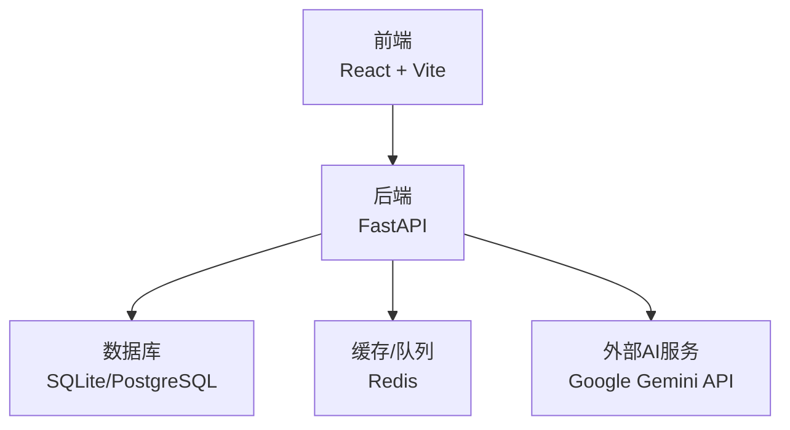
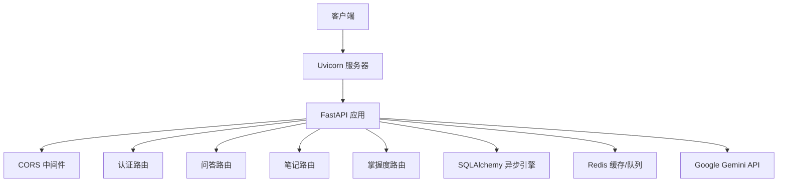
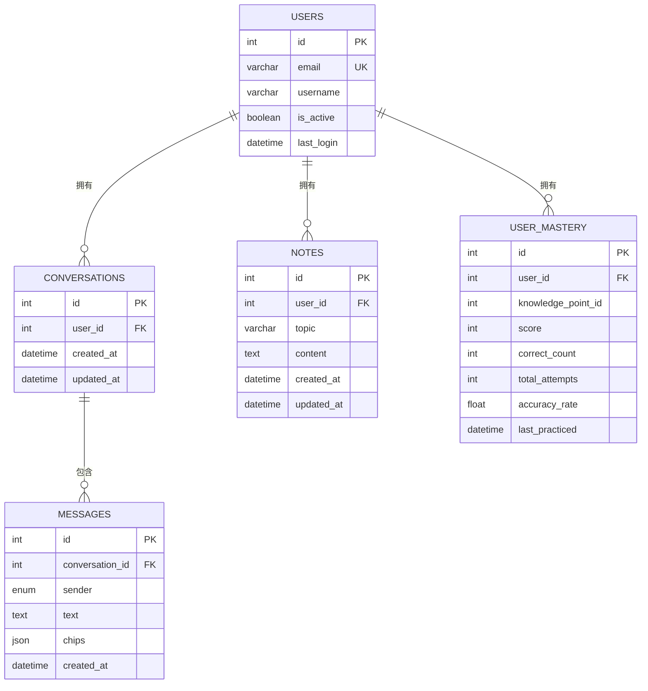
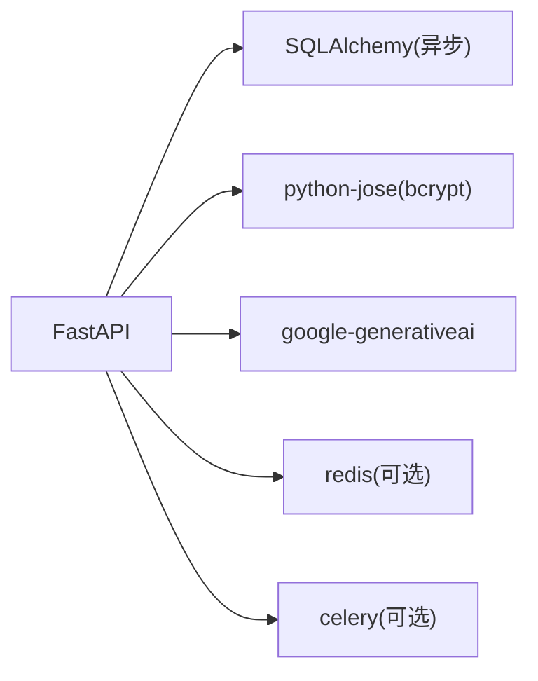

# 监控与维护

<cite>
**本文引用的文件**
- [PROJECT_OVERVIEW.md](file://PROJECT_OVERVIEW.md)
- [backend/README.md](file://backend/README.md)
- [backend/requirements.txt](file://backend/requirements.txt)
- [backend/app/main.py](file://backend/app/main.py)
- [backend/app/core/config.py](file://backend/app/core/config.py)
- [backend/app/core/database.py](file://backend/app/core/database.py)
- [backend/app/core/security.py](file://backend/app/core/security.py)
- [backend/app/api/auth.py](file://backend/app/api/auth.py)
- [backend/app/api/chat.py](file://backend/app/api/chat.py)
- [backend/app/api/notes.py](file://backend/app/api/notes.py)
- [backend/app/api/mastery.py](file://backend/app/api/mastery.py)
- [backend/app/models/user.py](file://backend/app/models/user.py)
- [backend/.env.example](file://backend/.env.example)
</cite>

## 目录
1. [简介](#简介)
2. [项目结构](#项目结构)
3. [核心组件](#核心组件)
4. [架构总览](#架构总览)
5. [详细组件分析](#详细组件分析)
6. [依赖分析](#依赖分析)
7. [性能考虑](#性能考虑)
8. [故障排除指南](#故障排除指南)
9. [结论](#结论)
10. [附录](#附录)

## 简介
本指南面向Quickly项目的运维与开发团队，围绕应用性能监控（APM）、错误追踪、日志管理、数据库监控与优化、系统资源监控、备份与恢复、安全监控与入侵检测以及定期维护任务展开，帮助在开发与生产环境中建立完善的可观测性与可维护性体系。

## 项目结构
Quickly采用前后端分离架构：前端基于React + TypeScript + Vite，后端基于FastAPI + SQLAlchemy异步ORM。后端通过统一入口注册多个业务API路由，并通过配置中心集中管理应用参数（如数据库、Redis、CORS、AI密钥等）。

图表来源
- [backend/app/main.py:42-49](file://backend/app/main.py#L42-L49)
- [backend/app/core/config.py:24-37](file://backend/app/core/config.py#L24-L37)
- [PROJECT_OVERVIEW.md:69-74](file://PROJECT_OVERVIEW.md#L69-L74)

章节来源
- [PROJECT_OVERVIEW.md:3-58](file://PROJECT_OVERVIEW.md#L3-L58)
- [backend/app/main.py:42-49](file://backend/app/main.py#L42-L49)

## 核心组件
- 应用入口与生命周期：统一注册路由、CORS中间件、健康检查与状态检查端点。
- 配置中心：集中管理调试模式、数据库URL、Redis/Celery连接、CORS白名单、AI密钥等。
- 数据库层：异步引擎与连接池配置，支持SQLite与PostgreSQL差异化参数。
- 安全模块：密码哈希、JWT签发与校验、OAuth2 Bearer令牌解析与用户鉴权。
- 业务API：认证、聊天问答、笔记、掌握度等模块化路由。

章节来源
- [backend/app/main.py:15-65](file://backend/app/main.py#L15-L65)
- [backend/app/core/config.py:10-44](file://backend/app/core/config.py#L10-L44)
- [backend/app/core/database.py:15-45](file://backend/app/core/database.py#L15-L45)
- [backend/app/core/security.py:19-80](file://backend/app/core/security.py#L19-L80)
- [backend/app/api/auth.py:19-99](file://backend/app/api/auth.py#L19-L99)
- [backend/app/api/chat.py:22-252](file://backend/app/api/chat.py#L22-L252)
- [backend/app/api/notes.py:17-133](file://backend/app/api/notes.py#L17-L133)
- [backend/app/api/mastery.py:17-140](file://backend/app/api/mastery.py#L17-L140)

## 架构总览
下图展示了后端服务的运行时交互：客户端请求进入FastAPI，经CORS与安全中间件处理，路由分发至各业务模块；数据库层负责持久化；Redis用于缓存与可选的任务队列；外部AI服务用于回答生成。

图表来源
- [backend/app/main.py:34-49](file://backend/app/main.py#L34-L49)
- [backend/app/core/config.py:26-37](file://backend/app/core/config.py#L26-L37)
- [backend/app/api/chat.py:78-150](file://backend/app/api/chat.py#L78-L150)

## 详细组件分析

### 应用性能监控（APM）
- 指标采集建议
  - HTTP请求延迟与吞吐：在FastAPI中间件中埋点，记录每个路由的请求耗时、状态码分布与异常计数。
  - 数据库查询性能：开启SQLAlchemy echo（仅限调试）或使用数据库性能分析工具，识别慢查询与高并发下的锁等待。
  - 外部依赖延迟：对Google Gemini API调用增加超时与重试策略，并记录调用耗时与成功率。
  - 缓存命中率：统计Redis读写命中率与键空间大小，评估缓存策略有效性。
- 错误追踪
  - 使用结构化日志记录异常堆栈与上下文信息，结合追踪ID串联请求链路。
  - 对认证失败、权限不足、数据库连接异常等关键错误进行告警。
- APM工具集成
  - 推荐集成OpenTelemetry或类似APM平台，自动采集Traces、Metrics与Logs，统一聚合与可视化。

章节来源
- [backend/app/main.py:52-65](file://backend/app/main.py#L52-L65)
- [backend/app/core/config.py:14-21](file://backend/app/core/config.py#L14-L21)

### 日志管理策略
- 日志级别
  - 开发：DEBUG，便于定位问题；生产：INFO/ERROR，避免噪声。
- 日志轮转
  - 使用日志库自带轮转策略或系统级工具（如logrotate），按大小或时间切分，保留最近N份副本。
- 集中式日志收集
  - 将日志输出到标准输出/错误流，由容器编排系统或日志代理统一收集，接入ELK/EFK或云日志服务。

章节来源
- [backend/app/core/config.py:15](file://backend/app/core/config.py#L15)
- [backend/app/main.py:19-22](file://backend/app/main.py#L19-L22)

### 数据库监控与性能优化
- 连接池监控
  - 关注活跃连接数、空闲连接数、等待连接数与连接超时次数；根据流量峰值调整pool_size与max_overflow。
- 慢查询分析
  - 在PostgreSQL环境下启用慢查询日志与pg_stat_statements扩展，识别Top N慢SQL并制定索引优化方案。
- 索引优化建议
  - 用户表：对email与id建立唯一/主键索引；last_login用于登录统计与活动分析。
  - 会话与消息：按user_id与时间戳建立复合索引，支撑会话历史与消息检索。
  - 笔记与掌握度：按user_id与时间戳建立索引，支撑分页与排序。
- 事务与锁
  - 控制单事务时长，避免长时间持有行锁；对批量写入使用批量插入与事务合并。

图表来源
- [backend/app/models/user.py:11-39](file://backend/app/models/user.py#L11-L39)
- [backend/app/api/chat.py:14-19](file://backend/app/api/chat.py#L14-L19)
- [backend/app/api/notes.py:13-14](file://backend/app/api/notes.py#L13-L14)
- [backend/app/api/mastery.py:13-14](file://backend/app/api/mastery.py#L13-L14)

章节来源
- [backend/app/core/database.py:15-36](file://backend/app/core/database.py#L15-L36)
- [backend/app/models/user.py:11-39](file://backend/app/models/user.py#L11-L39)
- [backend/app/api/chat.py:14-19](file://backend/app/api/chat.py#L14-L19)
- [backend/app/api/notes.py:13-14](file://backend/app/api/notes.py#L13-L14)
- [backend/app/api/mastery.py:13-14](file://backend/app/api/mastery.py#L13-L14)

### 系统资源监控
- CPU与内存
  - 通过系统监控工具（如Prometheus Node Exporter）采集进程级指标，设置阈值告警。
- 磁盘
  - 监控inode与可用空间，关注日志文件与数据库文件增长趋势。
- 网络
  - 统计入/出站带宽与连接数，识别异常流量或外部API调用波动。

章节来源
- [backend/app/main.py:52-65](file://backend/app/main.py#L52-L65)

### 备份与恢复策略
- 数据库备份
  - SQLite：定期复制数据库文件；生产建议迁移到PostgreSQL，使用其原生命令或第三方工具做增量/全量备份。
  - 备份校验与恢复演练：定期验证备份文件完整性与可恢复性。
- 文件备份
  - 静态资源与上传文件纳入统一备份策略，区分热/温/冷存储层级。
- 灾难恢复
  - 明确RPO/RTO目标，准备多地域副本与自动化切换脚本，定期演练恢复流程。

章节来源
- [PROJECT_OVERVIEW.md:181-185](file://PROJECT_OVERVIEW.md#L181-L185)
- [backend/app/core/config.py:24](file://backend/app/core/config.py#L24)

### 安全监控与入侵检测
- 认证与授权
  - 监控异常登录行为（地理位置、设备指纹、短时间内多次失败）；对JWT密钥轮换与失效策略进行审计。
- API防护
  - 速率限制、IP封禁、WAF规则；对敏感端点（如删除、修改）增加二次确认与操作审计。
- 外部API安全
  - 严格管理AI密钥，限制访问范围与调用频率，启用HTTPS与证书校验。

章节来源
- [backend/app/core/security.py:33-51](file://backend/app/core/security.py#L33-L51)
- [backend/app/api/auth.py:52-86](file://backend/app/api/auth.py#L52-L86)
- [backend/app/core/config.py:33](file://backend/app/core/config.py#L33)

### 定期维护任务
- 依赖更新
  - 按月扫描后端依赖安全漏洞，优先升级高危版本；前端依赖同样进行安全扫描与兼容性测试。
- 安全补丁
  - 操作系统、容器基础镜像与运行时组件及时打补丁。
- 性能调优
  - 基于APM与数据库性能分析报告，持续优化慢查询、索引与连接池参数。
- 配置审计
  - 审核环境变量与配置变更，确保生产配置与开发/测试隔离。

章节来源
- [backend/requirements.txt:1-37](file://backend/requirements.txt#L1-L37)
- [backend/.env.example:1-21](file://backend/.env.example#L1-L21)

## 依赖分析
后端依赖以FastAPI为核心，SQLAlchemy提供异步ORM，Redis与Celery用于缓存与任务队列（可选），Google Gemini SDK用于AI集成，bcrypt与python-jose用于安全。

图表来源
- [backend/requirements.txt:4-37](file://backend/requirements.txt#L4-L37)

章节来源
- [backend/requirements.txt:1-37](file://backend/requirements.txt#L1-L37)
- [backend/README.md:67-75](file://backend/README.md#L67-L75)

## 性能考虑
- 异步IO与连接池
  - 使用SQLAlchemy异步引擎与连接池参数（pool_pre_ping、pool_size、max_overflow）提升并发与稳定性。
- 查询优化
  - 为高频查询字段建立索引，避免SELECT *，合理分页与投影。
- 缓存策略
  - 对热点数据与计算结果进行缓存，设置合理TTL与失效策略。
- 外部依赖
  - 为外部API调用设置超时与重试，避免阻塞请求线程。

章节来源
- [backend/app/core/database.py:22-30](file://backend/app/core/database.py#L22-L30)
- [backend/app/api/chat.py:78-150](file://backend/app/api/chat.py#L78-L150)

## 故障排除指南
- 健康检查与状态
  - 访问根路径与状态端点，确认服务在线与AI模式（模拟/真实）。
- 认证失败
  - 检查JWT密钥、算法与过期时间配置；确认用户状态与密码哈希是否正确。
- 数据库连接异常
  - 校验DATABASE_URL与驱动；在非SQLite环境下启用pool_pre_ping；检查连接池参数。
- CORS跨域问题
  - 确认CORS_ORIGINS配置包含前端地址；检查请求头与方法是否在允许范围内。
- AI集成问题
  - 确认GEMINI_API_KEY已配置且有效；检查网络连通性与配额限制。

章节来源
- [backend/app/main.py:52-65](file://backend/app/main.py#L52-L65)
- [backend/app/core/security.py:33-51](file://backend/app/core/security.py#L33-L51)
- [backend/app/core/config.py:29-33](file://backend/app/core/config.py#L29-L33)
- [backend/.env.example:16-17](file://backend/.env.example#L16-L17)

## 结论
通过在开发与生产环境中实施上述监控与维护策略，可以显著提升Quickly系统的稳定性、可维护性与安全性。建议以APM为核心，结合日志、数据库与系统资源监控，形成闭环的可观测性体系，并配套完善的备份、安全与应急响应流程。

## 附录
- 快速参考
  - 启动后端服务与查看API文档的命令与端点见项目说明。
  - 环境变量示例文件包含关键配置项，生产环境务必覆盖并加固。

章节来源
- [PROJECT_OVERVIEW.md:106-125](file://PROJECT_OVERVIEW.md#L106-L125)
- [backend/.env.example:1-21](file://backend/.env.example#L1-L21)