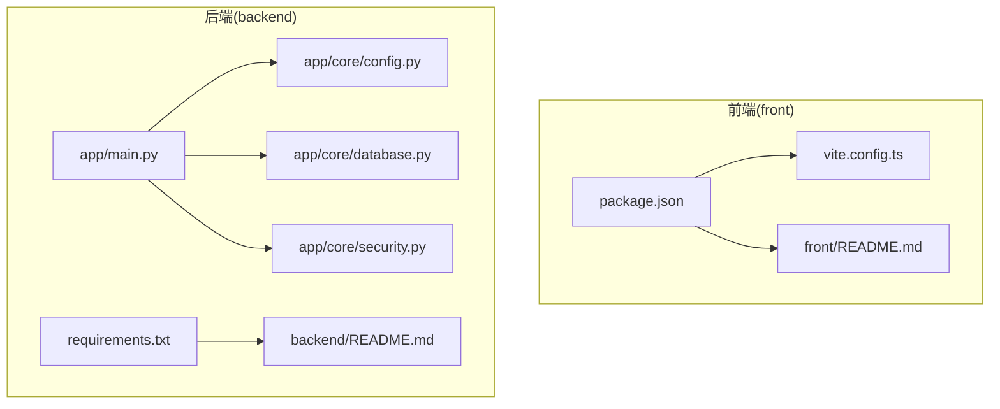
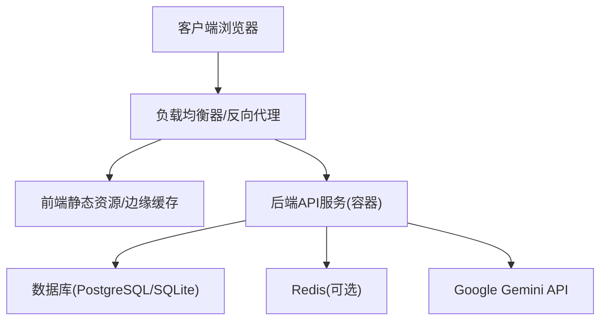
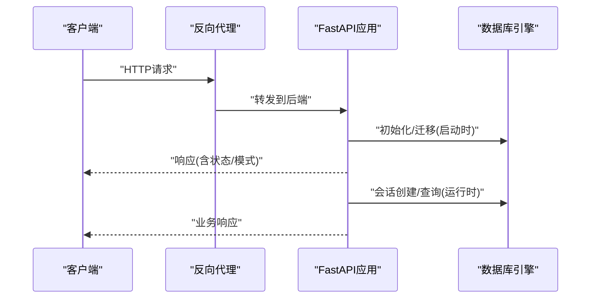
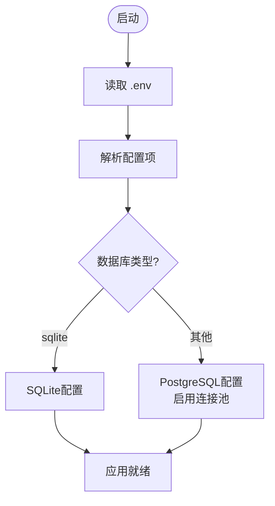
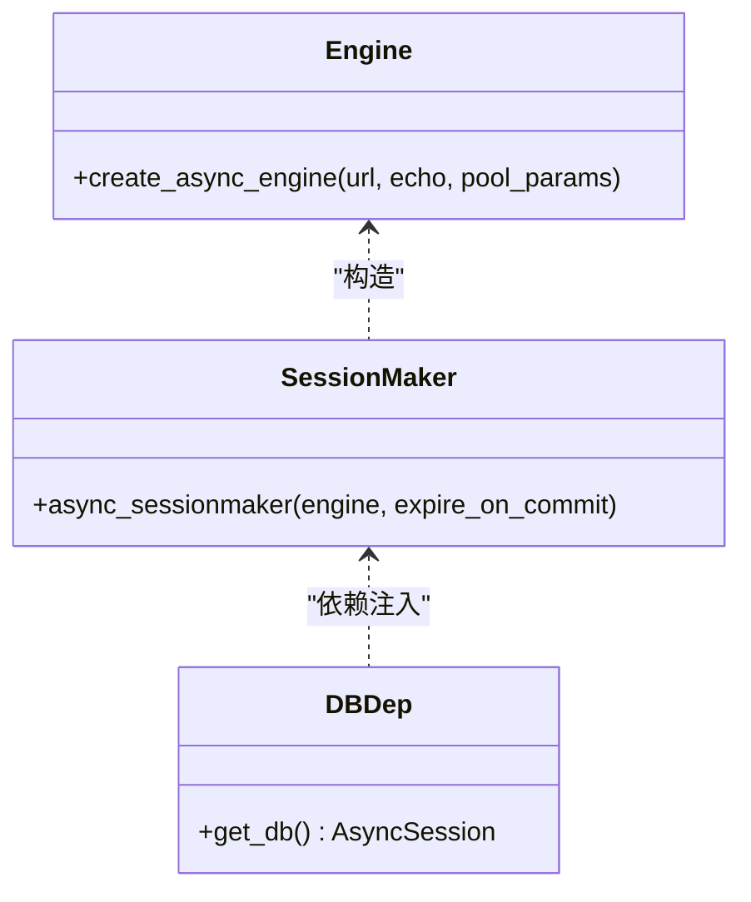
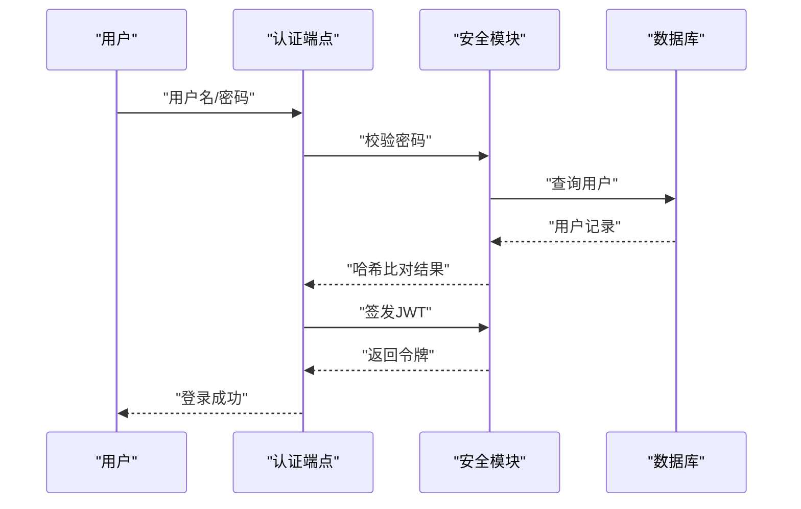
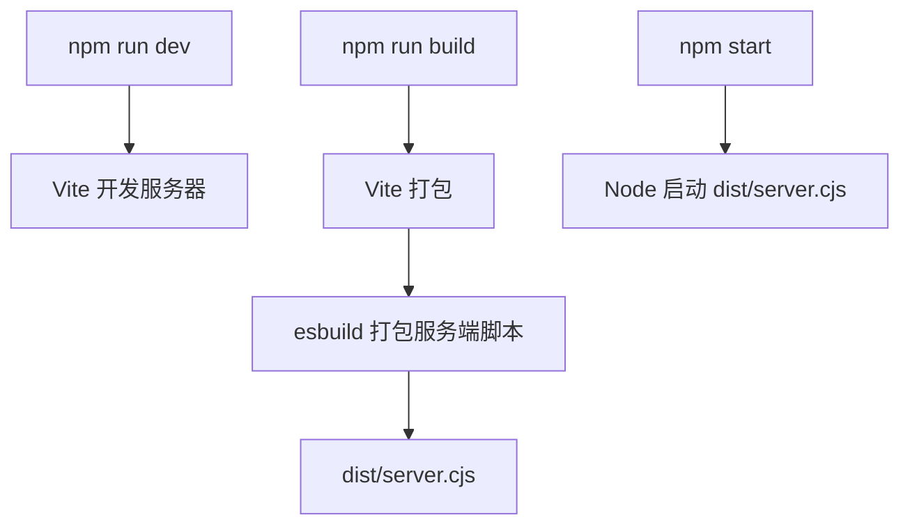
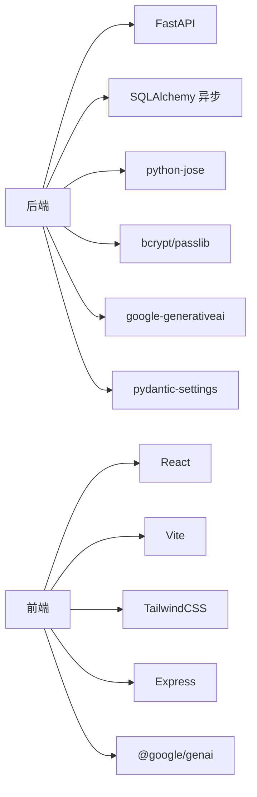

# 部署指南

<cite>
**本文引用的文件**
- [PROJECT_OVERVIEW.md](file://PROJECT_OVERVIEW.md)
- [backend/README.md](file://backend/README.md)
- [front/README.md](file://front/README.md)
- [backend/app/main.py](file://backend/app/main.py)
- [backend/app/core/config.py](file://backend/app/core/config.py)
- [backend/app/core/database.py](file://backend/app/core/database.py)
- [backend/app/core/security.py](file://backend/app/core/security.py)
- [backend/requirements.txt](file://backend/requirements.txt)
- [front/package.json](file://front/package.json)
- [front/vite.config.ts](file://front/vite.config.ts)
</cite>

## 目录
1. [简介](#简介)
2. [项目结构](#项目结构)
3. [核心组件](#核心组件)
4. [架构总览](#架构总览)
5. [详细组件分析](#详细组件分析)
6. [依赖分析](#依赖分析)
7. [性能考量](#性能考量)
8. [故障排除指南](#故障排除指南)
9. [结论](#结论)
10. [附录](#附录)

## 简介
本指南面向Quickly项目的运维与开发团队，提供从开发到生产的完整部署方案。内容涵盖：
- 开发与生产环境配置差异（环境变量、数据库与安全策略）
- Docker容器化与编排思路（镜像构建、容器编排与网络）
- 云平台部署选项（AWS/Azure/GCP）的落地步骤
- CI/CD流水线配置（自动化测试、构建与部署）
- 性能监控、日志管理与故障排除
- 负载均衡、缓存与数据库优化最佳实践
- 安全加固与合规性建议

## 项目结构
Quickly采用前后端分离架构：前端基于React + TypeScript + Vite，后端基于FastAPI + SQLAlchemy异步ORM。项目根目录包含前端、后端与项目概览文档。

图表来源
- [backend/app/main.py:1-66](file://backend/app/main.py#L1-L66)
- [backend/app/core/config.py:1-45](file://backend/app/core/config.py#L1-L45)
- [backend/app/core/database.py:1-46](file://backend/app/core/database.py#L1-L46)
- [backend/app/core/security.py:1-80](file://backend/app/core/security.py#L1-L80)
- [backend/requirements.txt:1-37](file://backend/requirements.txt#L1-L37)
- [front/package.json:1-36](file://front/package.json#L1-L36)
- [front/vite.config.ts:1-23](file://front/vite.config.ts#L1-L23)
- [backend/README.md:1-75](file://backend/README.md#L1-L75)
- [front/README.md:1-21](file://front/README.md#L1-L21)

章节来源
- [PROJECT_OVERVIEW.md:1-200](file://PROJECT_OVERVIEW.md#L1-L200)
- [backend/README.md:1-75](file://backend/README.md#L1-L75)
- [front/README.md:1-21](file://front/README.md#L1-L21)

## 核心组件
- 应用入口与路由：后端通过FastAPI应用入口统一挂载认证、聊天、笔记、知识、掌握度、复习与设置等路由，并内置健康检查与运行模式探测端点。
- 配置中心：通过Pydantic Settings加载环境变量，集中管理应用名称、调试模式、密钥、数据库URL、Redis、CORS、AI与Celery等配置项。
- 数据层：异步SQLAlchemy引擎适配SQLite与PostgreSQL，生产环境推荐PostgreSQL并启用连接池参数；提供会话工厂与依赖注入。
- 安全模块：基于JWT与bcrypt实现密码哈希与令牌签发/校验，提供OAuth2密码流与当前用户解析。
- 前端构建：Vite + React + TailwindCSS，支持开发服务器与产物打包，后端提供静态资源服务脚本。

章节来源
- [backend/app/main.py:1-66](file://backend/app/main.py#L1-L66)
- [backend/app/core/config.py:1-45](file://backend/app/core/config.py#L1-L45)
- [backend/app/core/database.py:1-46](file://backend/app/core/database.py#L1-L46)
- [backend/app/core/security.py:1-80](file://backend/app/core/security.py#L1-L80)
- [backend/requirements.txt:1-37](file://backend/requirements.txt#L1-L37)
- [front/package.json:1-36](file://front/package.json#L1-L36)
- [front/vite.config.ts:1-23](file://front/vite.config.ts#L1-L23)

## 架构总览
下图展示了Quickly在不同环境下的典型部署拓扑：前端通过反向代理或CDN暴露，后端以容器形式运行，数据库与缓存/任务队列作为外部服务或容器化组件提供。

说明
- 负载均衡器用于流量分发与TLS终止（生产建议开启HTTPS）。
- 前端可部署于CDN或静态托管，减少后端压力。
- 后端容器内运行FastAPI服务，按需启用Redis/Celery。
- 数据库生产环境推荐PostgreSQL，开发环境可用SQLite。

## 详细组件分析

### 后端应用与路由
- 应用生命周期：在启动时自动创建数据库表，在关闭时释放连接。
- 跨域策略：CORS允许指定来源，生产环境应限制为实际域名。
- 路由挂载：认证、聊天、笔记、知识、掌握度、复习与设置模块按前缀组织。
- 健康检查：根路径与/api/status端点用于探活与运行模式判断。

图表来源
- [backend/app/main.py:15-31](file://backend/app/main.py#L15-L31)
- [backend/app/core/database.py:18-30](file://backend/app/core/database.py#L18-L30)

章节来源
- [backend/app/main.py:1-66](file://backend/app/main.py#L1-L66)

### 配置与环境变量
- 关键配置项：应用名、调试模式、密钥、令牌过期时间、数据库URL、Redis、CORS白名单、Gemini API Key、Celery Broker/Backend。
- 默认值与覆盖：开发默认SQLite与本地Redis，生产建议替换为PostgreSQL与外部Redis/Celery。
- 加载机制：通过.env文件与Pydantic Settings自动加载。

图表来源
- [backend/app/core/config.py:10-42](file://backend/app/core/config.py#L10-L42)
- [backend/app/core/database.py:16-30](file://backend/app/core/database.py#L16-L30)

章节来源
- [backend/app/core/config.py:1-45](file://backend/app/core/config.py#L1-L45)
- [PROJECT_OVERVIEW.md:164-186](file://PROJECT_OVERVIEW.md#L164-L186)

### 数据库与会话管理
- 引擎选择：SQLite不支持连接池参数；PostgreSQL启用pool_pre_ping、pool_size与max_overflow。
- 会话工厂：异步会话工厂与依赖注入，确保事务一致性与资源回收。
- 迁移与初始化：应用启动时自动创建表结构。

图表来源
- [backend/app/core/database.py:15-45](file://backend/app/core/database.py#L15-L45)

章节来源
- [backend/app/core/database.py:1-46](file://backend/app/core/database.py#L1-L46)

### 安全与认证
- 密码处理：bcrypt哈希与校验。
- JWT令牌：HS256算法，支持自定义过期时间，令牌解码与当前用户解析。
- OAuth2密码流：提供令牌端点与依赖注入解析当前用户。

图表来源
- [backend/app/core/security.py:23-80](file://backend/app/core/security.py#L23-L80)

章节来源
- [backend/app/core/security.py:1-80](file://backend/app/core/security.py#L1-L80)

### 前端构建与运行
- 依赖与脚本：Vite、React、TailwindCSS、Express用于本地开发与打包。
- 构建流程：Vite打包前端产物，配合Express提供静态服务。
- 开发体验：Vite HMR与文件监听可根据环境变量调整。

图表来源
- [front/package.json:6-12](file://front/package.json#L6-L12)
- [front/vite.config.ts:6-22](file://front/vite.config.ts#L6-L22)

章节来源
- [front/package.json:1-36](file://front/package.json#L1-L36)
- [front/vite.config.ts:1-23](file://front/vite.config.ts#L1-L23)
- [front/README.md:1-21](file://front/README.md#L1-L21)

## 依赖分析
- 后端依赖：FastAPI、Uvicorn、SQLAlchemy异步、Alembic、Redis/CELERY（可选）、JWT、bcrypt、Google Generative AI、Pydantic Settings、httpx等。
- 前端依赖：React、Vite、TailwindCSS、Express、dotenv、@google/genai等。

图表来源
- [backend/requirements.txt:1-37](file://backend/requirements.txt#L1-L37)
- [front/package.json:13-34](file://front/package.json#L13-L34)

章节来源
- [backend/requirements.txt:1-37](file://backend/requirements.txt#L1-L37)
- [front/package.json:1-36](file://front/package.json#L1-L36)

## 性能考量
- 数据库连接池
  - 生产环境使用PostgreSQL并启用连接池参数（预检查、池大小、溢出），降低连接竞争与超时风险。
  - 开发环境SQLite无需连接池参数。
- 缓存与任务队列
  - Redis可用于会话存储、限流与缓存热点数据；Celery可异步处理耗时任务（如日志上报、指标统计）。
- 前端性能
  - 使用Vite生产构建，启用代码分割与压缩；CDN缓存静态资源。
- API性能
  - 合理设置CORS白名单，避免通配符带来的安全与性能隐患；对高频接口进行缓存与限流。
- 监控与日志
  - 后端接入结构化日志与指标导出；前端埋点与错误上报；结合APM工具进行端到端追踪。

## 故障排除指南
- 启动失败
  - 确认Python虚拟环境已激活且依赖安装完成。
  - 检查数据库URL与凭证是否正确，生产环境优先使用PostgreSQL。
- 认证异常
  - 核对SECRET_KEY是否设置且未使用默认值；确认JWT算法与过期时间配置一致。
- CORS错误
  - 生产环境仅保留可信域名；确保Origin与Headers匹配。
- AI集成问题
  - 确认GEMINI_API_KEY已配置；若为空则后端将以模拟模式运行。
- 数据库迁移
  - 启动时自动创建表；若出现迁移冲突，检查Alembic版本与数据库权限。

章节来源
- [backend/app/main.py:58-66](file://backend/app/main.py#L58-L66)
- [backend/app/core/config.py:18-37](file://backend/app/core/config.py#L18-L37)
- [PROJECT_OVERVIEW.md:164-186](file://PROJECT_OVERVIEW.md#L164-L186)

## 结论
本指南提供了从开发到生产的部署蓝图：明确环境差异、配置要点与安全策略，给出容器化与云平台落地步骤，以及CI/CD、性能与安全加固建议。建议在生产环境中优先采用PostgreSQL、外部Redis/Celery、严格的CORS与密钥管理，并建立完善的监控与告警体系。

## 附录

### 开发环境与生产环境配置差异
- 环境变量
  - 开发：DEBUG=true，SQLite数据库，本地Redis，CORS允许本地端口。
  - 生产：DEBUG=false，PostgreSQL数据库，外部Redis/Celery，严格CORS白名单，密钥与API Key必须配置。
- 数据库
  - 开发：sqlite+aiosqlite，无需连接池。
  - 生产：PostgreSQL，启用连接池参数与连接预检查。
- 安全
  - 生产必须更换默认SECRET_KEY，启用HTTPS与安全头，限制CORS与上传大小。
- AI集成
  - 生产需配置GEMINI_API_KEY，避免模拟模式影响用户体验。

章节来源
- [backend/app/core/config.py:14-37](file://backend/app/core/config.py#L14-L37)
- [backend/app/core/database.py:16-30](file://backend/app/core/database.py#L16-L30)
- [PROJECT_OVERVIEW.md:164-186](file://PROJECT_OVERVIEW.md#L164-L186)

### Docker容器化部署方案
- 镜像构建
  - 后端：基于Python 3.x镜像，复制requirements.txt并安装依赖，复制源码，暴露8000端口，使用Uvicorn启动。
  - 前端：基于Node镜像构建产物，再复制至Nginx或静态服务镜像，暴露80端口。
- 容器编排
  - 使用Compose编排：后端容器、数据库容器、Redis/Celery容器（可选）、反向代理/负载均衡容器。
  - 网络：后端与数据库在同一内部网络，前端通过反向代理对外暴露。
- 环境变量与持久化
  - 通过环境变量注入数据库URL、密钥、AI Key；数据库与日志目录映射到宿主机卷。

说明：以上为通用容器化思路，具体镜像与Compose文件需根据实际需求补充。

### 云平台部署选项（AWS/Azure/GCP）
- AWS
  - 使用ECS/EKS部署后端容器，RDS托管PostgreSQL，ElastiCache/内存数据库替代Redis，CloudFront分发前端静态资源。
- Azure
  - 使用Container Instances/aks，Azure Database for PostgreSQL，Azure Cache for Redis，Static Web Apps托管前端。
- GCP
  - 使用Cloud Run/Anthos，Cloud SQL托管PostgreSQL，Memorystore Redis，Cloud CDN分发前端。

说明：以上为通用架构建议，需结合各平台服务与合规要求细化实施。

### CI/CD流水线配置
- 触发条件
  - push到主分支触发构建；PR触发单元测试与静态检查。
- 步骤
  - 前端：安装依赖、TypeScript检查、构建产物、上传制品。
  - 后端：安装依赖、运行测试、构建镜像、推送仓库、触发部署。
  - 部署：拉取镜像、编排容器、健康检查、滚动更新。
- 质量门禁
  - 代码覆盖率阈值、依赖漏洞扫描、安全基线检查。

说明：流水线具体实现需结合所选CI平台（GitHub Actions/Azure Pipelines/Jenkins等）配置。

### 负载均衡、缓存与数据库优化
- 负载均衡
  - 使用反向代理或云负载均衡，开启健康检查与超时重试；TLS终止与安全头配置。
- 缓存
  - Redis用于热点数据与会话存储；前端静态资源CDN缓存；API响应缓存（需注意一致性）。
- 数据库优化
  - 生产使用PostgreSQL并启用连接池；索引与查询优化；慢查询日志与分析；备份与高可用。

### 安全加固与合规性
- 密钥与机密
  - 使用平台机密管理服务（AWS Secrets Manager/Azure Key Vault/GCP Secret Manager）管理密钥与API Key。
- 网络与访问控制
  - 最小权限原则、网络隔离、防火墙规则、只暴露必要端口。
- 合规性
  - 数据最小化、用户同意与撤回、数据留存与删除、跨境传输评估与约束。