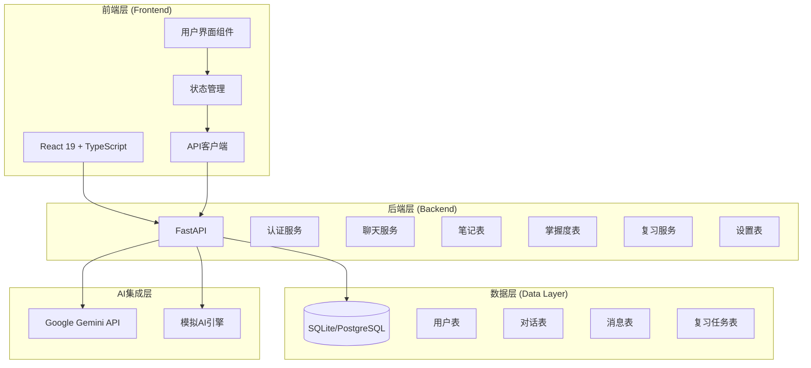
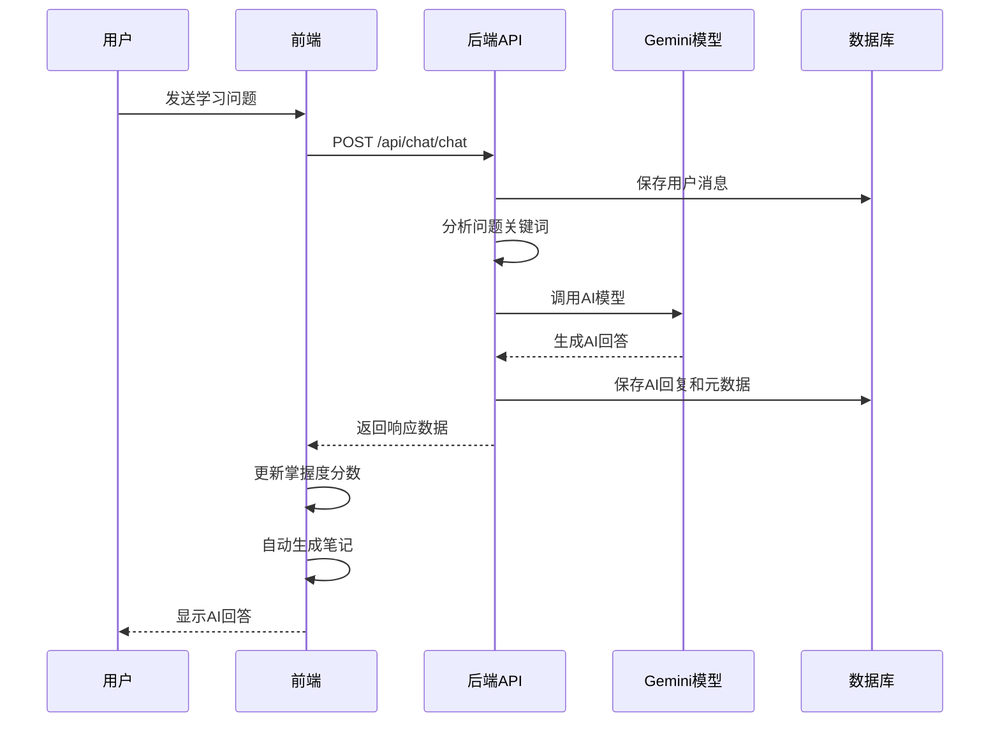
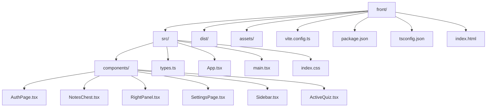
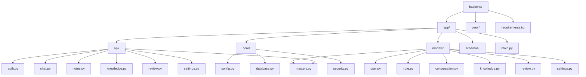
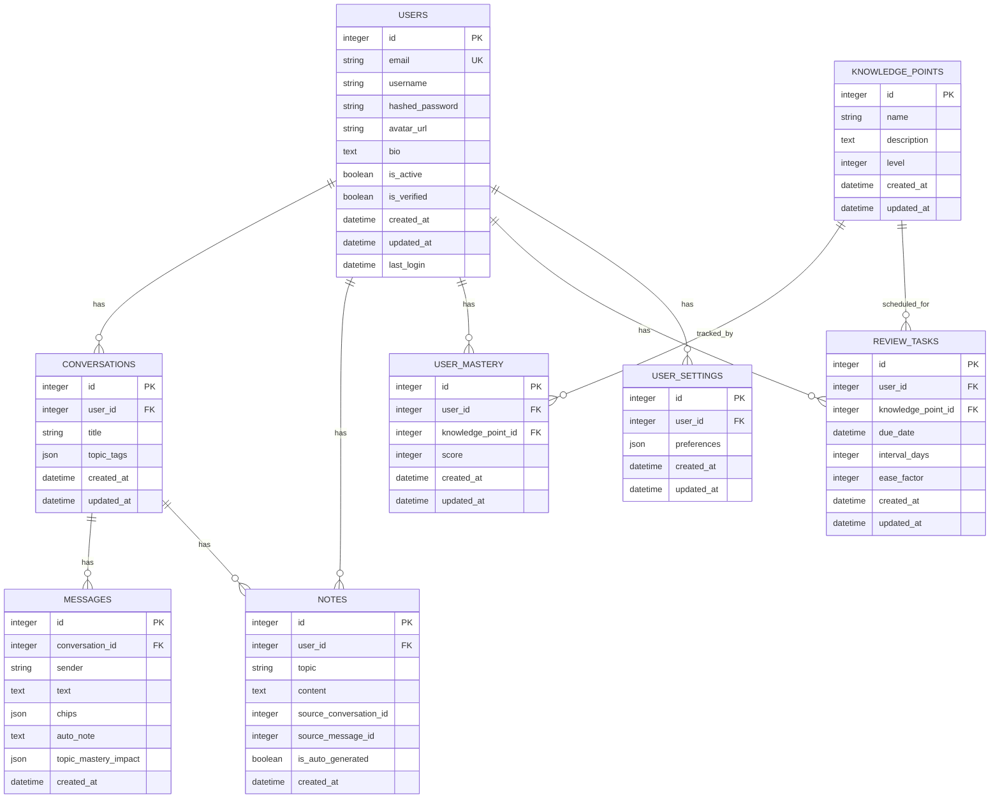

# 项目概览

<cite>
**本文档引用的文件**
- [PROJECT_OVERVIEW.md](file://PROJECT_OVERVIEW.md)
- [backend/README.md](file://backend/README.md)
- [front/README.md](file://front/README.md)
- [backend/app/main.py](file://backend/app/main.py)
- [backend/app/api/chat.py](file://backend/app/api/chat.py)
- [backend/app/models/conversation.py](file://backend/app/models/conversation.py)
- [backend/app/schemas/conversation.py](file://backend/app/schemas/conversation.py)
- [backend/app/core/config.py](file://backend/app/core/config.py)
- [backend/app/models/user.py](file://backend/app/models/user.py)
- [backend/requirements.txt](file://backend/requirements.txt)
- [front/src/App.tsx](file://front/src/App.tsx)
- [front/src/components/ActiveQuiz.tsx](file://front/src/components/ActiveQuiz.tsx)
- [front/src/types.ts](file://front/src/types.ts)
- [front/package.json](file://front/package.json)
</cite>

## 目录
1. [项目简介](#项目简介)
2. [核心目标与愿景](#核心目标与愿景)
3. [技术架构概览](#技术架构概览)
4. [核心功能特性](#核心功能特性)
5. [AI驱动学习助手](#ai驱动学习助手)
6. [项目结构分析](#项目结构分析)
7. [数据库设计](#数据库设计)
8. [用户体验设计](#用户体验设计)
9. [技术选型分析](#技术选型分析)
10. [项目状态与版本信息](#项目状态与版本信息)
11. [发展路线图](#发展路线图)
12. [总结](#总结)

## 项目简介

Quickly AI学习平台是一个基于人工智能技术的智能化学习辅助系统，旨在通过AI驱动的学习助手帮助用户提高学习效率。该平台结合了现代Web技术栈，提供了从基础认证到高级AI问答、从笔记管理到知识掌握度跟踪的完整学习体验。

平台采用前后端分离架构，前端使用React 19 + TypeScript + Vite构建现代化的用户界面，后端基于FastAPI提供高性能的API服务，数据库采用SQLAlchemy ORM进行数据持久化管理。

## 核心目标与愿景

### 主要目标
- **智能化学习体验**：通过AI助手提供个性化的学习指导和即时答疑
- **高效知识管理**：建立完整的知识体系，支持智能检索和笔记管理
- **精准掌握度跟踪**：实时监控学习进度，提供数据驱动的学习建议
- **沉浸式学习环境**：创造无干扰的学习空间，最大化学习专注度

### 设计理念
- **以用户为中心**：简洁直观的界面设计，降低学习门槛
- **AI赋能教育**：充分利用大语言模型的能力，提供高质量的学习资源
- **数据驱动优化**：通过学习数据分析，持续改进学习效果
- **技术开放透明**：采用开源技术栈，便于社区贡献和扩展

## 技术架构概览

### 整体架构图

**架构图来源**
- [backend/app/main.py:26-49](file://backend/app/main.py#L26-L49)
- [backend/app/core/config.py:10-44](file://backend/app/core/config.py#L10-L44)

### 技术栈详情

#### 前端技术栈
- **框架**: React 19 + TypeScript - 提供类型安全的现代化前端开发
- **构建工具**: Vite - 快速的开发服务器和高效的构建流程
- **UI库**: Tailwind CSS 4 - 原子化CSS框架，支持快速样式开发
- **图标库**: Lucide React - 精美的SVG图标集合
- **动画**: Framer Motion - 流畅的动画和过渡效果

#### 后端技术栈
- **框架**: FastAPI 0.115 - 高性能异步Web框架，自动生成API文档
- **数据库**: SQLAlchemy 2.0 (异步) - ORM对象关系映射，支持SQLite和PostgreSQL
- **认证**: JWT + bcrypt - 安全的用户认证和密码哈希
- **AI集成**: Google Gemini API - 大语言模型集成
- **缓存**: Redis (可选) - 性能优化和会话存储
- **任务队列**: Celery (可选) - 异步任务处理

**章节来源**
- [PROJECT_OVERVIEW.md:60-75](file://PROJECT_OVERVIEW.md#L60-L75)
- [backend/README.md:67-75](file://backend/README.md#L67-L75)
- [front/package.json:13-34](file://front/package.json#L13-L34)

## 核心功能特性

### 前端页面功能

#### 1. 登录/注册页面
- 支持邮箱登录和密码验证
- 社交登录选项（如Google）
- 实时表单验证和错误提示

#### 2. 学习问答页面
- AI聊天界面，支持自然语言交互
- 预设问题快捷访问
- 知识点标签和自动笔记生成功能
- 实时掌握度分数更新

#### 3. 笔记管理页面
- 笔记列表展示和搜索
- 在线编辑和Markdown支持
- 笔记导出功能
- 自动笔记同步

#### 4. 掌握度页面
- 三大学科领域的掌握度可视化
- 多维度诊断图表
- 实时分数追踪和趋势分析

#### 5. 学习路径页面
- 四级通关路线设计
- 智能进度跟踪
- 解锁条件和奖励机制

#### 6. 复习页面
- 智能评测入口
- 主题化测验系统
- 错题回顾和知识点巩固

#### 7. 设置页面
- 学习目标设定
- 提醒和通知配置
- 语言和主题个性化设置

**章节来源**
- [PROJECT_OVERVIEW.md:76-86](file://PROJECT_OVERVIEW.md#L76-L86)

### 后端API功能

#### 认证API
- 用户注册和登录
- JWT令牌管理和刷新
- 当前用户信息获取
- 密码安全验证

#### 问答API
- 发送问题获取AI回答
- 会话历史管理
- 对话上下文维护
- 知识点标签提取

#### 笔记API
- 笔记的增删改查操作
- 搜索和过滤功能
- Markdown内容处理
- 自动笔记生成

#### 掌握度API
- 掌握度概览查询
- 详细分数记录获取
- 测验结果提交和处理
- 学习进度统计分析

#### 设置API
- 用户偏好设置管理
- 学习目标配置
- 通知和提醒设置
- 个人资料更新

**章节来源**
- [PROJECT_OVERVIEW.md:87-95](file://PROJECT_OVERVIEW.md#L87-L95)

## AI驱动学习助手

### 智能问答系统

#### 核心功能
- **自然语言理解**: 支持中文和英文的自然语言查询
- **上下文记忆**: 维护多轮对话的历史上下文
- **知识点关联**: 自动识别和标记相关知识点
- **智能推荐**: 基于掌握度提供学习建议

#### AI响应生成

**序列图来源**
- [backend/app/api/chat.py:78-150](file://backend/app/api/chat.py#L78-L150)
- [backend/app/models/conversation.py:11-54](file://backend/app/models/conversation.py#L11-L54)

#### 掌握度影响机制

| 知识点 | 逻辑回归 | 梯度下降 | 正则化 |
|--------|----------|----------|--------|
| 逻辑回归 | +5% | +2% | +0% |
| 梯度下降 | +0% | +8% | +3% |
| 正则化 | +3% | +2% | +10% |
| Sigmoid函数 | +5% | +0% | +0% |

**章节来源**
- [backend/app/api/chat.py:70-75](file://backend/app/api/chat.py#L70-L75)
- [backend/app/api/chat.py:176-183](file://backend/app/api/chat.py#L176-L183)

### 笔记管理系统

#### 自动笔记生成功能
- **内容提取**: 从AI回答中提取关键知识点
- **格式化处理**: 自动生成结构化的笔记内容
- **标签关联**: 自动添加相关知识点标签
- **时间戳记录**: 详细的操作时间记录

#### 笔记组织结构
- **按主题分类**: 基于知识点自动分组
- **时间顺序**: 最新笔记优先显示
- **搜索功能**: 支持全文搜索和标签过滤
- **导出功能**: 支持多种格式的数据导出

**章节来源**
- [backend/app/api/chat.py:125-136](file://backend/app/api/chat.py#L125-L136)

## 项目结构分析

### 前端项目结构

**前端结构图来源**
- [PROJECT_OVERVIEW.md:7-24](file://PROJECT_OVERVIEW.md#L7-L24)

### 后端项目结构

**后端结构图来源**
- [PROJECT_OVERVIEW.md:25-57](file://PROJECT_OVERVIEW.md#L25-L57)

**章节来源**
- [PROJECT_OVERVIEW.md:3-57](file://PROJECT_OVERVIEW.md#L3-L57)

## 数据库设计

### 数据库实体关系图

**ER图来源**
- [backend/app/models/user.py:11-39](file://backend/app/models/user.py#L11-L39)
- [backend/app/models/conversation.py:11-54](file://backend/app/models/conversation.py#L11-L54)
- [backend/app/models/note.py:1-50](file://backend/app/models/note.py#L1-L50)
- [backend/app/models/mastery.py:1-50](file://backend/app/models/mastery.py#L1-L50)
- [backend/app/models/knowledge.py:1-50](file://backend/app/models/knowledge.py#L1-L50)
- [backend/app/models/review.py:1-50](file://backend/app/models/review.py#L1-L50)
- [backend/app/models/settings.py:1-50](file://backend/app/models/settings.py#L1-L50)

### 核心数据模型

#### 用户模型 (User)
- **唯一标识**: 自增主键ID
- **身份信息**: 邮箱地址（唯一）、用户名
- **安全信息**: 哈希密码存储
- **个人资料**: 头像URL、个人简介
- **状态管理**: 激活状态、验证状态
- **时间戳**: 创建时间、最后登录时间

#### 会话模型 (Conversation)
- **会话标识**: 主键ID
- **用户关联**: 外键关联用户表
- **内容管理**: 会话标题、话题标签
- **时间管理**: 创建和更新时间戳
- **关系映射**: 一对多关系到消息表

#### 消息模型 (Message)
- **消息标识**: 主键ID
- **会话关联**: 外键关联会话表
- **内容结构**: 发送者类型、文本内容
- **AI元数据**: 知识点标签、自动笔记、掌握度影响
- **时间戳**: 创建时间

#### 掌握度模型 (UserMastery)
- **记录标识**: 主键ID
- **用户关联**: 外键关联用户表
- **知识点关联**: 外键关联知识点表
- **学习进度**: 分数记录、时间戳
- **动态更新**: 实时掌握度调整

**章节来源**
- [backend/app/models/user.py:11-39](file://backend/app/models/user.py#L11-L39)
- [backend/app/models/conversation.py:11-54](file://backend/app/models/conversation.py#L11-L54)
- [backend/app/models/conversation.py:33-54](file://backend/app/models/conversation.py#L33-L54)

## 用户体验设计

### 视觉设计原则

#### 主题色彩系统
- **主色调**: `#181818` (深灰背景)
- **强调色**: `#b8f600` (亮绿色，用于重要元素)
- **文字色**: `#e3e3de` (浅灰文字)
- **边框色**: `#434933` (中性边框)

#### 组件设计规范
- **圆角半径**: 8px的基础圆角
- **间距系统**: 4px倍数的网格系统
- **字体系统**: 等宽字体用于代码和技术内容
- **动画时长**: 200-300ms的流畅过渡

### 交互设计模式

#### 1. 学习问答界面
- **消息气泡**: AI消息左对齐，用户消息右对齐
- **输入区域**: 固定底部，支持多行输入
- **快捷按钮**: 预设问题快速访问
- **状态指示**: 思考状态的视觉反馈

#### 2. 掌握度仪表板
- **分数展示**: 三个核心领域的分数卡片
- **进度条**: 多维度诊断的雷达图
- **颜色编码**: 不同领域使用不同强调色
- **动态更新**: 实时分数变化动画

#### 3. 测验系统
- **渐进式难度**: 从简单到复杂的题目排列
- **即时反馈**: 答案正确性立即显示
- **解释性反馈**: 提供详细的学术解析
- **完成庆祝**: 成功完成的视觉和听觉反馈

**章节来源**
- [front/src/App.tsx:37-91](file://front/src/App.tsx#L37-L91)
- [front/src/components/ActiveQuiz.tsx:140-330](file://front/src/components/ActiveQuiz.tsx#L140-L330)

## 技术选型分析

### 前端技术选型

#### React 19 + TypeScript
- **优势**: 
  - 强类型检查，减少运行时错误
  - 现代JSX语法，提升开发体验
  - 丰富的生态系统和社区支持
- **适用场景**: 复杂的单页应用，需要类型安全的大型项目

#### Vite构建工具
- **优势**:
  - 极快的冷启动和热更新
  - 内置ESLint和TypeScript支持
  - 优秀的开发体验和性能
- **适用场景**: 现代前端项目的快速开发和构建

#### Tailwind CSS 4
- **优势**:
  - 原子化CSS，快速样式开发
  - 响应式设计内置支持
  - 与TypeScript完美集成
- **适用场景**: 需要快速原型开发和一致设计系统的项目

### 后端技术选型

#### FastAPI 0.115
- **优势**:
  - 自动API文档生成
  - 异步支持和高性能
  - Pydantic集成，数据验证
  - 类型注解支持
- **适用场景**: 需要高性能和良好开发体验的API服务

#### SQLAlchemy 2.0 (异步)
- **优势**:
  - 异步ORM支持，提升性能
  - 类型安全的查询构建
  - 支持多种数据库后端
  - 灵活的映射策略
- **适用场景**: 需要高性能数据库操作的现代应用

#### Google Gemini API
- **优势**:
  - 优秀的中文理解和生成能力
  - 多模态支持（文本、图像）
  - 企业级安全和可靠性
  - 持续的模型更新
- **适用场景**: 需要高质量AI问答和内容生成的应用

**章节来源**
- [PROJECT_OVERVIEW.md:60-75](file://PROJECT_OVERVIEW.md#L60-L75)
- [backend/requirements.txt:1-37](file://backend/requirements.txt#L1-L37)
- [front/package.json:13-34](file://front/package.json#L13-L34)

## 项目状态与版本信息

### 当前项目状态

#### 已完成的功能
- ✅ 前端核心功能开发完成
- ✅ 后端API框架搭建完成
- ✅ 数据库模型设计完成
- ✅ JWT认证实现完成
- ✅ 模拟AI问答功能
- ✅ 笔记管理系统
- ✅ 掌握度跟踪系统

#### 开发中的功能
- ⏳ AI模型集成优化中
- ⏳ 异步任务队列待实现
- ⏳ 测验系统完善
- ⏳ 复习提醒功能

### 版本信息

#### 当前版本
- **后端版本**: FastAPI 0.115.0
- **前端版本**: React 19.0.1 + TypeScript
- **数据库**: SQLAlchemy 2.0.35
- **AI集成**: Google Gemini API 0.8.3

#### 环境要求
- **Python**: 3.8+
- **Node.js**: 16.0+
- **数据库**: SQLite (开发) / PostgreSQL (生产)
- **Redis**: 6.0+ (可选)

**章节来源**
- [PROJECT_OVERVIEW.md:187-196](file://PROJECT_OVERVIEW.md#L187-L196)

## 发展路线图

### MVP (当前阶段)
- **已完成**: 前端页面开发完成
- **已完成**: 后端API基础框架完成
- **进行中**: AI模型集成 (Gemini API)
- **进行中**: 测验系统完善
- **进行中**: 复习提醒功能

### 迭代1 (短期目标)
- [ ] 引入机器学习模型预测掌握度
- [ ] 建立知识依赖关系图
- [ ] 实现 SM-2 复习算法
- [ ] 添加知识图谱支持

### 迭代2 (中期目标)
- [ ] 高级大模型能力集成
- [ ] 团队报告功能
- [ ] 数据脱敏和审计
- [ ] 多语言支持完善

### 长期规划
- [ ] 移动端应用开发
- [ ] 离线学习功能
- [ ] 学习分析仪表板
- [ ] 社区学习功能

## 总结

Quickly AI学习平台是一个技术先进、设计精良的智能化学习辅助系统。通过精心设计的技术架构和丰富的功能特性，平台为用户提供了高效、便捷、个性化的学习体验。

### 核心优势

#### 技术优势
- **现代化技术栈**: 前后端均采用最新的技术标准
- **高性能架构**: 异步处理和优化的数据库设计
- **AI集成**: 深度整合Google Gemini API，提供高质量的AI服务
- **类型安全**: TypeScript和Pydantic确保代码质量

#### 功能优势
- **完整学习生态**: 从问答到笔记再到掌握度跟踪的一站式服务
- **智能推荐**: 基于AI的个性化学习建议
- **数据驱动**: 实时掌握度分析和学习效果追踪
- **用户体验**: 简洁直观的界面设计和流畅的交互体验

#### 开发优势
- **模块化设计**: 清晰的项目结构和职责分离
- **可扩展性**: 灵活的架构支持未来功能扩展
- **文档完善**: 详细的API文档和开发指南
- **测试友好**: 结构化的代码组织便于测试和维护

### 发展前景

Quickly AI学习平台具备成为优秀在线学习工具的所有要素。随着AI模型集成的完善和功能的持续扩展，平台有望为广大的学习者提供更加智能化、个性化的学习体验。通过持续的技术创新和功能优化，平台将在在线教育领域占据重要地位。